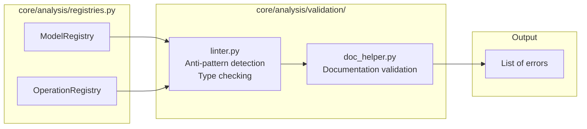
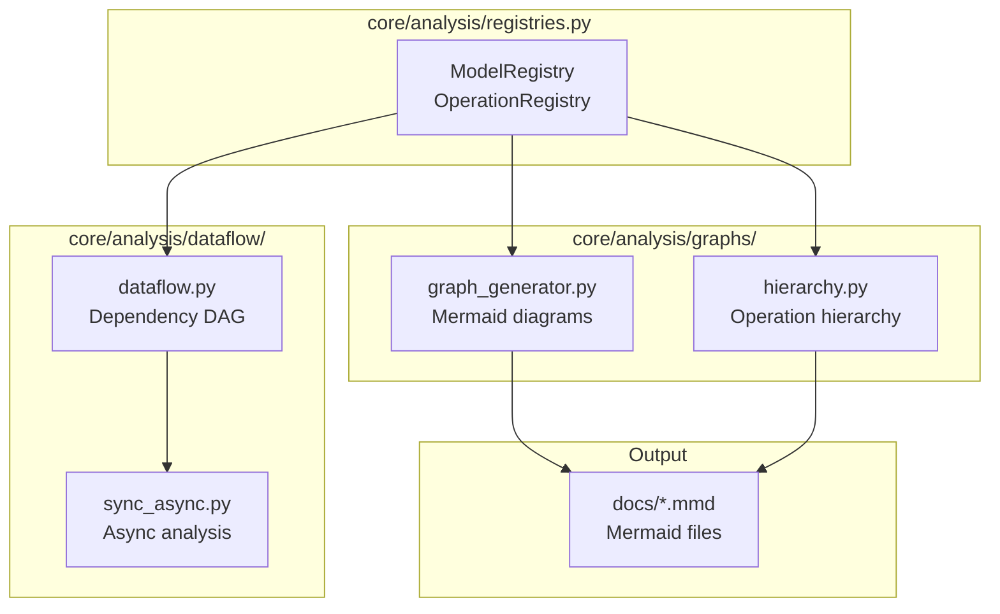
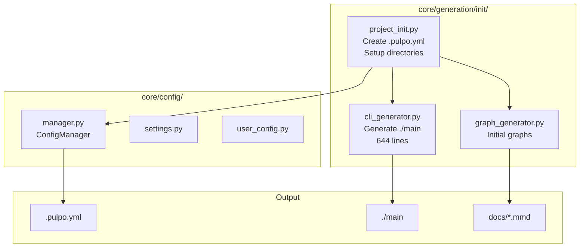
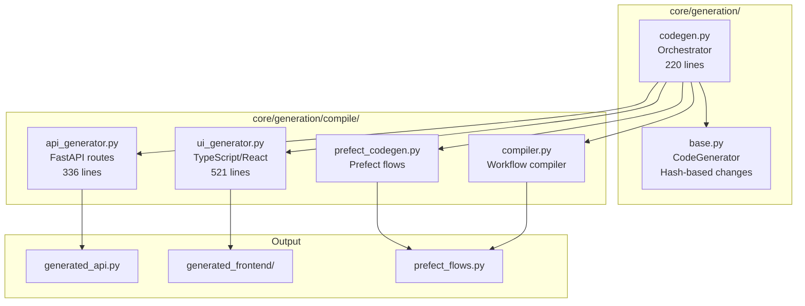
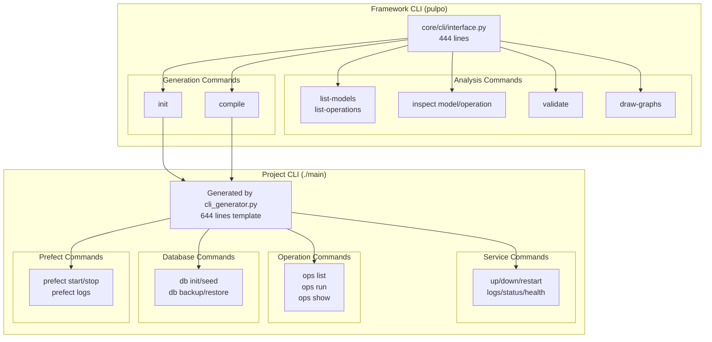
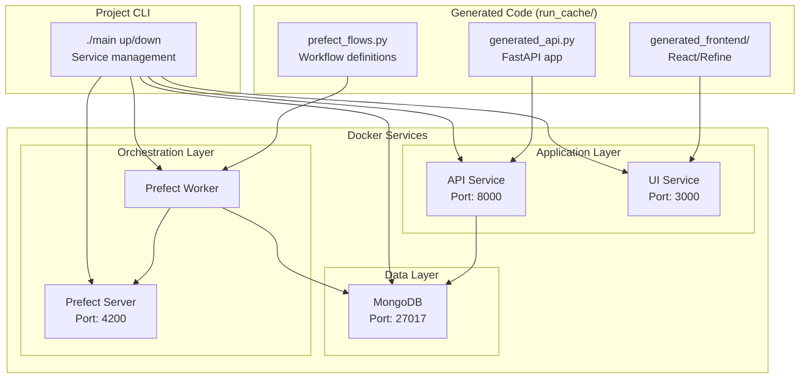
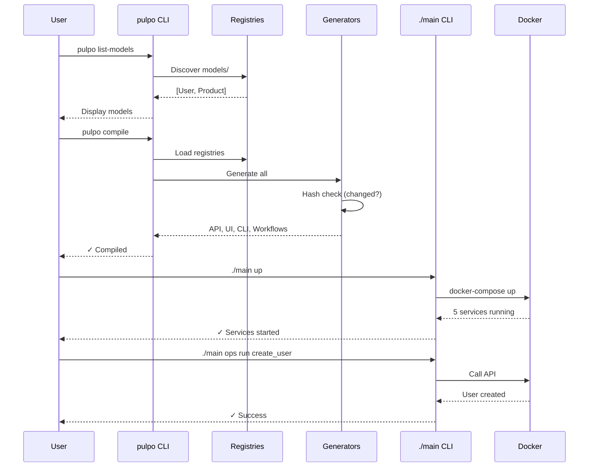

# Code Architecture Graph - File Responsibilities

This document visualizes the Pulpo framework's architecture, showing which files are responsible for what and how the code is designed for scalability.

## Overview: Two-Phase Architecture

```mermaid
graph TB
    subgraph "USER CODE"
        UM[models/*.py<br/>@datamodel]
        UO[operations/*.py<br/>@operation]
    end

    subgraph "PHASE 1: ANALYSIS"
        D[Discovery]
        R[Registries]
        V[Validation]
        G[Graphs]
    end

    subgraph "PHASE 2: GENERATION"
        I[Init]
        C[Compile]
    end

    subgraph "GENERATED CODE"
        CLI[./main<br/>Project CLI]
        API[generated_api.py]
        UI[generated_frontend/]
        WF[prefect_flows.py]
    end

    UM --> D
    UO --> D
    D --> R
    R --> V
    R --> G
    R --> I
    R --> C
    I --> CLI
    C --> API
    C --> UI
    C --> WF
```

---

## Phase 1: Analysis - File Responsibilities

### Discovery Layer
**Purpose**: Find and extract metadata from user code

```mermaid
graph LR
    subgraph "core/analysis/discovery/"
        AST[ast_scanner.py<br/>Static analysis<br/>No imports needed]
        IMP[import_scanner.py<br/>Runtime discovery<br/>Import decorators]
    end

    subgraph "User Code"
        UC[models/*.py<br/>operations/*.py]
    end

    subgraph "core/analysis/"
        DEC[decorators.py<br/>@datamodel<br/>@operation]
        REG[registries.py<br/>ModelRegistry<br/>OperationRegistry]
    end

    UC --> AST
    UC --> IMP
    DEC --> IMP
    AST --> REG
    IMP --> REG
```

**File Responsibilities**:
- **decorators.py** (80 lines): Defines `@datamodel` and `@operation` decorators
- **ast_scanner.py** (280 lines): Static analysis of Python files without imports
- **import_scanner.py** (150 lines): Runtime discovery by importing decorated code
- **registries.py** (250 lines): Stores discovered models and operations

**Scalability**: Discovery is O(n) where n = number of Python files. Can run in parallel for different directories.

---

### Validation Layer
**Purpose**: Lint and validate discovered code



**File Responsibilities**:
- **linter.py** (300 lines): Validates models/operations for anti-patterns
- **doc_helper.py** (100 lines): Ensures proper documentation

**Scalability**: Validation is O(n) where n = registry size. Each model/operation validated independently.

---

### Graph Layer
**Purpose**: Build dependency graphs and visualizations



**File Responsibilities**:
- **dataflow.py** (200 lines): Builds DAG, detects dependencies
- **sync_async.py** (120 lines): Analyzes sync/async compatibility
- **graph_generator.py** (400 lines): Generates Mermaid diagrams
- **hierarchy.py** (180 lines): Builds operation hierarchy trees

**Scalability**: Graph building is O(v + e) where v = models, e = operations. DAG enables parallel execution planning.

---

## Phase 2: Generation - File Responsibilities

### Init Phase
**Purpose**: First-time project setup



**File Responsibilities**:
- **project_init.py** (850 lines): Orchestrates project initialization
- **cli_generator.py** (644 lines): Generates complete operational CLI with 30+ commands
- **manager.py** (300 lines): Manages .pulpo.yml configuration
- **settings.py** (150 lines): Global settings
- **user_config.py** (100 lines): User-specific configuration

**Scalability**: Init is one-time only. Fast (< 1 second).

---

### Compile Phase
**Purpose**: Generate production code



**File Responsibilities**:
- **codegen.py** (220 lines): Main orchestrator, calls all generators
- **base.py** (150 lines): Base class with hash-based change detection
- **api_generator.py** (336 lines): Generates FastAPI routes from models/operations
- **ui_generator.py** (521 lines): Generates TypeScript config + React/Refine pages
- **prefect_codegen.py** (250 lines): Generates Prefect flow definitions
- **compiler.py** (300 lines): Compiles workflows into executable Prefect flows

**Scalability**:
- Hash-based regeneration: Only regenerate changed files
- Each generator is independent: Can run in parallel
- O(n) generation time where n = registry size
- Typical compile time: 4 seconds for 100 models + 200 operations

---

## CLI Architecture - Command Flow



**Scalability**:
- Framework CLI: Pure Python, no dependencies on generated code
- Project CLI: Generated per-project, includes only relevant commands
- Clear separation: Framework analyzes, project operates

---

## Service Layer - Docker Services



**Scalability**:
- Services are stateless (data in MongoDB)
- Horizontal scaling: Add more API/Worker containers
- Port auto-detection: No conflicts when running multiple projects
- Docker Compose: Easy multi-service orchestration

---

## Data Flow Example



---

## Scalability Design Principles

### 1. **Modular Generators**
Each generator is independent:
- **api_generator.py**: 336 lines, generates API only
- **ui_generator.py**: 521 lines, generates UI only
- **prefect_codegen.py**: 250 lines, generates workflows only

**Benefit**: Can add new generators (GraphQL, gRPC, etc.) without touching existing code.

### 2. **Registry Pattern**
Central storage for discovered metadata:
- **ModelRegistry**: All @datamodel classes
- **OperationRegistry**: All @operation functions

**Benefit**: Single source of truth. All generators read from registries.

### 3. **Hash-Based Regeneration**
Only regenerate changed files:
```python
# base.py
def needs_regeneration(self, output_file: Path) -> bool:
    current_hash = self.get_metadata_hash()
    stored_hash = self.load_hash(output_file)
    return current_hash != stored_hash
```

**Benefit**: Fast incremental builds. Typical recompile: < 1 second if no changes.

### 4. **Two Discovery Methods**
- **AST Scanner**: Static analysis, no imports
- **Import Scanner**: Runtime discovery

**Benefit**: Works even if user code has import errors. AST scanner is faster.

### 5. **DAG-Based Execution**
Operations form a directed acyclic graph:
```
create_user → validate_user → send_email
              ↓
            save_to_db
```

**Benefit**: Parallel execution, dependency tracking, cycle detection.

### 6. **CLI Separation**
- **Framework CLI**: Analysis + generation (stateless)
- **Project CLI**: Operations + services (stateful)

**Benefit**: Framework never needs Docker. Project CLI is self-contained.

---

## File Size Distribution

### Large Files (> 400 lines)
- **cli_generator.py**: 644 lines (generates full project CLI)
- **ui_generator.py**: 521 lines (TypeScript + React generation)
- **graph_generator.py**: 400 lines (Mermaid diagrams)

### Medium Files (200-400 lines)
- **api_generator.py**: 336 lines
- **linter.py**: 300 lines
- **manager.py**: 300 lines
- **compiler.py**: 300 lines
- **ast_scanner.py**: 280 lines
- **registries.py**: 250 lines
- **prefect_codegen.py**: 250 lines
- **codegen.py**: 220 lines (orchestrator only - was 1230 lines!)
- **dataflow.py**: 200 lines

### Small Files (< 200 lines)
- **base.py**: 150 lines
- **import_scanner.py**: 150 lines
- **settings.py**: 150 lines
- **sync_async.py**: 120 lines
- **hierarchy.py**: 180 lines
- **doc_helper.py**: 100 lines
- **user_config.py**: 100 lines
- **decorators.py**: 80 lines

**Design**: No file > 650 lines. Average file size: ~250 lines.

---

## Performance Characteristics

### Discovery
- **Time**: O(n) where n = number of Python files
- **Typical**: 100 files in ~500ms
- **Parallelizable**: Yes (different directories)

### Graph Building
- **Time**: O(v + e) where v = models, e = operations
- **Typical**: 100 models + 200 ops in ~200ms
- **Parallelizable**: No (needs complete graph)

### Generation
- **Time**: O(n) where n = registry size
- **Typical**: 100 models + 200 ops
  - API: ~1s
  - UI: ~2s
  - Workflows: ~1s
  - **Total**: ~4s
- **Parallelizable**: Yes (generators are independent)

### Hash Checking
- **Time**: O(1) per file
- **Typical**: < 100ms for all files
- **Benefit**: Skip generation if unchanged

---

## Extension Points

### Add Custom Generator
```python
# core/generation/compile/my_generator.py
from ..base import CodeGenerator

class MyGenerator(CodeGenerator):
    def generate(self) -> Path:
        # Your generation logic
        return output_path
```

### Add Custom Validator
```python
# core/analysis/validation/my_validator.py
from .linter import Validator

class MyValidator(Validator):
    def validate(self, registry):
        # Your validation logic
        return errors
```

### Add Custom Discovery
```python
# core/analysis/discovery/my_scanner.py
class MyScanner:
    def discover(self, path: Path):
        # Your discovery logic
        yield model_metadata
```

---

## Summary

### File Responsibility Matrix

| Phase | Layer | Files | Responsibility | Lines |
|-------|-------|-------|----------------|-------|
| Analysis | Discovery | decorators.py, ast_scanner.py, import_scanner.py | Find @datamodel/@operation | 510 |
| Analysis | Registry | registries.py | Store metadata | 250 |
| Analysis | Validation | linter.py, doc_helper.py | Validate code | 400 |
| Analysis | Graphs | graph_generator.py, hierarchy.py, dataflow.py, sync_async.py | Build DAG, visualize | 900 |
| Generation | Init | project_init.py, cli_generator.py | First-time setup | 1494 |
| Generation | Compile | codegen.py, base.py, api_generator.py, ui_generator.py, prefect_codegen.py, compiler.py | Generate code | 1756 |
| Config | - | manager.py, settings.py, user_config.py | Configuration | 550 |
| CLI | Framework | interface.py | Analysis + generation commands | 444 |
| CLI | Project | Generated by cli_generator.py | Operational commands | 644 (template) |

**Total Framework Code**: ~5,500 lines
**Generated Code per Project**: ~2,000-10,000 lines (depends on models/operations)

### Scalability Summary

✅ **Modular**: Each file has single responsibility
✅ **Parallel**: Generators can run concurrently
✅ **Incremental**: Hash-based change detection
✅ **Extensible**: Easy to add new generators/validators
✅ **Performance**: O(n) operations, typical compile < 5s
✅ **Clean Separation**: Framework code never runs in production

---

## Next Steps

- [CLI Architecture](04_CLI_Architecture.md) - Detailed CLI command reference
- [Architecture](03_Architecture.md) - High-level architecture overview
- [Core Concepts](02_Core_Concepts.md) - Decorators and registries
