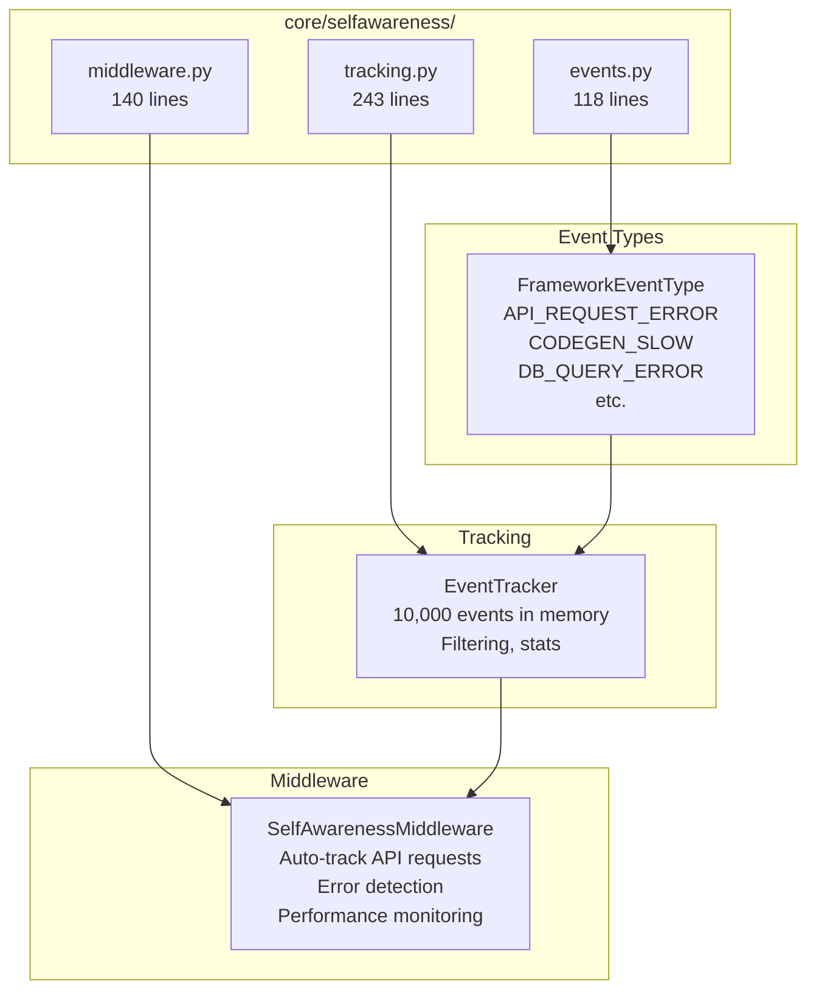
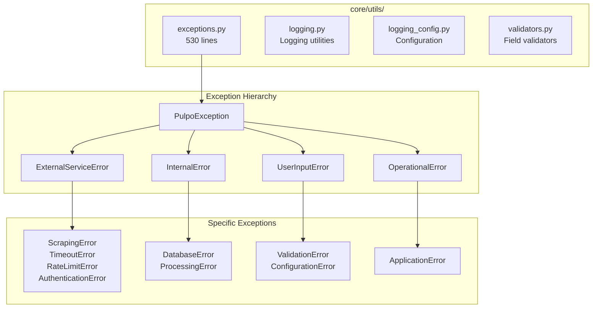
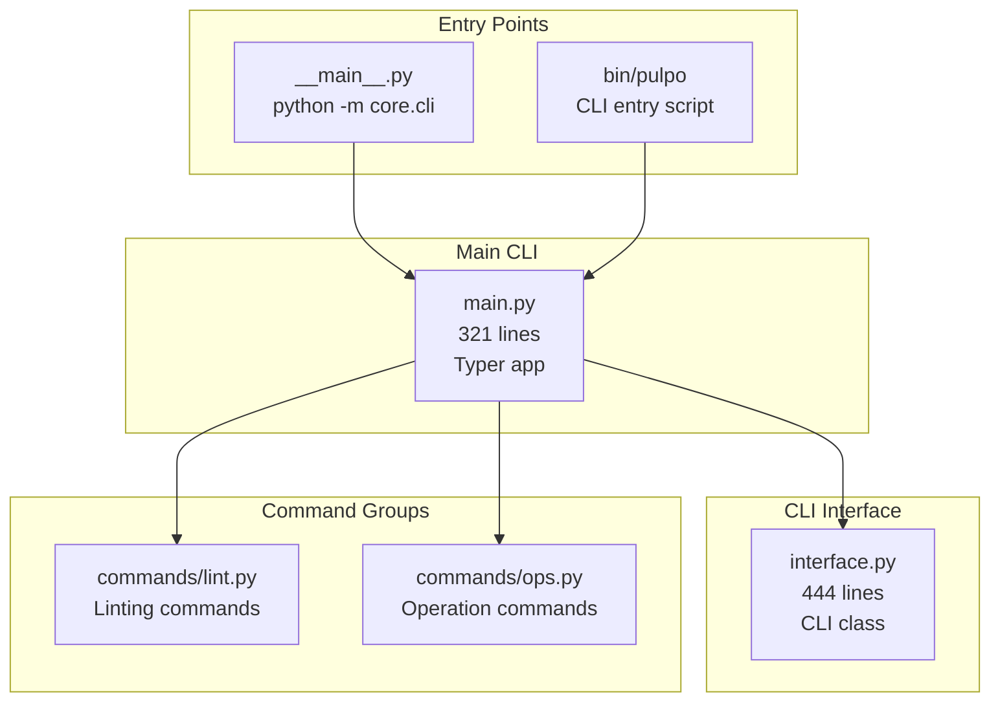
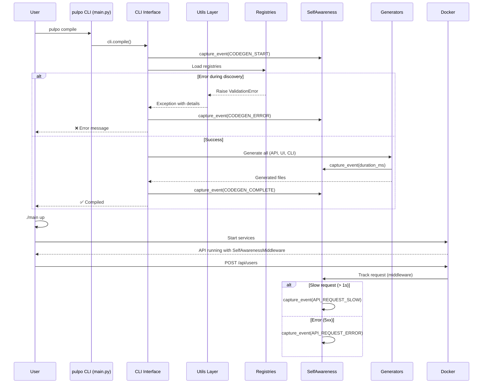

# Complete Code Architecture - All Layers

This document shows **all layers** of the Pulpo framework, including the infrastructure layers that weren't in the initial architecture graph.

## Complete System Overview

```mermaid
graph TB
    subgraph "USER CODE"
        UM[models/*.py<br/>@datamodel]
        UO[operations/*.py<br/>@operation]
    end

    subgraph "INFRASTRUCTURE"
        BASE[base.py<br/>Base classes]
        UTILS[utils/<br/>exceptions, logging, validators]
        SELF[selfawareness/<br/>observability]
    end

    subgraph "PHASE 1: ANALYSIS"
        D[Discovery]
        R[Registries]
        V[Validation]
        G[Graphs]
    end

    subgraph "PHASE 2: GENERATION"
        I[Init]
        C[Compile]
    end

    subgraph "CLI LAYER"
        FCLI[Framework CLI<br/>main.py + interface.py]
        PCLI[Project CLI<br/>Generated ./main]
    end

    subgraph "GENERATED CODE"
        API[generated_api.py<br/>+ selfawareness middleware]
        UI[generated_frontend/]
        WF[prefect_flows.py]
    end

    UM --> D
    UO --> D
    D --> R
    R --> V
    R --> G
    R --> I
    R --> C

    BASE -.optional.-> UM
    BASE -.optional.-> UO
    UTILS --> D
    UTILS --> R
    UTILS --> V
    UTILS --> G
    UTILS --> I
    UTILS --> C

    I --> PCLI
    C --> API
    C --> UI
    C --> WF

    FCLI --> I
    FCLI --> C
    FCLI --> D
    FCLI --> R

    SELF --> API
```

---

## Infrastructure Layer Details

### 1. Base Classes (core/base.py - 41 lines)

```python
class DataModelBase:
    """Optional mixin for Beanie documents."""
    searchable_fields: list[str] = []
    sortable_fields: list[str] = []

    @classmethod
    def relations(cls) -> list[dict]:
        """Return relation hints."""
        return []

    @classmethod
    def indexes(cls) -> list[dict]:
        """Return index definitions."""
        return []

class OperationBase(ABC):
    """Base class for operations."""

    @abstractmethod
    async def run(self, input_model: Any) -> Any:
        """Execute the operation."""
```

**Purpose**: Optional base classes that user models/operations can inherit from.

**Usage**:
```python
# User code (optional)
from core.base import DataModelBase

@datamodel(name="User")
class User(Document, DataModelBase):
    name: str

    @classmethod
    def relations(cls):
        return [{"name": "posts", "target": "Post", "cardinality": "many"}]
```

---

### 2. Observability Layer (core/selfawareness/ - 461 lines)

#### Architecture



#### Events (events.py - 118 lines)

**Event Levels**:
- DEBUG, INFO, WARN, ERROR, CRITICAL

**Event Types** (17 types):
- API: `API_REQUEST_ERROR`, `API_REQUEST_SLOW`, `API_VALIDATION_ERROR`
- Codegen: `CODEGEN_START`, `CODEGEN_COMPLETE`, `CODEGEN_ERROR`, `CODEGEN_SLOW`
- Database: `DB_QUERY_ERROR`, `DB_QUERY_SLOW`, `DB_CONNECTION_ERROR`
- Decorator: `DECORATOR_REGISTRATION_ERROR`, `DECORATOR_VALIDATION_ERROR`
- CLI: `CLI_COMMAND_ERROR`, `CLI_COMMAND_COMPLETE`
- Framework: `FRAMEWORK_INIT_ERROR`, `FRAMEWORK_INIT_COMPLETE`
- Registry: `REGISTRY_ERROR`, `REGISTRY_LOOKUP`

**FrameworkEvent class**:
```python
@dataclass
class FrameworkEvent:
    level: FrameworkEventLevel
    event_type: FrameworkEventType
    module: str  # "api", "codegen", "database", etc.
    message: str
    timestamp: datetime
    duration_ms: int | None = None
    error_details: dict[str, Any]
    metadata: dict[str, Any]
```

#### Tracking (tracking.py - 243 lines)

**EventTracker class**:
- Stores up to 10,000 events in memory (oldest dropped)
- Async operations with lock for thread safety
- Filtering: by module, level, event type
- Queries: `get_errors()`, `get_warnings()`, `get_slow_operations()`
- Statistics: event counts by level/module/type

**Usage**:
```python
from core.selfawareness.tracking import capture_event, get_tracker

# Capture event
await capture_event(
    level=FrameworkEventLevel.WARN,
    event_type=FrameworkEventType.CODEGEN_SLOW,
    module="codegen",
    message="API generation took 2.5s",
    duration_ms=2500
)

# Query events
tracker = get_tracker()
errors = await tracker.get_errors(limit=50)
stats = await tracker.get_stats()
```

#### Middleware (middleware.py - 140 lines)

**SelfAwarenessMiddleware**:
- Automatically tracks all API requests
- Detects errors (4xx, 5xx status codes)
- Detects slow requests (configurable threshold, default 1000ms)
- Captures exceptions

**Usage**:
```python
from core.selfawareness.middleware import add_selfawareness_middleware

app = FastAPI()
add_selfawareness_middleware(app, slow_request_ms=1000)
```

**What it tracks**:
- Request path, method, status code
- Duration in milliseconds
- Errors with exception details
- Slow requests above threshold

---

### 3. Utils Layer (core/utils/ - ~1,400 lines)

#### Architecture



#### Exceptions (exceptions.py - 530 lines)

**Base Exception**:
```python
class PulpoException(Exception, ABC):
    """Base exception for all Pulpo errors."""
    category: str = "general"

    def __init__(self, message: str, details: dict | None = None):
        self.message = message
        self.details = details or {}

    def with_detail(self, key: str, value: Any) -> "PulpoException":
        """Add detail (chainable)."""
        self.details[key] = value
        return self
```

**Exception Categories** (4 abstract bases):
1. **ExternalServiceError**: Scraping, API, network errors
2. **InternalError**: Database, processing errors
3. **UserInputError**: Validation, configuration errors
4. **OperationalError**: Application submission errors

**Specific Exceptions** (9 concrete):
- `ScrapingError`, `TimeoutError`, `RateLimitError`, `AuthenticationError`
- `DatabaseError`, `ProcessingError`
- `ValidationError`, `ConfigurationError`
- `ApplicationError`
- `RetryableError` (special marker for retry logic)

**ExceptionFactory**:
```python
class ExceptionFactory:
    @staticmethod
    def validation_failed(field: str, value: Any, reason: str) -> ValidationError:
        return ValidationError(
            f"Validation failed for field '{field}': {reason}",
            details={"field": field, "value": value, "reason": reason}
        )

    @staticmethod
    def database_connection_failed(uri: str, error: str) -> DatabaseError: ...

    @staticmethod
    def rate_limit_exceeded(limit: int, current: int) -> RateLimitError: ...
```

**Context Managers**:
```python
# Convert exceptions
with handle_errors(ValueError, KeyError, reraise_as=ValidationError):
    int("not a number")

# Retry logic
with retry_on_error(ConnectionError, max_retries=3, on_retry=log_retry):
    fetch_data()
```

**Utility Functions**:
- `is_retryable(error)`: Check if error can be retried
- `get_error_category(error)`: Get error category string

---

### 4. CLI Layer Details (core/cli/ - ~844 lines)

#### Architecture



#### main.py (321 lines) - Typer CLI

**Commands** (20 commands):

| Command | Description | Lines |
|---------|-------------|-------|
| `version` | Show version info | 7 |
| `status` | Show project status | 5 |
| `models` | List registered models | 15 |
| `graph` | Generate relationship graphs | 20 |
| `flows` | Generate operation flow diagrams | 20 |
| `docs` | Generate documentation | 8 |
| `compile` | Compile all artifacts | 8 |
| `api` | Start FastAPI server | 12 |
| `init` | Initialize database & services | 12 |
| `up` | Start all services | 12 |
| `down` | Stop all services | 12 |
| `prefect` | Manage Prefect server | 10 |
| `db` | Manage database service | 10 |
| `clean` | Remove generated artifacts | 10 |
| `ui` | Launch web UI | 20 |
| `help` | Show framework documentation | 30 |
| `ops` | Command group (from commands/ops.py) | - |
| `lint` | Command group (from commands/lint.py) | - |

**Technology**:
- **Typer**: Modern CLI framework (type hints)
- **Rich**: Beautiful terminal output
- Delegates to `CLI` class from `interface.py`

**Example**:
```python
@app.command()
def compile():
    """Compile all artifacts to run_cache."""
    cli = get_cli()
    console.print("[cyan]Compiling...[/cyan]")
    cache_dir = cli.compile()
    console.print(f"[green]✓[/green] Compiled to {cache_dir}")
```

---

## Complete Layer Breakdown

### Summary Table

| Layer | Purpose | Files | Lines | Key Responsibilities |
|-------|---------|-------|-------|---------------------|
| **Base** | Optional mixins | 1 | 41 | DataModelBase, OperationBase |
| **Utils** | Infrastructure | 4 | ~1,400 | Exceptions, logging, validators |
| **Observability** | Self-awareness | 3 | 461 | Event tracking, middleware |
| **Analysis** | Phase 1 | 10 | 2,060 | Discovery, registries, validation, graphs |
| **Generation** | Phase 2 | 8 | 3,250 | Init, compile, code generators |
| **Config** | Configuration | 3 | 550 | Settings, user config, manager |
| **CLI** | User interface | 5+ | ~844 | Framework commands, Typer app |
| **Total** | **All layers** | **34+** | **~8,600** | **Complete framework** |

---

## Data Flow: Complete Picture



---

## Missing from Initial Graph

The initial architecture graph (05_Code_Architecture_Graph.md) was missing:

### Missing Modules (~2,300 lines)

1. **core/base.py** (41 lines)
   - Purpose: Optional base classes
   - Impact: Users can extend for relations/indexes

2. **core/selfawareness/** (461 lines)
   - Purpose: Observability and monitoring
   - Impact: Production insights, error tracking, performance monitoring

3. **core/cli/main.py** (321 lines)
   - Purpose: Typer-based CLI entry point
   - Impact: Beautiful CLI with Rich output

4. **core/cli/commands/** (~100 lines)
   - Purpose: Command groups (lint, ops)
   - Impact: Organized command structure

5. **core/utils/** (~1,400 lines)
   - Purpose: Infrastructure utilities
   - Impact: Exception handling, logging, validation

### Why These Matter

1. **Observability** is critical for production:
   - Track API errors automatically
   - Identify slow operations
   - Debug issues with event history

2. **Exception hierarchy** provides clean error handling:
   - Structured exception types
   - Factory methods for common errors
   - Context managers for retry logic

3. **CLI main.py** gives professional UX:
   - Rich terminal output (colors, formatting)
   - Typer for modern CLI (vs argparse)
   - Better help messages

4. **Base classes** enable advanced features:
   - Relations between models
   - Custom index definitions
   - Searchable/sortable fields

---

## Scalability: Complete Picture

### With All Layers

**Performance**:
- Discovery: O(n) files × discovery
- Validation: O(n) models/ops × validators
- Graph building: O(v + e) DAG construction
- Generation: O(n) models/ops × generators
- **Event tracking**: O(1) capture, O(n) queries

**Resource Usage**:
- EventTracker: ~10,000 events × ~1KB = ~10MB memory
- Exception handling: Minimal overhead
- CLI: Fast (Typer startup ~50ms)

**Extension Points**:
1. Add custom generators → compile/ directory
2. Add custom validators → validation/ directory
3. Add custom exceptions → inherit from PulpoException
4. Add custom CLI commands → commands/ directory
5. Add custom event types → FrameworkEventType enum
6. Add custom middleware → SelfAwarenessMiddleware

---

## Next Steps

1. **For Production**: Enable observability
   ```python
   # In generated_api.py
   from core.selfawareness.middleware import add_selfawareness_middleware
   add_selfawareness_middleware(app, slow_request_ms=500)
   ```

2. **For Error Handling**: Use exception hierarchy
   ```python
   from core.utils.exceptions import ValidationError, ExceptionFactory
   raise ExceptionFactory.validation_failed("email", value, "invalid format")
   ```

3. **For CLI**: Add custom commands
   ```python
   # In commands/mycmd.py
   @app.command()
   def mycmd():
       """My custom command."""
       pass
   ```

4. **For Monitoring**: Query event tracker
   ```python
   from core.selfawareness.tracking import get_tracker
   tracker = get_tracker()
   errors = await tracker.get_errors(limit=100)
   stats = await tracker.get_stats()
   ```

---

## References

- [Architecture Graph (Initial)](05_Code_Architecture_Graph.md) - Phase 1 & 2 only
- [CLI Architecture](04_CLI_Architecture.md) - Framework vs Project CLI
- [Architecture Overview](03_Architecture.md) - High-level design
