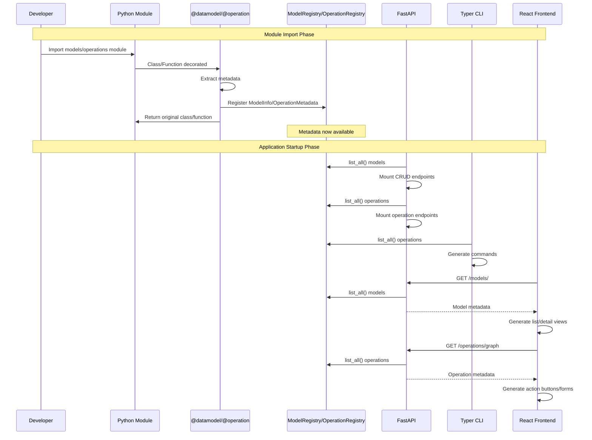
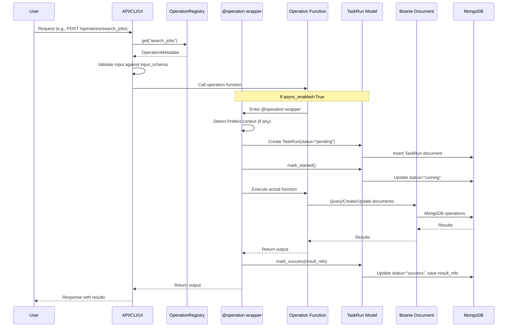

# Architecture Overview

**Version:** 1.0.0
**Date:** 2025-10-15
**Status:** Core Minimal Implementation

## Table of Contents

1. [Overview](#overview)
2. [Component Diagram](#component-diagram)
3. [Registration Flow](#registration-flow)
4. [Execution Flow](#execution-flow)
5. [Data Flow](#data-flow)
6. [Layer Responsibilities](#layer-responsibilities)
7. [Design Principles](#design-principles)
8. [Key Decisions](#key-decisions)
9. [Extension Points](#extension-points)

## Overview

### Metadata-Driven Architecture Philosophy

The Jobhunter system uses a **metadata-driven architecture** where:

1. **Define Once**: Models and operations are defined once using decorators (`@datamodel`, `@operation`)
2. **Auto-Generate Surfaces**: API endpoints, CLI commands, and UI views are automatically generated from metadata
3. **Single Source of Truth**: All metadata lives in central registries (`ModelRegistry`, `OperationRegistry`)
4. **Type-Safe**: Full type safety through Pydantic models for inputs, outputs, and data models

**Core Principle**: Write business logic → Get full-stack application automatically.

### The Full Stack

```
DataExplorer UI (React + Refine)
    ↓
API (FastAPI)
    ↓
Core (Decorators + Registries)
    ↓
Database (MongoDB + Beanie)

Orchestration (Prefect) - Optional
    Flows → Tasks → Operations
```

### What This Means

```python
# You write this:
@datamodel(name="Job", tags=["jobs"])
class Job(Document):
    title: str
    company: str

@operation(name="search_jobs", category="jobs", ...)
async def search_jobs(input: SearchJobsInput) -> SearchJobsOutput:
    return await Job.find(...).to_list()

# You get automatically:
# - GET/POST/PUT/DELETE /api/models/Job/         (FastAPI - CRUD)
# - POST /api/operations/search_jobs/            (FastAPI - Operation endpoint)
# - DataExplorer view with list/detail/edit      (React + Refine)
# - TaskRun audit trail for every execution      (MongoDB)
```

### Orchestration (Optional)

```python
# Optionally wrap in Prefect for complex workflows:
@task(retries=3)
async def search_jobs_task(input):
    return await search_jobs(input)  # Wraps @operation

@flow
async def daily_job_search():
    # Multi-step workflow with retry/scheduling/monitoring
    result = await search_jobs_task(...)
    # Operation detects Prefect context, links TaskRun to flow
```

## Component Diagram

```mermaid
graph TB
    subgraph "User Interfaces"
        API[FastAPI Application]
        CLI[Typer CLI]
        UI[React + Refine Frontend]
    end

    subgraph "Core Layer"
        Decorators[@datamodel<br/>@operation]
        ModelReg[ModelRegistry]
        OpReg[OperationRegistry]
        Renderers[Renderers<br/>API/CLI Contracts]
    end

    subgraph "Business Logic"
        Models[Beanie Documents<br/>Job, User, etc.]
        Operations[Operations<br/>search_jobs, etc.]
    end

    subgraph "Data Layer"
        Beanie[Beanie ODM]
        Motor[Motor Driver]
        MongoDB[(MongoDB)]
        TaskRun[TaskRun<br/>Audit Trail]
    end

    subgraph "Orchestration"
        Prefect[Prefect<br/>Workflows]
        Flows[Flows]
        Tasks[Tasks]
    end

    %% Define relationships
    Models -->|decorated by| Decorators
    Operations -->|decorated by| Decorators
    Decorators -->|register metadata| ModelReg
    Decorators -->|register metadata| OpReg

    API -->|reads| ModelReg
    API -->|reads| OpReg
    CLI -->|reads| OpReg
    UI -->|reads| ModelReg
    UI -->|reads| OpReg

    API -->|calls| Operations
    CLI -->|calls| Operations
    UI -->|calls via| API

    Operations -->|uses| Models
    Operations -->|creates| TaskRun

    Models -->|inherits| Beanie
    TaskRun -->|inherits| Beanie
    Beanie -->|uses| Motor
    Motor -->|connects| MongoDB

    Flows -->|contains| Tasks
    Tasks -->|wrap| Operations
    Operations -->|detects| Prefect

    style Decorators fill:#4a90e2
    style ModelReg fill:#4a90e2
    style OpReg fill:#4a90e2
    style TaskRun fill:#f39c12
    style Prefect fill:#9b59b6
```

## Registration Flow



### Step-by-Step Registration

1. **Module Import**: When a Python module is imported:
   ```python
   from models.test_model import TestItem  # Triggers registration (user project)
   ```

2. **Decorator Execution**: `@datamodel` or `@operation` decorator runs:
   ```python
   @datamodel(name="TestItem", tags=["test"])
   class TestItem(Document):
       ...
   # → Creates ModelInfo → Stores in ModelRegistry._models
   ```

3. **Metadata Storage**: Registries hold all metadata:
   ```python
   ModelRegistry._models = {
       "TestItem": ModelInfo(name="TestItem", document_cls=TestItem, ...),
       "Job": ModelInfo(name="Job", document_cls=Job, ...),
   }

   OperationRegistry._ops = {
       "create_test_item": OperationMetadata(name="create_test_item", ...),
       "search_jobs": OperationMetadata(name="search_jobs", ...),
   }
   ```

4. **Surface Generation**: Surfaces read registries and generate:
   - API: CRUD + operation endpoints
   - CLI: Commands for each operation
   - UI: Tables, forms, action buttons

## Execution Flow



### Execution Steps Explained

1. **Request Received**: User makes request via API/CLI/UI
   ```bash
   POST /operations/create_test_item
   Body: {"name": "Test", "value": 42}
   ```

2. **Metadata Lookup**: Surface finds operation metadata
   ```python
   meta = OperationRegistry.get("create_test_item")
   # → OperationMetadata(input_schema=CreateTestItemInput, ...)
   ```

3. **Input Validation**: Validate against Pydantic schema
   ```python
   input_data = CreateTestItemInput(**request.json())
   # → Validates name, value fields
   ```

4. **Decorator Wrapping**: If `async_enabled=True`, decorator creates TaskRun
   ```python
   @operation(..., async_enabled=True)
   async def create_test_item(input):
       # Wrapper creates TaskRun BEFORE function runs
       ...
   ```

5. **TaskRun Creation**: Audit record created
   ```python
   taskrun = TaskRun(
       operation_name="create_test_item",
       status="pending",
       input_dump={"name": "Test", "value": 42},
       actor=Actor(user_id="123", channel="api"),
       orchestrated=False,  # or True if in Prefect flow
   )
   await taskrun.insert()
   ```

6. **Operation Execution**: Business logic runs
   ```python
   item = TestItem(name=input.name, value=input.value)
   await item.insert()
   ```

7. **TaskRun Update**: Success/failure recorded
   ```python
   taskrun.mark_success(
       result_refs=[{"collection": "test_items", "document_id": str(item.id)}]
   )
   await taskrun.save()
   ```

8. **Response**: Result returned to user
   ```python
   return {"success": True, "item_id": "..."}
   ```

## Data Flow

```mermaid
flowchart LR
    subgraph "Input"
        User[User Request]
        Input[Pydantic Input Model]
    end

    subgraph "Processing"
        Validation[Input Validation]
        Operation[Operation Function]
        BusinessLogic[Business Logic]
    end

    subgraph "Data Access"
        Beanie[Beanie Query/CRUD]
        Models[Document Models]
    end

    subgraph "Storage"
        MongoDB[(MongoDB)]
    end

    subgraph "Observability"
        TaskRun[TaskRun Audit Log]
    end

    subgraph "Output"
        Result[Pydantic Output Model]
        Response[HTTP/CLI Response]
    end

    User -->|JSON/CLI Args| Input
    Input -->|Validate| Validation
    Validation -->|Parse| Operation
    Operation -->|Execute| BusinessLogic
    BusinessLogic -->|Query/Create| Beanie
    Beanie -->|Interact| Models
    Models -->|Read/Write| MongoDB
    MongoDB -->|Results| Models
    Models -->|Return| Beanie
    Beanie -->|Data| BusinessLogic
    BusinessLogic -->|Output| Result
    Result -->|Serialize| Response
    Response -->|Return| User

    Operation -.->|Create/Update| TaskRun
    TaskRun -.->|Store| MongoDB

    style Input fill:#3498db
    style Result fill:#2ecc71
    style TaskRun fill:#f39c12
    style MongoDB fill:#95a5a6
```

### Data Flow Example: Search Jobs

```
1. User Input:
   POST /operations/search_jobs
   {"keywords": ["python"], "location": "Berlin"}

2. Validation:
   SearchJobsInput.model_validate(...)
   → SearchJobsInput(keywords=["python"], location="Berlin")

3. Operation Execution:
   @operation wrapper creates TaskRun
   → TaskRun(operation_name="search_jobs", status="running")

   search_jobs() function runs:
   → jobs = await Job.find(Job.location == "Berlin").to_list()
   → Filter by keywords

4. Beanie Query:
   Job.find(...) → MongoDB query
   → Results: [Job(...), Job(...), ...]

5. TaskRun Update:
   taskrun.mark_success(result_refs=[...])
   → TaskRun(status="success", result_refs=[{...}])

6. Output:
   SearchJobsOutput(jobs=[...], count=5)
   → JSON response to user
```

## Layer Responsibilities

### 1. Core Layer (`core/core/`)

**Purpose**: Metadata management and registry infrastructure

**Components**:
- `decorators.py`: `@datamodel` and `@operation` decorators
- `registries.py`: `ModelRegistry` and `OperationRegistry` storage
- `base.py`: Optional base classes (`DataModelBase`, `OperationBase`)
- `codegen.py`: Code generation engine
- `api.py`: FastAPI integration

**Responsibilities**:
- Capture metadata from decorators
- Store metadata in registries
- Provide query interface for metadata
- Generate API/CLI/UI code

**Does NOT**:
- Contain business logic
- Access database directly

### 2. External System Layer (User Project: `models/`, `operations/`)

**Purpose**: User's business logic - models and operations (decorated code)

**Location**: In user project directories (NOT in core):
- `models/`: User's Beanie Document classes decorated with `@datamodel`
- `operations/`: User's async functions decorated with `@operation`
- Optional: `src/models/`, `src/operations/` (configurable in `.jobhunter.yml`)

**Interaction**: Via CLI commands (user works with their business logic)

**Key Pattern**:
```python
# models/job.py (in user project)
@datamodel(name="Job", tags=["jobs"], ui={...})
class Job(Document):
    title: str
    company: str

    class Settings:
        name = "jobs"
        indexes = [...]
```

**Critical**: This layer is completely independent from core implementation. Core discovers it via AST-based scanning (no imports).

### 3. Generated Layer (`.run_cache/` - Auto-generated, Never Edited)

**Purpose**: Auto-generated code from decorators

**Location**: `.run_cache/` directory in user project
**Interaction**: NONE - Read-only, regenerated with `make compile`

**Generated artifacts**:
- `generated_api.py`: FastAPI application with CRUD and operation endpoints
- `generated_frontend/`: React admin UI with Refine.dev
- `cli/`: Typer CLI commands
- `Dockerfile`, `docker-compose.yml`: Container configuration
- `core_docs/`: Documentation and dependency graphs

**Critical Rule**: These files are **NEVER manually edited**. Any fix must be done in:
- Core layer (for generator bugs) → Test on `core-minimal` branch
- External system layer (for business logic bugs) → Fix in `models/` or `operations/`

**Operation Example** (defined in external system, auto-discovered):
```python
# operations/job_ops.py (in user project)
@operation(name="create_job", category="jobs", ...)
async def create_job(input: CreateJobInput) -> CreateJobOutput:
    job = Job(title=input.title, company=input.company)
    await job.insert()
    return CreateJobOutput(success=True, job_id=str(job.id))
```

### 4. Orchestration Layer (Optional: Prefect in User Project)

**Purpose**: Complex multi-step workflows

**Location**: User project (e.g., `workflows/` or `src/workflows/`)

**Components**:
- `flows.py`: Prefect flows (multi-step workflows)
- `tasks.py`: Prefect tasks (wrappers for operations)

**Responsibilities**:
- Orchestrate multiple operations
- Handle retries, scheduling, monitoring
- Provide workflow-level observability

**The Three Execution Layers**:

```
┌─────────────────────────────────────────────────┐
│ Layer 3: Prefect Flows (@flow)                  │
│ - Compose multiple tasks into workflows         │
│ - Define execution order                        │
│ - Schedule periodic runs                        │
│ - Example: daily_job_hunt_flow()                │
└──────────────────────┬──────────────────────────┘
                       │ calls
┌──────────────────────▼──────────────────────────┐
│ Layer 2: Prefect Tasks (@task)                  │
│ - Wrap operations for orchestration             │
│ - Add retry logic, dependencies                 │
│ - Link TaskRuns to Prefect runs                 │
│ - Example: scrape_jobs_task()                   │
└──────────────────────┬──────────────────────────┘
                       │ calls
┌──────────────────────▼──────────────────────────┐
│ Layer 1: Operations (@operation)                │
│ - Core business logic                           │
│ - Can run standalone OR orchestrated            │
│ - Always create TaskRun audit records           │
│ - Example: scrape_jobs()                        │
└─────────────────────────────────────────────────┘
```

**When to Use Each Layer**:
- **Operations only**: Simple single tasks, API calls, CLI commands
- **Tasks**: Need retries, dependencies, or workflow composition
- **Flows**: Multi-step workflows, scheduled runs, complex orchestration

**Key Pattern**:
```python
# Layer 1: Operation (Core business logic)
@operation(name="scrape_jobs", async_enabled=True, ...)
async def scrape_jobs(input: ScrapeJobsInput) -> ScrapeJobsOutput:
    """Core scraping logic - can run standalone or orchestrated."""
    # Business logic here
    pass

# Layer 2: Task (Orchestration wrapper)
@task(name="scrape_task", retries=3)
async def scrape_task(keywords: str):
    """Prefect task wrapping scrape_jobs operation."""
    return await scrape_jobs(ScrapeJobsInput(keywords=keywords))

# Layer 3: Flow (Complete workflow)
@flow(name="daily_job_hunt")
async def daily_job_hunt_flow():
    """Multi-step workflow: scrape → process → apply."""
    scrape_result = await scrape_task("python")
    process_result = await process_task(scrape_result.job_ids)
    return {"jobs": len(scrape_result.job_ids)}
```

### 5. Observability Layer (TaskRun)

**Purpose**: Audit trail for all operations

**Components**:
- `TaskRun` model: Stores execution metadata
- Automatic creation via `@operation` decorator

**Responsibilities**:
- Record who/what/when for every operation
- Store input/output snapshots
- Track errors and tracebacks
- Link to Prefect flows (if orchestrated)
- Enable replay, debugging, analytics

**Key Fields**:
```python
TaskRun(
    operation_name="search_jobs",
    actor=Actor(user_id="123", channel="api"),
    status="success",
    input_dump={"keywords": ["python"]},
    result_refs=[{"collection": "jobs", "document_id": "..."}],
    orchestrated=True,
    prefect_flow_run_id="...",
    duration_ms=1500,
)
```

## Design Principles

### 1. Metadata-Driven, Not Code-Generated

**What**: Decorators capture metadata at import time, surfaces consume metadata at runtime

**Why**:
- No code generation step
- No build process
- Changes to models/operations immediately reflected
- Easy to inspect metadata at runtime

**How**:
```python
# Metadata captured at import
@datamodel(name="Job", ...)
class Job(Document): ...

# Metadata consumed at runtime
for model_info in ModelRegistry.list_all():
    create_api_routes(model_info)
```

### 2. Type-Safe End-to-End

**What**: Full type hints from database to API to UI

**Why**:
- Catch errors at development time
- IDE autocomplete
- Self-documenting code
- Safe refactoring

**How**:
```python
# Input/output schemas are Pydantic models
class CreateJobInput(BaseModel):
    title: str
    company: str

# Beanie documents are Pydantic models
class Job(Document):
    title: str
    company: str

# Type checker validates this
async def create_job(input: CreateJobInput) -> CreateJobOutput:
    job = Job(title=input.title, company=input.company)
    await job.insert()
    return CreateJobOutput(success=True, job_id=str(job.id))
```

### 3. No Abstraction Without Purpose

**What**: Don't add layers unless they solve a real problem

**Why**:
- Simpler code
- Easier to understand
- Fewer places to look
- Faster development

**Examples**:
- ❌ **No repository pattern**: Beanie already provides query methods
- ❌ **No service layer**: Operations are the service layer
- ✅ **Yes registries**: Enable metadata-driven generation
- ✅ **Yes decorators**: Single place to define metadata

### 4. Async-First

**What**: All operations are async, all I/O is non-blocking

**Why**:
- FastAPI is async
- Beanie/Motor are async
- Better performance under load
- Matches Python's direction

**How**:
```python
@operation(name="search_jobs", async_enabled=True)
async def search_jobs(input: SearchJobsInput) -> SearchJobsOutput:
    jobs = await Job.find(...).to_list()  # Non-blocking I/O
    return SearchJobsOutput(jobs=jobs)
```

### 5. Define Once, Use Everywhere

**What**: Write model/operation once, get API/CLI/UI automatically

**Why**:
- No duplication
- Single source of truth
- Changes propagate automatically
- Less maintenance

**Example**:
```python
# Define once
@datamodel(name="Job", ui={"icon": "💼", ...})
class Job(Document):
    title: str

# Get automatically
# - API: GET/POST/PUT/DELETE /models/Job/
# - CLI: jobhunter models list Job
# - UI: Job list view with 💼 icon
```

### 6. Observability by Default

**What**: Every operation creates a TaskRun audit record

**Why**:
- Always know what happened
- Debug production issues
- Replay failed operations
- Analytics and reporting

**How**: `@operation` decorator automatically creates/updates TaskRun

## Key Decisions

### 1. Why No Repository Pattern?

**Decision**: Use Beanie models directly, no repository layer

**Rationale**:
- Beanie already provides: `find()`, `find_one()`, `insert()`, `save()`, `delete()`, `count()`
- Repository pattern adds abstraction without value
- More code to maintain
- Circular import risks

**Example**:
```python
# ❌ With repository (unnecessary)
class JobRepository:
    async def find_by_company(self, company: str) -> list[Job]:
        return await Job.find(Job.company == company).to_list()

jobs = await JobRepository().find_by_company("Acme")

# ✅ Without repository (use Beanie directly)
jobs = await Job.find(Job.company == "Acme").to_list()
```

**When you might need repositories**:
- Complex queries spanning multiple models → Use model class methods
- Need to mock database for tests → Use test database or mocks
- Enforcing access control → Add permission checks in operations

### 2. Why Decorators?

**Decision**: Use `@datamodel` and `@operation` decorators for metadata

**Rationale**:
- Single place to define model/operation metadata
- Pythonic (decorators are standard)
- No separate config files
- Metadata lives next to code
- Type-safe (metadata class is type-checked)

**Alternative considered**: Separate config files (YAML/JSON)
- ❌ Harder to keep in sync
- ❌ No type checking
- ❌ Duplication

### 3. Why Central Registries?

**Decision**: `ModelRegistry` and `OperationRegistry` store all metadata

**Rationale**:
- Single source of truth
- Easy to query ("show me all operations in category X")
- Surfaces can discover models/operations at runtime
- No need to pass metadata around

**Pattern**:
```python
# Registration happens at import time
@datamodel(name="Job", ...)
class Job(Document): ...
# → Stores in ModelRegistry._models["Job"]

# Consumption happens at runtime
for model_info in ModelRegistry.list_all():
    mount_crud_routes(model_info)
```

### 4. Why Beanie?

**Decision**: Use Beanie ODM instead of raw Motor or SQLAlchemy

**Rationale**:
- **Async-first**: Built for asyncio (FastAPI, Motor)
- **Pydantic integration**: Models are Pydantic models
- **Type-safe**: Full type hints
- **Expressive queries**: `Job.find(Job.company == "Acme")`
- **No migrations needed**: Schema changes are gradual (add optional fields)
- **Index management**: Declare indexes in code

**Alternative considered**: SQLAlchemy + PostgreSQL
- ❌ Migrations more complex
- ❌ Async support less mature
- ❌ Rigid schemas
- ✅ Better for relational data (we use MongoDB for flexibility)

### 5. Why TaskRun for Observability?

**Decision**: Automatically create TaskRun for every operation execution

**Rationale**:
- Always know what happened (who, when, what, why)
- Debug production issues (see exact inputs)
- Replay failed operations (use saved input_dump)
- Analytics (success rates, durations)
- Prefect integration (link to flows)

**Cost**: One extra DB write per operation (minimal overhead)

**Benefit**: Complete audit trail without manual logging

### 6. Why Prefect Integration Optional?

**Decision**: Operations work standalone OR in Prefect flows

**Rationale**:
- **Flexibility**: Simple operations don't need orchestration
- **Simplicity**: API/CLI can call operations directly
- **Power**: Complex workflows use Prefect for retries, scheduling
- **Detection**: `@operation` decorator auto-detects Prefect context

**Pattern**:
```python
# Direct call (API/CLI)
result = await create_test_item(input)
# → TaskRun(orchestrated=False)

# Prefect flow call
@flow
async def my_flow():
    result = await create_test_item_task(input)
    # → TaskRun(orchestrated=True, prefect_flow_run_id="...")
```

## Extension Points

### 1. Adding a New Model

**Steps**:
1. Create Beanie Document class
2. Decorate with `@datamodel`
3. Import module (triggers registration)

**Example**:
```python
# models/application.py (in user project)
from beanie import Document
from pydantic import Field
from core.decorators import datamodel

@datamodel(
    name="Application",
    description="Job application",
    tags=["applications"],
    ui={
        "icon": "📄",
        "primary_field": "job_title",
        "list_fields": ["job_title", "company", "status", "applied_at"],
    }
)
class Application(Document):
    job_id: str = Field(..., description="Reference to Job")
    job_title: str = Field(..., description="Job title")
    company: str = Field(..., description="Company name")
    status: str = Field(default="draft", description="Application status")
    applied_at: datetime | None = Field(None, description="Application date")

    class Settings:
        name = "applications"
```

**Result**: Automatically get:
- CRUD API endpoints: `/models/Application/`
- Frontend views: Application list, detail, create form
- TaskRun tracking for all operations

### 2. Adding a New Operation

**Steps**:
1. Define input/output Pydantic models
2. Write async function with business logic
3. Decorate with `@operation`
4. Import module (triggers registration)

**Example**:
```python
# operations/application_ops.py (in user project)
from pydantic import BaseModel, Field
from core.decorators import operation
from models.application import Application  # Import from user's models

class SubmitApplicationInput(BaseModel):
    job_id: str
    cover_letter: str

class SubmitApplicationOutput(BaseModel):
    success: bool
    application_id: str | None

@operation(
    name="submit_application",
    description="Submit job application",
    category="applications",
    inputs=SubmitApplicationInput,
    outputs=SubmitApplicationOutput,
    tags=["application", "submit"],
    models_in=["Job"],
    models_out=["Application"],
    async_enabled=True,  # Enable TaskRun tracking
)
async def submit_application(input: SubmitApplicationInput) -> SubmitApplicationOutput:
    # Validate job exists
    job = await Job.get(input.job_id)
    if not job:
        return SubmitApplicationOutput(success=False, application_id=None)

    # Create application
    app = Application(
        job_id=input.job_id,
        job_title=job.title,
        company=job.company,
        status="submitted",
        applied_at=datetime.utcnow(),
    )
    await app.insert()

    return SubmitApplicationOutput(success=True, application_id=str(app.id))
```

**Result**: Automatically get:
- API endpoint: `POST /operations/submit_application/`
- CLI command: `jobhunter ops submit_application --job-id ... --cover-letter ...`
- Frontend action button: "Submit Application" form
- TaskRun audit record for each execution

### 3. Adding a New Surface (e.g., Telegram Bot)

**Steps**:
1. Read `OperationRegistry` to discover operations
2. Create bot commands for each operation
3. Parse user input → Create input model
4. Call operation function
5. Format output → Send to user

**Example**:
```python
# src/surfaces/telegram_bot.py
from telegram import Update
from telegram.ext import CommandHandler
from core.registries import OperationRegistry
from core.examples.operations.application_ops import submit_application, SubmitApplicationInput

async def handle_submit_application(update: Update, context):
    # Parse Telegram command
    job_id = context.args[0]
    cover_letter = " ".join(context.args[1:])

    # Create input model
    input_data = SubmitApplicationInput(
        job_id=job_id,
        cover_letter=cover_letter,
    )

    # Call operation
    result = await submit_application(input_data)

    # Send response
    if result.success:
        await update.message.reply_text(f"✅ Application submitted! ID: {result.application_id}")
    else:
        await update.message.reply_text("❌ Failed to submit application")

# Register command
application.add_handler(CommandHandler("submit_application", handle_submit_application))
```

**Benefits**:
- Reuse existing operations
- TaskRun tracking works automatically
- Same business logic across all surfaces

### 4. Adding Complex Workflow (Prefect Flow)

**Steps**:
1. Create Prefect tasks that wrap operations
2. Create Prefect flow that orchestrates tasks
3. Deploy flow to Prefect server

**Example**:
```python
# workflows/flows.py
from prefect import flow, task
from core.examples.operations.scraping_ops import scrape_jobs, ScrapeJobsInput
from core.examples.operations.application_ops import submit_application, SubmitApplicationInput

@task(name="scrape_jobs_task", retries=3)
async def scrape_jobs_task(keywords: str):
    input_data = ScrapeJobsInput(keywords=keywords, limit=50)
    return await scrape_jobs(input_data)

@task(name="auto_apply_task", retries=2)
async def auto_apply_task(job_id: str, cover_letter: str):
    input_data = SubmitApplicationInput(job_id=job_id, cover_letter=cover_letter)
    return await submit_application(input_data)

@flow(name="auto_apply_flow")
async def auto_apply_flow(keywords: str):
    """Scrape jobs and auto-apply to high matches."""

    # Step 1: Scrape jobs
    scrape_result = await scrape_jobs_task(keywords=keywords)

    # Step 2: Filter high matches (example logic)
    high_match_jobs = [
        job_id for job_id in scrape_result.job_ids
        # Add matching logic here
    ]

    # Step 3: Apply to each high match
    applications = []
    for job_id in high_match_jobs:
        result = await auto_apply_task(
            job_id=job_id,
            cover_letter="I am interested in this position...",
        )
        applications.append(result)

    return {"jobs_scraped": len(scrape_result.job_ids), "applications": len(applications)}
```

**Result**:
- Multi-step workflow with retries
- Each operation creates TaskRun with `orchestrated=True`
- TaskRuns linked to Prefect flow via `prefect_flow_run_id`
- Prefect UI shows flow visualization
- Can schedule daily runs, monitor failures

### 5. Adding UI Field Extensions (Source-Specific)

**Steps**:
1. Add `source_fields` dict to model
2. Store platform-specific data in dict
3. Register UI hints for each source

**Example**:
```python
# Model with extension bag
@datamodel(name="Job", ...)
class Job(Document):
    title: str
    company: str

    # Extension bag for platform-specific data
    source_fields: dict[str, dict[str, Any]] = Field(default_factory=dict)
    # Example: {"stepstone": {"workload": "full-time", "salary": "50-70k"}}

    def get_source_field(self, field_name: str, source: str = "stepstone") -> Any:
        return self.source_fields.get(source, {}).get(field_name)

    def set_source_field(self, field_name: str, value: Any, source: str = "stepstone"):
        if source not in self.source_fields:
            self.source_fields[source] = {}
        self.source_fields[source][field_name] = value

# UI hints for source-specific fields
stepstone_ui_hints = {
    "workload": {"label": "Arbeitslast", "widget": "select"},
    "salary": {"label": "Gehalt", "widget": "text"},
}

# Frontend merges these hints at runtime
```

**Benefits**:
- Core model stays clean
- Each adapter can add its own fields
- No schema changes needed
- Forward-compatible

---

## Summary

The Jobhunter architecture is built on these core concepts:

1. **Metadata-Driven**: Decorators capture metadata → Registries store metadata → Surfaces consume metadata
2. **Type-Safe**: Pydantic models everywhere (inputs, outputs, documents)
3. **Async-First**: Non-blocking I/O throughout the stack
4. **No Abstraction Without Purpose**: Beanie provides everything, no repositories needed
5. **Observability by Default**: TaskRun tracks every operation execution
6. **Flexible Orchestration**: Operations work standalone or in Prefect flows

**You write**:
- Beanie Document models decorated with `@datamodel`
- Async functions decorated with `@operation`

**You get**:
- Full CRUD API
- CLI commands
- Frontend views and actions
- Complete audit trail
- Prefect orchestration support

**Next steps**:
- Read [HOW_CORE_WORKS.md](./HOW_CORE_WORKS.md) for detailed examples
- Read [ORCHESTRATION.md](./ORCHESTRATION.md) for Prefect workflow guide
- Explore demo project models and operations (use `make demo` to unpack test-project-demo)
- Add your first model and operation following the extension patterns above
