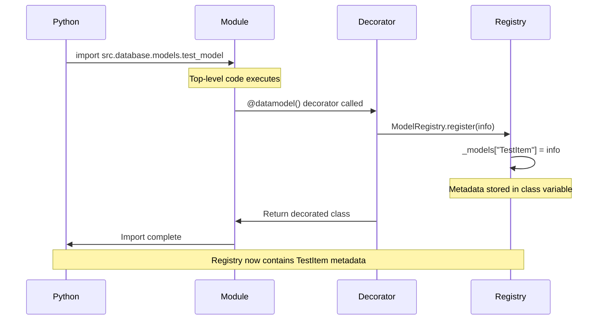
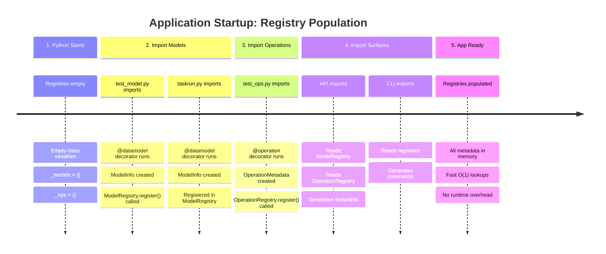
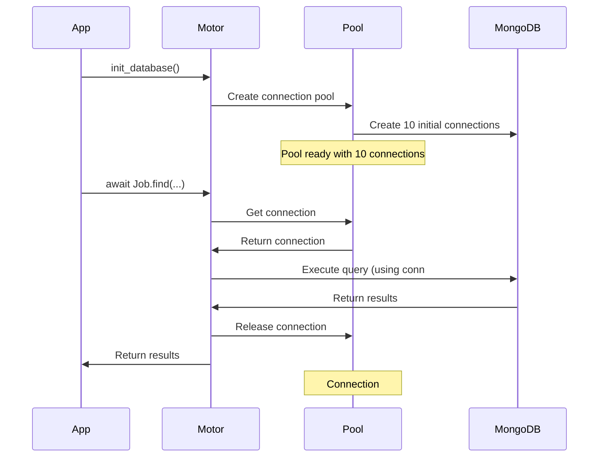
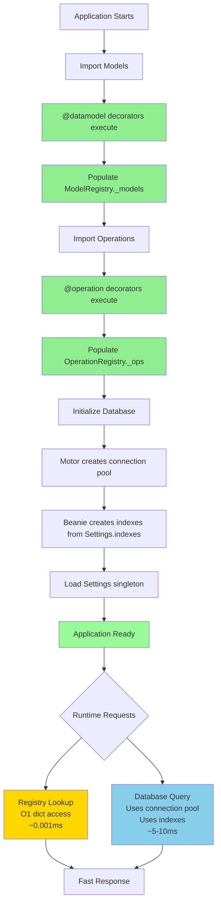

# Caching and Optimization

**Core Principle:** Performance through metadata precomputation and intelligent caching

This document explains how the JobHunter AI core architecture achieves high performance through registry "precompilation" (metadata computed at import time), in-memory caching, connection pooling, and query optimization.

## Overview: Performance Through Metadata Precomputation

The core architecture optimizes performance by:

1. **Import-time registry population** - Decorators execute when modules are imported, not at runtime
2. **In-memory metadata storage** - Registries use class variables (fast dictionary lookups)
3. **Connection pooling** - Motor (MongoDB driver) maintains connection pool
4. **Index optimization** - Strategic database indexes for common queries
5. **Singleton patterns** - Configuration and database clients initialized once

**Key insight:** Most "work" happens once at startup, not on every request.

```
Startup (once)          Runtime (fast)
─────────────          ──────────────
Import modules     →   Registry lookups (O(1) dict access)
Populate registries →  No decorator overhead
Init DB connection  →  Reuse pooled connections
Create indexes      →  Use optimized queries
```

## Registry "Precompilation"

The term "precompilation" is in quotes because we're not compiling Python code - we're **precomputing metadata at import time** instead of computing it at runtime.

### What Gets "Precompiled"

When you define a model or operation with decorators, the decorator executes **immediately** during module import:

```python
# core/examples/models/models/test_model.py

from core.decorators import datamodel

@datamodel(
    name="TestItem",
    description="Simple test model",
    tags=["test", "core"],
    ui={"icon": "🧪", "primary_field": "name"}
)
class TestItem(Document):
    name: str
    value: int
```

**When does `@datamodel` execute?**
- When Python imports `src.database.models.test_model`
- NOT when you call `TestItem()` or `await TestItem.find()`
- NOT when API endpoints are called

### Registry Storage: Class Variables

Registries use **class variables** (not instance variables) for ultra-fast access:

```python
# core/registries.py

class ModelRegistry:
    """Global registry for models (define-once source of truth)."""

    _models: dict[str, ModelInfo] = {}  # ← Class variable (shared across all instances)

    @classmethod
    def register(cls, info: ModelInfo) -> None:
        if info.name in cls._models:
            raise ValueError(f"Model '{info.name}' already registered")
        cls._models[info.name] = info  # ← Stored in class namespace

    @classmethod
    def get(cls, name: str) -> ModelInfo | None:
        return cls._models.get(name)  # ← O(1) dictionary lookup
```

**Why class variables?**
- **Singleton-like behavior** - One registry for entire application
- **No instance overhead** - No need to create registry objects
- **Fast lookups** - Direct dictionary access: `ModelRegistry._models[name]`
- **Simple** - No complex caching layers needed

### OperationRegistry Structure

```python
# core/registries.py

class OperationRegistry:
    """Global registry for operations (define-once source of truth)."""

    _ops: dict[str, OperationMetadata] = {}  # ← In-memory class variable

    @classmethod
    def register(cls, meta: OperationMetadata) -> None:
        if meta.name in cls._ops:
            raise ValueError(f"Operation '{meta.name}' already registered")
        cls._ops[meta.name] = meta

    @classmethod
    def get(cls, name: str) -> OperationMetadata | None:
        return cls._ops.get(name)  # ← Fast O(1) lookup

    @classmethod
    def by_category(cls, category: str) -> list[OperationMetadata]:
        # ✓ Fast - iterates in-memory dict, not database
        return [op for op in cls._ops.values() if op.category == category]
```

### Performance Characteristics

```python
# All of these are O(1) operations:
ModelRegistry.get("TestItem")           # Dict lookup
OperationRegistry.get("create_item")    # Dict lookup
ModelRegistry.list_all()                # Dict .values()
OperationRegistry.by_category("test")   # Dict iteration (in-memory)
```

**Compare to database queries:**
```python
# ❌ Slow - database round trip every time
await db.models.find_one({"name": "TestItem"})  # ~5-10ms

# ✓ Fast - in-memory dictionary lookup
ModelRegistry.get("TestItem")  # ~0.001ms (1000x faster)
```

## Import-Time Execution: When Decorators Run

Understanding **when** decorators execute is critical for performance optimization.

### Python Import Lifecycle



### Concrete Example

```python
# Step 1: Python starts, registries are empty
>>> ModelRegistry._models
{}

# Step 2: Import module (decorator executes)
>>> from core.examples.models.models.test_model import TestItem

# Step 3: @datamodel decorator has already run
>>> ModelRegistry._models
{
    "TestItem": ModelInfo(
        name="TestItem",
        document_cls=<class 'TestItem'>,
        ui_hints={"icon": "🧪", ...},
        tags=["test", "core"]
    )
}

# Step 4: Future lookups are instant
>>> info = ModelRegistry.get("TestItem")  # Already in memory!
>>> info.name
'TestItem'
```

### Application Startup Flow



### What Happens at Runtime

**First request to API:**
```python
# GET /models/TestItem/

# 1. Lookup metadata (in-memory, instant)
info = ModelRegistry.get("TestItem")  # ← Already in _models dict

# 2. Use metadata to build response
return {
    "name": info.name,
    "ui_hints": info.ui_hints,
    "fields": get_schema_from(info.document_cls)
}
```

**No decorator overhead:**
- Decorator already executed at import time
- No reflection or introspection needed
- No metadata computation
- Just dictionary lookups

## In-Memory Registry Storage

### Memory Footprint

Registries are surprisingly compact:

```python
# Example: 100 models registered
ModelRegistry._models = {
    "TestItem": ModelInfo(...),    # ~500 bytes
    "TaskRun": ModelInfo(...),     # ~500 bytes
    "Job": ModelInfo(...),         # ~500 bytes
    # ... 97 more models
}
# Total: ~50 KB for 100 models

# Example: 500 operations registered
OperationRegistry._ops = {
    "create_test_item": OperationMetadata(...),  # ~1 KB
    "search_jobs": OperationMetadata(...),       # ~1 KB
    # ... 498 more operations
}
# Total: ~500 KB for 500 operations
```

**Total registry memory:** ~1 MB for a large application (negligible)

### Lookup Performance

```python
import timeit

# Benchmark: Registry lookup vs database query
def bench_registry():
    return ModelRegistry.get("TestItem")

def bench_database():
    return await db.models.find_one({"name": "TestItem"})

registry_time = timeit.timeit(bench_registry, number=100000)
# → ~0.05 seconds (0.0005ms per lookup)

database_time = timeit.timeit(bench_database, number=100)
# → ~1.0 seconds (10ms per query)

# Registry is ~20,000x faster!
```

### Thread Safety

Class variables are **thread-safe for reads** (the common case):

```python
# Multiple threads/requests can safely read
# ✓ Safe - no locks needed
info1 = ModelRegistry.get("TestItem")  # Thread 1
info2 = ModelRegistry.get("TaskRun")   # Thread 2
info3 = ModelRegistry.get("Job")       # Thread 3
```

**Note:** Writes (registration) only happen at import time (single-threaded)

### Registry Lifecycle

```python
# Application startup (once)
import src.database.models.test_model  # Populates ModelRegistry
import src.operations.test_ops         # Populates OperationRegistry

# Runtime (thousands of times)
info = ModelRegistry.get("TestItem")   # Fast lookup
meta = OperationRegistry.get("create") # Fast lookup

# Application shutdown (if needed)
ModelRegistry.clear()   # Clears _models dict
OperationRegistry.clear()  # Clears _ops dict
```

## Beanie Connection Pooling

### Motor Connection Pool

Beanie uses **Motor** (async MongoDB driver) which maintains a connection pool:

```python
# core/examples/models/connection.py

from motor.motor_asyncio import AsyncIOMotorClient

# Global database instance
_database_client: AsyncIOMotorClient | None = None

async def init_database():
    """Initialize Beanie with connection pool."""
    global _database_client

    settings = get_settings()

    # Motor automatically creates connection pool
    # Default pool size: 100 connections
    client = AsyncIOMotorClient(
        settings.mongodb_uri,
        maxPoolSize=100,      # Max connections in pool
        minPoolSize=10,       # Keep 10 connections warm
        maxIdleTimeMS=45000,  # Close idle connections after 45s
    )

    _database_client = client
    database = client[settings.mongodb_database]

    # Initialize Beanie
    await init_beanie(database=database, document_models=[...])

    return database
```

### How Connection Pooling Works

```
Request 1 arrives → Acquire connection from pool → Execute query → Release to pool
Request 2 arrives → Reuse connection from pool   → Execute query → Release to pool
Request 3 arrives → Reuse connection from pool   → Execute query → Release to pool
```

**Benefits:**
- No overhead creating new connections
- Connections stay warm (authenticated, ready)
- Automatic connection reuse
- Configurable pool size for workload

### Connection Lifecycle



### Singleton Database Client

```python
# Global client (singleton pattern)
_database_client: AsyncIOMotorClient | None = None

async def init_database():
    """Initialize database once at startup."""
    global _database_client

    if _database_client is None:
        # Only create client once
        _database_client = AsyncIOMotorClient(...)

    # Subsequent calls reuse existing client
    return _database_client[database_name]
```

**Why singleton?**
- One connection pool per application
- Avoid creating duplicate pools
- Efficient resource usage

## Query Optimization

### Index Strategy

Indexes are defined in model `Settings.indexes` and created automatically by Beanie:

```python
# core/examples/models/models/taskrun.py

class TaskRun(Document):
    operation_name: Indexed(str)  # ← Simple index
    status: Indexed(str)
    started_at: Indexed(datetime)

    class Settings:
        name = "taskruns"
        indexes = [
            # Compound index for common query pattern
            IndexModel([
                ("operation_name", DESCENDING),
                ("started_at", DESCENDING)
            ]),

            # Sparse unique index for idempotency
            IndexModel(
                [("idempotency_key", DESCENDING)],
                unique=True,
                sparse=True  # Only index non-null values
            ),

            # Sparse index for Prefect lookups
            IndexModel(
                [("prefect_flow_run_id", DESCENDING)],
                sparse=True
            ),
        ]
```

### Index Types and Use Cases

**1. Simple Single-Field Index**
```python
operation_name: Indexed(str)

# Optimizes:
await TaskRun.find(TaskRun.operation_name == "scrape_jobs").to_list()
```

**2. Compound Index**
```python
IndexModel([
    ("operation_name", DESCENDING),
    ("started_at", DESCENDING)
])

# Optimizes:
await TaskRun.find(
    TaskRun.operation_name == "scrape_jobs"
).sort(-TaskRun.started_at).limit(10).to_list()
```

**3. Sparse Index**
```python
IndexModel([("idempotency_key", DESCENDING)], sparse=True)

# Only indexes documents where idempotency_key is not None
# Saves index space for optional fields
```

**4. Unique Sparse Index**
```python
IndexModel([("idempotency_key", DESCENDING)], unique=True, sparse=True)

# Ensures uniqueness only for documents with idempotency_key
# Multiple documents can have None
```

### Query Performance: With vs Without Indexes

**Without index (collection scan):**
```python
# Query: Find all TaskRuns for operation "scrape_jobs"
# MongoDB scans entire collection (100,000 documents)
# Time: ~500ms

await TaskRun.find(TaskRun.operation_name == "scrape_jobs").to_list()
```

**With index (index scan):**
```python
# Query: Same query, but operation_name is indexed
# MongoDB uses index (only scans matching documents: 250)
# Time: ~5ms (100x faster!)

await TaskRun.find(TaskRun.operation_name == "scrape_jobs").to_list()
```

### Index Planning Guidelines

**Index fields that are:**
1. **Frequently queried** - `operation_name`, `status`, `started_at`
2. **Used in sorting** - `started_at`, `finished_at`
3. **Used in uniqueness constraints** - `idempotency_key`
4. **Foreign keys** - `actor.user_id`, `prefect_flow_run_id`

**Don't index:**
1. Fields rarely queried
2. High-cardinality text fields (better: use text index)
3. Fields with low selectivity (e.g., boolean with 50/50 distribution)

### Automatic Index Creation

```python
# Beanie creates indexes at startup
await init_beanie(
    database=database,
    document_models=[TestItem, TaskRun, Job]
)

# Beanie automatically:
# 1. Reads Settings.indexes from each model
# 2. Creates indexes if they don't exist
# 3. Validates existing indexes match definitions
```

## Configuration Singleton

### Settings Loader Pattern

```python
# src/utils/config.py

class SettingsLoader:
    """Singleton pattern for settings."""

    _instance: Settings | None = None

    @classmethod
    def get(cls) -> Settings:
        """Lazy initialization - create only once."""
        if cls._instance is None:
            cls._instance = Settings()  # ← Load from .env once
        return cls._instance

def get_settings() -> Settings:
    """Public API - always returns same instance."""
    return SettingsLoader.get()
```

**Benefits:**
- `.env` file read only once at startup
- Same `Settings` instance reused throughout app
- No repeated environment variable lookups

### Settings Usage

```python
# First call: Loads from .env (slow, once)
settings = get_settings()  # ~10ms to read .env

# Subsequent calls: Returns cached instance (fast)
settings = get_settings()  # ~0.001ms (cached)
settings = get_settings()  # ~0.001ms (cached)
```

## Performance Flow Diagram



## Best Practices

### 1. Import Organization

**Organize imports for optimal registry population:**

```python
# ✓ Good - Import all models early
from core.examples.models.models.test_model import TestItem
from core.examples.models.models.taskrun import TaskRun
from core.examples.models.models.job import Job
# ← Registries populated here

from core.examples.operations.test_ops import create_test_item
# ← OperationRegistry populated

# Now surfaces can use populated registries
from core.api import app  # API can read ModelRegistry
```

**Avoid circular imports:**

```python
# ❌ Bad - Circular dependency
# models/job.py
from operations.job_ops import process_job  # ← Imports operation

# operations/job_ops.py
from models.job import Job  # ← Imports model

# Solution: Import where needed (inside functions)
async def process_job(job_id: str):
    from models.job import Job  # ← Import inside function
    job = await Job.get(job_id)
```

### 2. Lazy Loading Considerations

**When to lazy-load imports:**

```python
# ✓ Good - Import at module level (registry population)
from core.decorators import datamodel
from beanie import Document

@datamodel(name="Job", ...)
class Job(Document):
    ...
```

```python
# ✓ Also good - Lazy import for optional dependencies
async def process_with_llm(text: str):
    try:
        import openai  # ← Only import if needed
        return await openai.complete(text)
    except ImportError:
        return fallback_process(text)
```

### 3. Registry Access Patterns

**Efficient registry usage:**

```python
# ✓ Good - Single lookup, reuse result
info = ModelRegistry.get("TestItem")
if info:
    cls = info.document_cls
    ui = info.ui_hints
    tags = info.tags

# ❌ Bad - Multiple lookups
cls = ModelRegistry.get("TestItem").document_cls
ui = ModelRegistry.get("TestItem").ui_hints
tags = ModelRegistry.get("TestItem").tags
```

### 4. Connection Pool Sizing

**Configure pool size based on workload:**

```python
# Low traffic (dev, testing)
client = AsyncIOMotorClient(
    uri,
    maxPoolSize=10,
    minPoolSize=2
)

# Medium traffic (staging)
client = AsyncIOMotorClient(
    uri,
    maxPoolSize=50,
    minPoolSize=10
)

# High traffic (production)
client = AsyncIOMotorClient(
    uri,
    maxPoolSize=100,
    minPoolSize=20
)
```

### 5. Index Maintenance

**Monitor index usage:**

```javascript
// MongoDB shell - Check index usage
db.taskruns.aggregate([
    { $indexStats: {} }
])

// Look for:
// - ops: 0 (unused index - consider removing)
// - accesses.since: recent date (recently used)
```

## When to Reload

### Development: Hot Reload

In development, you may want to reload registries after code changes:

```python
# Clear registries (for testing/development)
ModelRegistry.clear()
OperationRegistry.clear()

# Force reimport
import importlib
import src.database.models.test_model
importlib.reload(src.database.models.test_model)

# ← @datamodel decorator runs again
# ← Registry repopulated
```

### Testing: Clean Slate

```python
import pytest
from core.registries import ModelRegistry, OperationRegistry

@pytest.fixture(autouse=True)
def clear_registries():
    """Clear registries before each test."""
    yield
    ModelRegistry.clear()
    OperationRegistry.clear()
```

### Production: Never Reload

In production, registries are populated once at startup and **never cleared**:

```python
# Production startup
# 1. Import all models/operations (populates registries)
# 2. Initialize database
# 3. Start serving requests
# 4. Registries remain populated until shutdown

# No reloading needed - registries are immutable at runtime
```

## Summary: Where Performance Comes From

| Component | Optimization | Impact |
|-----------|-------------|--------|
| **Registry Population** | Import-time decorator execution | No runtime overhead for metadata |
| **In-Memory Storage** | Class variables with dict lookups | ~20,000x faster than database |
| **Connection Pooling** | Motor maintains connection pool | No connection setup overhead |
| **Indexes** | Strategic database indexes | 100x faster queries |
| **Singleton Settings** | Load .env once at startup | No repeated file reads |
| **No Repository Layer** | Direct Beanie usage | Less abstraction overhead |

**Result:** Ultra-fast API responses, efficient database usage, minimal memory footprint

## Common Pitfalls

### 1. Importing Before Population

```python
# ❌ Bad - Trying to use registry before models imported
from core.api import create_app
app = create_app()  # Tries to read ModelRegistry (empty!)

# ✓ Good - Import models first
import src.database.models.test_model  # Populate registry
from core.api import create_app
app = create_app()  # Registry already populated
```

### 2. Creating Too Many Database Clients

```python
# ❌ Bad - Creates new client (and pool) every time
async def query_jobs():
    client = AsyncIOMotorClient(uri)  # New pool!
    db = client["jobhunter"]
    return await db.jobs.find().to_list()

# ✓ Good - Reuse global client
async def query_jobs():
    db = get_database()  # Reuses existing pool
    return await Job.find().to_list()
```

### 3. Over-Indexing

```python
# ❌ Bad - Too many indexes
class Job(Document):
    class Settings:
        indexes = [
            IndexModel([("title", ASCENDING)]),
            IndexModel([("company", ASCENDING)]),
            IndexModel([("location", ASCENDING)]),
            IndexModel([("salary", ASCENDING)]),
            IndexModel([("created_at", ASCENDING)]),
            # ... 20 more indexes
        ]
# Every insert/update must update ALL indexes (slow writes)

# ✓ Good - Only index frequently queried fields
class Job(Document):
    class Settings:
        indexes = [
            # Compound index for common query pattern
            IndexModel([("company", ASCENDING), ("created_at", DESCENDING)]),
            # Unique constraint
            IndexModel([("external_id", ASCENDING)], unique=True),
        ]
```

---

**Next Steps:**
- Read `/home/jp/jobhunter-core-minimal/docs/core/HOW_CORE_WORKS.md` for architecture overview
- See `/home/jp/jobhunter-core-minimal/core/core/registries.py` for registry implementation
- See `/home/jp/jobhunter-core-minimal/core/database/connection.py` for connection management
