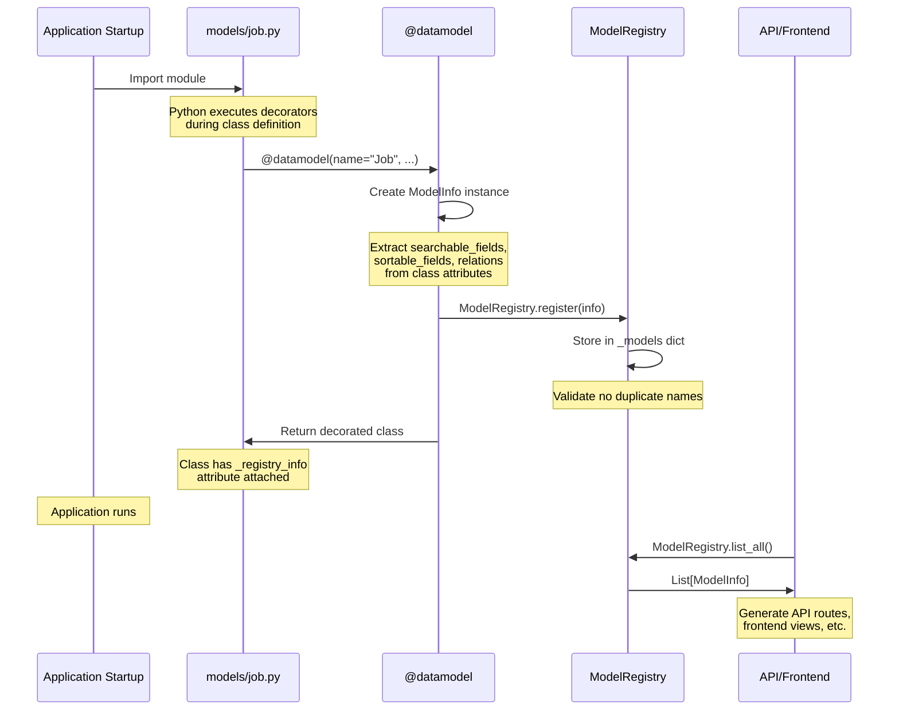

# @datamodel Decorator Reference

**Version:** 1.0.0
**Last Updated:** 2025-10-15

## Overview

The `@datamodel` decorator is the cornerstone of JobHunter's metadata-driven architecture. It registers Beanie Document models with the `ModelRegistry`, enabling automatic:

- **API generation** - RESTful endpoints for CRUD operations
- **Frontend generation** - Data tables, forms, and detail views
- **Search/filter UI** - Auto-generated search and sort controls
- **Relationship handling** - Model relationships for UI navigation
- **Type-safe operations** - Validated input/output schemas

### Key Philosophy

**Define once, surface everywhere.** Instead of manually creating API routes, frontend components, and database queries for each model, you decorate your model class once and the system generates all necessary interfaces automatically.

### Location

**Decorator:** `core/decorators.py` - Main @datamodel decorator implementation
**Registry:** `core/registries.py` - ModelRegistry and OperationRegistry storage

---

## Decorator Signature

```python
def datamodel(
    *,
    name: str,
    description: str | None = None,
    tags: list[str] | None = None,
    ui: dict[str, Any] | None = None,
    indexes: list[Any] | None = None,
    relations: list[dict[str, Any]] | None = None,
)
```

### Parameters

| Parameter | Type | Required | Description |
|-----------|------|----------|-------------|
| `name` | `str` | **Yes** | Public name for the model (e.g., "Job", "TestItem"). Used in API paths and UI labels. |
| `description` | `str \| None` | No | Human-readable description of the model's purpose. Used for documentation and UI tooltips. |
| `tags` | `list[str] \| None` | No | Tags for grouping/filtering models (e.g., `["jobs", "scraping"]`). Used for organizing models in UI. |
| `ui` | `dict[str, Any] \| None` | No | UI hints for frontend generation. See [UI Hints](#ui-hints-deep-dive) section. |
| `indexes` | `list[Any] \| None` | No | **Documentation only.** Actual indexes defined in Beanie `Settings.indexes`. |
| `relations` | `list[dict[str, Any]] \| None` | No | Relationships to other models. Can also be defined as class method. See [Relations](#relations-definition) section. |

---

## ModelInfo Structure

When `@datamodel` executes, it creates a `ModelInfo` instance and registers it:

```python
@dataclass
class ModelInfo:
    """Registered model information for CRUD/UI generation."""

    name: str                                # Public model name
    document_cls: type[Any]                  # Reference to the Beanie Document class
    ui_hints: dict[str, Any]                 # UI configuration
    tags: list[str]                          # Grouping tags
    relations: list[dict[str, Any]]          # Relationship definitions
    searchable_fields: list[str]             # Fields available for text search
    sortable_fields: list[str]               # Fields available for sorting
```

### Where ModelInfo Lives

```python
from core.registries import ModelRegistry

# Get model info by name
info = ModelRegistry.get("Job")

# List all registered models
all_models = ModelRegistry.list_all()

# Access from model class directly
from models.job import Job  # Your model
info = Job._registry_info
```

---

## Registration Process



### Step-by-Step Breakdown

1. **Import Time**: When Python imports a model module, it executes decorators during class definition
2. **Decorator Execution**: `@datamodel` runs before the class is fully created
3. **Info Creation**: Decorator builds `ModelInfo` from parameters and class attributes
4. **Registration**: Calls `ModelRegistry.register(info)` to store metadata
5. **Class Attachment**: Adds `_registry_info` attribute to the class for convenience
6. **Surface Access**: API/Frontend queries registry to generate interfaces

---

## UI Hints Deep Dive

The `ui` parameter controls how the frontend renders your model. All fields are optional.

### Available UI Hints

```python
ui = {
    # Visual identification
    "icon": "💼",                           # Emoji or icon class for the model

    # List view configuration
    "primary_field": "title",               # Main display field in lists
    "secondary_field": "company_name",      # Subtitle field in lists
    "list_fields": [                        # Columns to show in data table
        "title",
        "company_name",
        "location_city",
        "status",
        "match_score"
    ],

    # Detail view configuration
    "detail_sections": [                    # Organize detail view into sections
        {
            "name": "Basic Info",           # Section title
            "fields": [                     # Fields in this section
                "title",
                "company_name",
                "location_raw"
            ]
        },
        {
            "name": "Source-Specific",
            "fields": ["source_fields"],
            "collapsible": True,            # Section can be collapsed
            "collapsed": True               # Start collapsed
        }
    ],

    # Form configuration
    "form_layout": "horizontal",            # "horizontal" or "vertical"
    "form_widget_overrides": {              # Custom widgets for specific fields
        "description": "textarea",
        "status": "select",
        "tags": "multiselect"
    },

    # Display configuration
    "hidden_fields": [                      # Fields to hide in UI
        "raw_data",
        "internal_metadata"
    ],
    "readonly_fields": [                    # Fields that can't be edited
        "created_at",
        "updated_at",
        "external_id"
    ]
}
```

### UI Hints: Field Reference

| Hint | Type | Default | Description |
|------|------|---------|-------------|
| `icon` | `str` | `"📄"` | Icon for the model (emoji or icon class) |
| `primary_field` | `str` | `"id"` | Main field for list display |
| `secondary_field` | `str` | `None` | Subtitle field for list display |
| `list_fields` | `list[str]` | All fields | Fields to show in data table |
| `detail_sections` | `list[dict]` | Auto-generated | How to organize detail view |
| `form_layout` | `str` | `"vertical"` | Form layout style |
| `form_widget_overrides` | `dict[str, str]` | `{}` | Custom widgets per field |
| `hidden_fields` | `list[str]` | `[]` | Fields to hide entirely |
| `readonly_fields` | `list[str]` | `[]` | Fields that can't be edited |

### Detail Section Structure

```python
{
    "name": "Section Title",                # Required: Section heading
    "fields": ["field1", "field2"],         # Required: Fields in section
    "collapsible": True,                    # Optional: Can collapse section
    "collapsed": False,                     # Optional: Start collapsed
    "columns": 2,                           # Optional: Multi-column layout
    "description": "Helper text..."         # Optional: Section description
}
```

---

## Relations Definition

Relations define how models connect to each other. This enables:

- **UI navigation** - Links between related records
- **Cascading operations** - Delete related records
- **Graph visualization** - Model relationship diagrams

### Two Ways to Define Relations

**Option 1: In decorator**

```python
@datamodel(
    name="Job",
    relations=[
        {
            "name": "applications",
            "model": "Application",
            "type": "one_to_many",
            "foreign_key": "job_id",
            "description": "Applications for this job"
        }
    ]
)
class Job(Document):
    ...
```

**Option 2: As class method (recommended)**

```python
@datamodel(name="Job")
class Job(Document):
    ...

    @classmethod
    def relations(cls) -> list[dict[str, Any]]:
        """Define relationships with other models."""
        return [
            {
                "name": "applications",
                "model": "Application",
                "type": "one_to_many",
                "foreign_key": "job_id",
                "description": "Applications submitted for this job"
            },
            {
                "name": "generated_cvs",
                "model": "GeneratedCV",
                "type": "one_to_many",
                "foreign_key": "job_id",
                "description": "CVs generated for this job"
            }
        ]
```

### Relation Structure

```python
{
    "name": "applications",          # Relation name (used in API/UI)
    "model": "Application",          # Target model name
    "type": "one_to_many",          # Relationship type (see types below)
    "foreign_key": "job_id",        # Field linking models
    "description": "Applications...", # Human-readable description
    "cascade_delete": True,          # Optional: Delete related records
    "required": False                # Optional: Whether relation is required
}
```

### Relationship Types

| Type | Description | Example |
|------|-------------|---------|
| `one_to_one` | Single related record | User → Profile |
| `one_to_many` | Multiple related records | Job → Applications |
| `many_to_one` | Belongs to single record | Application → Job |
| `many_to_many` | Multiple on both sides | Job ↔ Skills |

---

## Searchable and Sortable Fields

These class-level attributes control what fields can be searched/sorted in the UI.

### Definition

```python
@datamodel(name="Job", ...)
class Job(Document):
    # Class attributes for registry
    searchable_fields: ClassVar[list[str]] = [
        "title",
        "company_name",
        "description",
        "location_city",
        "location_country",
    ]

    sortable_fields: ClassVar[list[str]] = [
        "created_at",
        "match_score",
        "salary_min",
        "posted_date",
        "title",
        "company_name",
    ]

    # Regular fields...
    title: str = Field(...)
    company_name: str = Field(...)
    ...
```

### How They're Used

1. **Decorator extracts them**: `getattr(document_cls, "searchable_fields", [])`
2. **Registry stores them**: Part of `ModelInfo`
3. **Frontend uses them**: Generate search inputs and sort dropdowns
4. **API uses them**: Validate search/sort parameters

### Best Practices

**Searchable fields:**
- Text fields suitable for full-text search
- Fields users commonly search by
- Exclude binary data, timestamps, IDs

**Sortable fields:**
- Numeric fields (scores, prices, counts)
- Date/time fields (created_at, posted_date)
- Important text fields (title, name)
- Fields with indexes for performance

---

## Complete Examples

### Example 1: Minimal Model

The simplest possible model with just required fields:

```python
from beanie import Document
from pydantic import Field
from core import datamodel

@datamodel(name="SimpleNote")
class SimpleNote(Document):
    """A minimal note-taking model."""

    content: str = Field(..., description="Note content")

    class Settings:
        name = "simple_notes"
```

**What you get:**
- Basic CRUD API endpoints
- Auto-generated list/detail views
- No search or sort (no fields specified)
- Default UI hints

---

### Example 2: Basic Model with UI

Adding UI customization for better frontend experience:

```python
from datetime import datetime
from beanie import Document, Indexed
from pydantic import Field
from core import datamodel

@datamodel(
    name="TestItem",
    description="Simple test model for validating core architecture",
    tags=["test", "core"],
    ui={
        "icon": "🧪",
        "primary_field": "name",
        "secondary_field": "status",
        "list_fields": ["name", "status", "value", "created_at"],
        "detail_sections": [
            {
                "name": "Basic Info",
                "fields": ["name", "description", "status"]
            },
            {
                "name": "Data",
                "fields": ["value", "metadata"]
            },
            {
                "name": "Timestamps",
                "fields": ["created_at", "updated_at"]
            }
        ]
    }
)
class TestItem(Document):
    """Simple test model to validate the core architecture."""

    # Fields
    name: str = Field(..., description="Item name")
    description: str | None = Field(None, description="Item description")
    status: str = Field(default="active", description="Status: active, inactive, archived")
    value: int = Field(default=0, description="Numeric value")
    metadata: dict = Field(default_factory=dict, description="Additional metadata")

    # Timestamps
    created_at: Indexed(datetime) = Field(
        default_factory=datetime.utcnow,
        description="Creation timestamp"
    )
    updated_at: datetime = Field(
        default_factory=datetime.utcnow,
        description="Last update timestamp"
    )

    class Settings:
        name = "test_items"

    @classmethod
    def relations(cls):
        """No relations for this simple test model."""
        return []
```

**What you get:**
- Custom icon (🧪) in UI
- Name shown as primary field in lists
- Organized detail view with 3 sections
- Specific columns in data table

---

### Example 3: Full-Featured Model

A production model with all features enabled:

```python
from datetime import datetime
from enum import Enum
from typing import Any, ClassVar

from beanie import Document, Indexed
from pydantic import Field
from pymongo import ASCENDING, DESCENDING, IndexModel

from core import datamodel

class JobStatus(str, Enum):
    """Job processing status."""
    NEW = "new"
    ANALYZED = "analyzed"
    MATCHED = "matched"
    APPLIED = "applied"
    REJECTED = "rejected"
    ARCHIVED = "archived"

@datamodel(
    name="Job",
    description="Job posting with enrichment and matching",
    tags=["jobs", "scraping", "matching"],
    ui={
        "icon": "💼",
        "primary_field": "title",
        "secondary_field": "company_name",
        "list_fields": [
            "title",
            "company_name",
            "location_city",
            "status",
            "match_score"
        ],
        "detail_sections": [
            {
                "name": "Basic Info",
                "fields": ["title", "company_name", "location_raw", "source", "url"]
            },
            {
                "name": "Details",
                "fields": ["description", "employment_type", "remote_type"]
            },
            {
                "name": "Compensation",
                "fields": ["salary_min", "salary_max", "salary_currency"]
            },
            {
                "name": "Skills",
                "fields": [
                    "required_skills",
                    "preferred_skills",
                    "required_experience"
                ]
            },
            {
                "name": "Matching",
                "fields": ["match_score", "match_details", "ai_summary"]
            },
            {
                "name": "Status",
                "fields": ["status", "is_applied", "is_saved", "is_favorite"]
            },
            {
                "name": "Source-Specific",
                "fields": ["source_fields"],
                "collapsible": True,
                "collapsed": True
            }
        ]
    }
)
class Job(Document):
    """Main job posting model with full enrichment."""

    # Class attributes for registry
    searchable_fields: ClassVar[list[str]] = [
        "title",
        "company_name",
        "description",
        "location_city",
        "location_country",
    ]

    sortable_fields: ClassVar[list[str]] = [
        "created_at",
        "match_score",
        "salary_min",
        "posted_date",
        "title",
        "company_name",
    ]

    # External identifiers - indexed for efficient queries
    source: Indexed(str) = Field(..., description="Job source (indeed, linkedin, etc.)")
    external_id: str = Field(..., description="External job ID from source")
    url: str = Field(..., description="Job posting URL")

    # Core fields
    title: str = Field(..., description="Job title")
    company_name: str = Field(..., description="Company name")
    location_city: str | None = Field(None, description="City")
    location_country: str = Field(default="DE", description="Country code")
    location_raw: str = Field(..., description="Raw location string")
    description: str = Field(..., description="Job description")

    # Optional fields
    employment_type: str | None = Field(None, description="Employment type")
    remote_type: str | None = Field(None, description="Remote work type")
    salary_min: float | None = Field(None, description="Minimum salary")
    salary_max: float | None = Field(None, description="Maximum salary")
    salary_currency: str | None = Field(default="EUR", description="Salary currency")

    # Skills and requirements
    required_skills: list[str] = Field(default_factory=list, description="Required skills")
    preferred_skills: list[str] = Field(default_factory=list, description="Preferred skills")
    required_experience: str | None = Field(None, description="Required experience")

    # AI enrichment
    ai_summary: str | None = Field(None, description="AI-generated summary")
    match_score: float | None = Field(
        None, ge=0, le=100,
        description="Match score against user profile (0-100)"
    )
    match_details: dict[str, Any] | None = Field(
        None,
        description="Detailed match breakdown"
    )

    # User associations
    user_id: Indexed(str) | None = Field(
        None,
        description="Associated user ID (None for system jobs)"
    )

    # Status tracking
    status: JobStatus = Field(default=JobStatus.NEW, description="Processing status")
    is_applied: bool = Field(default=False, description="Whether user applied")
    is_saved: bool = Field(default=False, description="Whether user saved")
    is_favorite: bool = Field(default=False, description="Marked as favorite")

    # Timestamps
    created_at: Indexed(datetime) = Field(
        default_factory=datetime.utcnow,
        description="Record creation"
    )
    updated_at: datetime = Field(
        default_factory=datetime.utcnow,
        description="Last update"
    )

    class Settings:
        name = "jobs"
        indexes = [
            IndexModel([("source", ASCENDING), ("external_id", ASCENDING)], unique=True),
            IndexModel([("user_id", ASCENDING), ("created_at", DESCENDING)]),
            IndexModel([("status", ASCENDING)]),
            IndexModel([("match_score", DESCENDING)]),
        ]

    @classmethod
    def relations(cls) -> list[dict[str, Any]]:
        """Define relationships with other models."""
        return [
            {
                "name": "applications",
                "model": "Application",
                "type": "one_to_many",
                "foreign_key": "job_id",
                "description": "Applications submitted for this job"
            },
            {
                "name": "generated_cvs",
                "model": "GeneratedCV",
                "type": "one_to_many",
                "foreign_key": "job_id",
                "description": "CVs generated for this job"
            },
            {
                "name": "user",
                "model": "User",
                "type": "many_to_one",
                "foreign_key": "user_id",
                "description": "User who owns this job (if scoped)"
            }
        ]
```

**What you get:**
- Full CRUD API with search and sort
- Rich frontend with 7 organized sections
- Searchable by 5 fields
- Sortable by 6 fields
- Three model relationships
- Custom indexes for performance

---

### Example 4: Raw Data Model (Inheritance)

Using inheritance to create multiple models from a base:

```python
from core import datamodel
from models.raw_scraping import RawScrapedDetailBase  # Your base model

@datamodel(
    name="RawScrapedStepStoneDetail",
    description="Raw job detail page from StepStone.de",
    tags=["raw_data", "scraping", "stepstone", "detail"],
    ui={
        "icon": "📄",
        "primary_field": "job_id",
        "secondary_field": "url",
        "list_fields": [
            "job_id",
            "url",
            "timestamp",
            "parse_success",
            "html_length"
        ],
        "detail_sections": [
            {
                "name": "Job Info",
                "fields": ["job_id", "url", "timestamp"]
            },
            {
                "name": "Parsed Data",
                "fields": ["parsed_data"]
            },
            {
                "name": "HTML Content",
                "fields": ["html_content"],
                "collapsible": True,
                "collapsed": True
            },
            {
                "name": "Metadata",
                "fields": [
                    "scraper_version",
                    "html_length",
                    "parse_success",
                    "parse_errors"
                ]
            }
        ]
    }
)
class RawScrapedStepStoneDetail(RawScrapedDetailBase):
    """Raw job detail page from StepStone.de.

    Inherits all fields from RawScrapedDetailBase.
    Only defines the collection name.
    """

    class Settings:
        name = "raw_scraped_stepstone_detail"
```

**Benefits:**
- Share common fields via base class
- Decorator on each subclass for separate registration
- Each model gets its own API endpoints
- Consistent structure across scrapers

---

## Patterns and Anti-patterns

### ✅ Good Patterns

#### 1. Class Method for Relations

```python
@datamodel(name="Job")
class Job(Document):
    @classmethod
    def relations(cls) -> list[dict[str, Any]]:
        """Define relationships - keeps relations close to model."""
        return [...]
```

**Why:** Relations reference other model names that might not exist yet. Class method avoids import-time errors.

---

#### 2. ClassVar for Search/Sort Fields

```python
@datamodel(name="Job")
class Job(Document):
    searchable_fields: ClassVar[list[str]] = ["title", "description"]
    sortable_fields: ClassVar[list[str]] = ["created_at", "match_score"]

    title: str = Field(...)
```

**Why:** `ClassVar` signals these are class-level metadata, not instance fields.

---

#### 3. Organized Detail Sections

```python
ui={
    "detail_sections": [
        {"name": "Basic Info", "fields": [...]},
        {"name": "Advanced", "fields": [...], "collapsible": True},
        {"name": "Debug", "fields": [...], "collapsed": True}
    ]
}
```

**Why:** Groups related fields, improves UX, allows collapsing less important sections.

---

#### 4. Consistent Icon Usage

```python
# Use semantic icons
"Job": "💼",
"Application": "📝",
"User": "👤",
"Search": "🔍",
"Detail": "📄"
```

**Why:** Users quickly identify model types, improves navigation.

---

### ❌ Anti-patterns

#### 1. Duplicate Model Names

```python
# ❌ BAD - Will raise ValueError
@datamodel(name="Job")
class JobV1(Document): ...

@datamodel(name="Job")  # Error: "Job" already registered
class JobV2(Document): ...
```

**Fix:** Use unique names like "JobV1", "JobV2" or clear old registry in tests.

---

#### 2. Defining Relations in Decorator (Import Order Issues)

```python
# ❌ BAD - May cause import errors if Application not yet imported
@datamodel(
    name="Job",
    relations=[
        {"model": "Application", ...}  # String reference, but still problematic
    ]
)
class Job(Document): ...
```

**Fix:** Use class method `relations()` to defer evaluation.

---

#### 3. Missing Primary Field

```python
# ❌ BAD - UI will default to "id" which is ugly
ui={
    "list_fields": ["title", "status"]
    # Missing "primary_field"
}
```

**Fix:** Always specify `primary_field` for better list display.

---

#### 4. Too Many List Fields

```python
# ❌ BAD - Table will be too wide, hard to read
ui={
    "list_fields": [
        "title", "company", "location", "salary_min", "salary_max",
        "employment_type", "remote_type", "status", "match_score",
        "created_at", "updated_at", "is_saved", "is_applied"
    ]
}
```

**Fix:** Show 4-6 most important fields. Use detail view for the rest.

---

#### 5. No Searchable/Sortable Fields

```python
# ❌ BAD - Users can't search or sort effectively
@datamodel(name="Job")
class Job(Document):
    # Missing: searchable_fields and sortable_fields
    title: str = Field(...)
    ...
```

**Fix:** Define both for user-facing models.

---

#### 6. Exposing Internal Fields

```python
# ❌ BAD - Shows raw data in UI
ui={
    "list_fields": ["title", "raw_data", "_internal_state"]
}
```

**Fix:** Use `hidden_fields` to exclude internal data, or omit from `list_fields`.

---

## Implementation Details

### Decorator Source Code

```python
# core/decorators.py

def datamodel(
    *,
    name: str,
    description: str | None = None,
    tags: list[str] | None = None,
    ui: dict[str, Any] | None = None,
    indexes: list[Any] | None = None,
    relations: list[dict[str, Any]] | None = None,
):
    """Decorator to register a data model for CRUD/UI generation."""

    def _wrap(document_cls: type[Any]) -> type[Any]:
        # Create ModelInfo from parameters and class attributes
        info = ModelInfo(
            name=name,
            document_cls=document_cls,
            ui_hints=ui or {},
            tags=tags or [],
            # Extract relations from class method or parameter
            relations=relations or getattr(document_cls, "relations", lambda: [])(),
            # Extract search/sort fields from class attributes
            searchable_fields=getattr(document_cls, "searchable_fields", []),
            sortable_fields=getattr(document_cls, "sortable_fields", []),
        )

        # Attach metadata to class for convenience
        document_cls._registry_info = info

        # Register with global registry
        ModelRegistry.register(info)

        return document_cls

    return _wrap
```

### Registry Storage

```python
# core/registries.py

class ModelRegistry:
    """Global registry for models (define-once source of truth)."""

    _models: dict[str, ModelInfo] = {}

    @classmethod
    def register(cls, info: ModelInfo) -> None:
        if info.name in cls._models:
            raise ValueError(f"Model '{info.name}' already registered")
        cls._models[info.name] = info

    @classmethod
    def get(cls, name: str) -> ModelInfo | None:
        return cls._models.get(name)

    @classmethod
    def list_all(cls) -> list[ModelInfo]:
        return list(cls._models.values())
```

---

## Testing

### Testing Decorator Registration

```python
import pytest
from core.registries import ModelRegistry
from core import datamodel
from beanie import Document

def test_datamodel_decorator():
    """Test that @datamodel registers model correctly."""

    # Clear registry
    ModelRegistry.clear()

    # Define test model
    @datamodel(
        name="TestModel",
        description="Test description",
        tags=["test"]
    )
    class TestModel(Document):
        name: str

        class Settings:
            name = "test_models"

    # Verify registration
    info = ModelRegistry.get("TestModel")
    assert info is not None
    assert info.name == "TestModel"
    assert info.description == "Test description"
    assert "test" in info.tags
    assert info.document_cls == TestModel

    # Verify class attribute
    assert hasattr(TestModel, "_registry_info")
    assert TestModel._registry_info == info
```

### Testing Relations Extraction

```python
def test_relations_class_method():
    """Test that relations() class method is called during registration."""

    ModelRegistry.clear()

    @datamodel(name="Parent")
    class Parent(Document):
        @classmethod
        def relations(cls):
            return [
                {
                    "name": "children",
                    "model": "Child",
                    "type": "one_to_many"
                }
            ]

        class Settings:
            name = "parents"

    info = ModelRegistry.get("Parent")
    assert len(info.relations) == 1
    assert info.relations[0]["name"] == "children"
```

---

## FAQ

### Q: When is the decorator executed?

**A:** At import time, when Python loads the module. The decorator runs during class definition, before any instances are created.

---

### Q: Can I change model metadata after registration?

**A:** No, the registry is immutable after registration. This is by design to ensure consistency. If you need to change metadata, restart the application or clear the registry in tests.

---

### Q: What if I forget to add @datamodel?

**A:** The model will work as a normal Beanie Document, but:
- No API endpoints will be auto-generated
- No frontend views will be created
- Model won't appear in ModelRegistry

---

### Q: Can I use @datamodel on non-Beanie classes?

**A:** Technically yes, but you'll lose Beanie's database functionality. The decorator only requires a class with optional `searchable_fields`, `sortable_fields`, and `relations()` attributes.

---

### Q: How do I debug registration issues?

```python
from core.registries import ModelRegistry

# List all registered models
print("Registered models:", [m.name for m in ModelRegistry.list_all()])

# Check specific model
info = ModelRegistry.get("Job")
if info:
    print(f"Found: {info.name}")
    print(f"Class: {info.document_cls}")
    print(f"Tags: {info.tags}")
else:
    print("Model not registered - check decorator syntax")
```

---

### Q: Can I register the same class with different names?

**A:** Yes! This is useful for versioning:

```python
@datamodel(name="JobV1")
class Job(Document):
    ...

@datamodel(name="JobV2")
class Job(Document):
    ...
```

Both will be registered separately.

---

## Related Documentation

- **[HOW_CORE_WORKS.md](./HOW_CORE_WORKS.md)** - Overall system architecture
- **[OPERATION_DECORATOR.md](./OPERATION_DECORATOR.md)** - Companion @operation decorator
- **[ORCHESTRATION.md](./ORCHESTRATION.md)** - Prefect orchestration guide
- **[ARCHITECTURE_OVERVIEW.md](./ARCHITECTURE_OVERVIEW.md)** - Complete architecture reference

---

## Summary

The `@datamodel` decorator is your entry point to JobHunter's metadata-driven architecture:

1. **Define once** - Add decorator to your Beanie Document
2. **Configure thoroughly** - Use `ui`, `searchable_fields`, `sortable_fields`, `relations`
3. **Surface everywhere** - API, frontend, and operations auto-generated
4. **Test registration** - Verify with `ModelRegistry.get()`

**Key takeaway:** Spend time on good model design and UI configuration. The rest is automatic.
