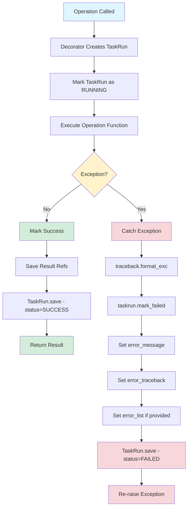

# Error Handling in Core System

**Version:** 1.0.0
**Last Updated:** 2025-10-15

## Table of Contents

1. [Overview](#overview)
2. [Error Fields in TaskRun](#error-fields-in-taskrun)
3. [Automatic Error Capture](#automatic-error-capture)
4. [Error Storage](#error-storage)
5. [Bulk Operation Errors](#bulk-operation-errors)
6. [Error Flow](#error-flow)
7. [Querying Errors](#querying-errors)
8. [Replay Failed Operations](#replay-failed-operations)
9. [Best Practices](#best-practices)

---

## Overview

The core system provides **automatic error capture at the operation level** through the `@operation` decorator. Every operation execution is tracked via a `TaskRun` record, which stores:

- Complete error messages
- Full stack traces
- Input parameters for debugging and replay
- Execution context (user, channel, orchestration status)

**Key Principle:** Operations don't need to manually handle error logging - the decorator does it automatically.

```python
# Operation implementation - no error handling code needed!
@operation(
    name="scrape_jobs",
    description="Scrape jobs from a job board",
    category="scraping",
    inputs=ScrapeJobsInput,
    outputs=ScrapeJobsOutput,
    async_enabled=True,
)
async def scrape_jobs(input: ScrapeJobsInput) -> ScrapeJobsOutput:
    # Just write the business logic
    scraper = get_scraper(input.source)
    jobs = await scraper.scrape(input.keywords, input.location)

    # If this raises an exception, the decorator catches it automatically
    return ScrapeJobsOutput(jobs=jobs, count=len(jobs))
```

---

## Error Fields in TaskRun

The `TaskRun` model includes three error-related fields:

```python
class TaskRun(Document):
    """Audit log for every operation execution."""

    # Error handling fields
    error_message: str | None = Field(
        None,
        description="Primary error message if failed"
    )

    error_traceback: str | None = Field(
        None,
        description="Full traceback if failed"
    )

    error_list: list[dict[str, Any]] = Field(
        default_factory=list,
        description="List of errors encountered (for bulk ops)"
    )
    # Example: [{"index": 0, "error": "...", "item": {...}}, ...]
```

### Field Usage

| Field | Purpose | When Used |
|-------|---------|-----------|
| `error_message` | Primary error message (short) | Single operation failures |
| `error_traceback` | Full Python traceback | All failures (for debugging) |
| `error_list` | Multiple errors with context | Bulk operations that partially succeed |

### Example Error Data

**Simple Operation Error:**
```python
{
    "error_message": "Connection timeout: StepStone API not responding",
    "error_traceback": """Traceback (most recent call last):
  File "/src/operations/scraping_ops.py", line 77, in scrape_jobs
    raw_jobs = await scraper.scrape(...)
  File "/src/scraping/stepstone.py", line 45, in scrape
    response = await self.client.get(url)
TimeoutError: Connection timeout: StepStone API not responding""",
    "error_list": []
}
```

**Bulk Operation Error:**
```python
{
    "error_message": "Bulk delete completed with 3 failures",
    "error_traceback": None,  # No global exception
    "error_list": [
        {
            "index": 2,
            "job_id": "507f1f77bcf86cd799439011",
            "error": "Job not found",
            "item": {"source": "stepstone", "external_id": "12345"}
        },
        {
            "index": 5,
            "job_id": "507f1f77bcf86cd799439012",
            "error": "Permission denied",
            "item": {"source": "indeed", "external_id": "67890"}
        },
        {
            "index": 8,
            "job_id": "507f1f77bcf86cd799439013",
            "error": "Database constraint violation",
            "item": {"source": "linkedin", "external_id": "54321"}
        }
    ]
}
```

---

## Automatic Error Capture

The `@operation` decorator automatically wraps operations with error handling when `async_enabled=True` and `create_taskrun=True` (default).

### Decorator Implementation

From `/home/jp/jobhunter-core-minimal/core/core/decorators.py`:

```python
@functools.wraps(fn)
async def _wrapped_async(*args, **kwargs):
    """Async wrapper that creates TaskRun for observability."""
    # ... TaskRun creation code ...

    try:
        # Execute operation
        start_time = datetime.utcnow()
        result = await fn(*args, **kwargs)
        execution_time = (datetime.utcnow() - start_time).total_seconds()

        # Mark as success with result references
        taskrun.mark_success(
            result_refs=result_refs,
            metadata={"execution_time": execution_time},
        )
        await taskrun.save()
        return result

    except Exception as e:
        # Automatic error capture
        error_tb = traceback.format_exc()
        taskrun.mark_failed(
            error_message=str(e),
            error_traceback=error_tb,
        )

        if verbose:
            taskrun.add_log("ERROR", f"Operation failed: {name}", {"error": str(e)})

        await taskrun.save()
        raise  # Re-raise to caller
```

### What Gets Captured

1. **Error Message**: `str(e)` - Short, human-readable error
2. **Full Traceback**: `traceback.format_exc()` - Complete stack trace
3. **Execution Time**: Time until failure occurred
4. **Input Parameters**: Saved in `input_dump` for replay
5. **Execution Context**: User, channel, orchestration info

### Error Propagation

**Important:** The decorator **re-raises the exception** after capturing it. This means:

- Callers still receive the exception (can be caught in flows)
- Error is logged to TaskRun for audit/debugging
- No silent failures - errors are visible to both system and caller

---

## Error Storage

Errors are stored in MongoDB via the `TaskRun` model, **regardless of whether Prefect orchestration is used**.

### With Prefect

When running under Prefect orchestration:

```python
# TaskRun fields populated automatically
taskrun = TaskRun(
    operation_name="scrape_jobs",
    orchestrated=True,
    prefect_flow_run_id="abc-123",
    prefect_task_run_id="xyz-789",
    # ... other fields ...
)
```

**Benefits:**
- Can correlate TaskRun with Prefect UI
- Unified error tracking across orchestrated and direct calls
- Historical data persists even if Prefect data is pruned

### Without Prefect (Direct Calls)

When calling operations directly (CLI, API, tests):

```python
# Same storage, no orchestration metadata
taskrun = TaskRun(
    operation_name="scrape_jobs",
    orchestrated=False,
    prefect_flow_run_id=None,
    prefect_task_run_id=None,
    # ... other fields ...
)
```

**Benefits:**
- Consistent error tracking everywhere
- No dependency on Prefect for basic error logging
- Can debug any operation call

### Storage Lifecycle

```
Operation Called
    ↓
TaskRun Created (status=PENDING)
    ↓
Mark Started (status=RUNNING)
    ↓
Execute Operation
    ↓
    ├─ Success → mark_success() → Save → status=SUCCESS
    └─ Failure → mark_failed() → Save → status=FAILED
```

---

## Bulk Operation Errors

Bulk operations often need to report **partial failures** - some items succeed, others fail.

### Pattern for Bulk Operations

```python
@operation(
    name="bulk_process_jobs",
    description="Process multiple jobs with error tracking",
    category="processing",
    inputs=BulkProcessInput,
    outputs=BulkProcessOutput,
    async_enabled=True,
)
async def bulk_process_jobs(input: BulkProcessInput) -> BulkProcessOutput:
    """Process multiple jobs, tracking individual failures."""

    success_count = 0
    failed_items = []

    for idx, job_id in enumerate(input.job_ids):
        try:
            # Process individual item
            job = await Job.get(job_id)
            await process_job(job)
            success_count += 1

        except Exception as e:
            # Capture individual failure
            failed_items.append({
                "index": idx,
                "job_id": job_id,
                "error": str(e),
                "traceback": traceback.format_exc(),
                "item": {"job_id": job_id}
            })
            # Continue processing other items
            continue

    # Build result
    result = BulkProcessOutput(
        success_count=success_count,
        failed_count=len(failed_items),
        total_count=len(input.job_ids),
    )

    # If there were failures, manually populate error_list
    # (This is captured by the TaskRun if operation raises)
    if failed_items:
        # Option 1: Return success with partial failures
        result.errors = failed_items
        return result

        # Option 2: Raise exception with error_list
        # raise BulkOperationError(
        #     message=f"Failed {len(failed_items)} of {len(input.job_ids)} items",
        #     error_list=failed_items
        # )
```

### Accessing Bulk Errors

When a bulk operation completes (even with partial failures):

```python
# Query the TaskRun
taskrun = await TaskRun.find_one(TaskRun.operation_name == "bulk_process_jobs")

# Check for partial failures
if taskrun.error_list:
    print(f"Partial failures: {len(taskrun.error_list)}")
    for error in taskrun.error_list:
        print(f"Item {error['index']}: {error['error']}")
        print(f"  Job ID: {error['job_id']}")
        print(f"  Traceback: {error['traceback']}")
```

### Manual Error List Population

For operations that need to report `error_list` to TaskRun:

```python
# Inside operation, before returning
from core.examples.models.models.taskrun import TaskRun

# Get current taskrun (if running under decorator)
# This is advanced usage - typically not needed
taskrun = await TaskRun.find_one(
    TaskRun.operation_name == "bulk_process_jobs",
    TaskRun.status == "running"
).sort("-started_at")

if taskrun and failed_items:
    taskrun.error_list = failed_items
    await taskrun.save()
```

**Note:** Most operations don't need manual TaskRun manipulation - just raise exceptions and let the decorator handle it.

---

## Error Flow



### Flow Details

1. **Operation Called**: User/system invokes operation
2. **Decorator Creates TaskRun**: Automatic audit record
3. **Mark RUNNING**: Update status and timestamp
4. **Execute Operation**: Run business logic
5. **Success Path**:
   - Extract result references (created/modified records)
   - Calculate execution time
   - Mark TaskRun as SUCCESS
   - Save and return result
6. **Error Path**:
   - Catch any exception
   - Format full traceback using `traceback.format_exc()`
   - Call `taskrun.mark_failed()` with error details
   - Save TaskRun with error data
   - Re-raise exception to caller

---

## Querying Errors

### Find All Failed Operations

```python
from core.examples.models.models.taskrun import TaskRun, TaskRunStatus

# Get all failed operations
failed_runs = await TaskRun.find(
    TaskRun.status == TaskRunStatus.FAILED.value
).sort("-started_at").to_list()

for run in failed_runs:
    print(f"{run.operation_name} - {run.started_at}")
    print(f"  Error: {run.error_message}")
    print(f"  User: {run.actor.user_id or 'system'}")
```

### Find Failures for Specific Operation

```python
# Get recent failures for scraping
scraping_failures = await TaskRun.find(
    TaskRun.operation_name == "scrape_jobs",
    TaskRun.status == TaskRunStatus.FAILED.value
).sort("-started_at").limit(10).to_list()

for run in scraping_failures:
    print(f"Failed at: {run.started_at}")
    print(f"Input: {run.input_dump}")
    print(f"Error: {run.error_message}")
    print(f"\nFull traceback:\n{run.error_traceback}")
```

### Find Failures by User

```python
# Get all errors for a specific user
user_failures = await TaskRun.find(
    TaskRun.status == TaskRunStatus.FAILED.value,
    TaskRun.actor.user_id == "user123"
).sort("-started_at").to_list()
```

### Find Operations with Partial Failures

```python
# Find bulk operations with error_list
bulk_failures = await TaskRun.find(
    TaskRun.error_list != []
).sort("-started_at").to_list()

for run in bulk_failures:
    print(f"{run.operation_name}: {len(run.error_list)} items failed")
    for error in run.error_list:
        print(f"  - Item {error['index']}: {error['error']}")
```

### Debug with Input Dump

```python
# Get failed operation with full context
failed_run = await TaskRun.find_one(
    {"_id": "507f1f77bcf86cd799439011"}
)

if failed_run:
    print(f"Operation: {failed_run.operation_name}")
    print(f"Input Parameters:")
    for key, value in failed_run.input_dump.items():
        print(f"  {key}: {value}")

    print(f"\nError Message: {failed_run.error_message}")
    print(f"\nFull Traceback:\n{failed_run.error_traceback}")

    # Check what records were being created
    if failed_run.result_refs:
        print(f"\nPartial results:")
        for ref in failed_run.result_refs:
            print(f"  {ref['collection']}: {ref['document_id']}")
```

### Analytics: Error Rates

```python
from datetime import datetime, timedelta

# Calculate error rate for last 7 days
seven_days_ago = datetime.utcnow() - timedelta(days=7)

total_runs = await TaskRun.find(
    TaskRun.started_at >= seven_days_ago
).count()

failed_runs = await TaskRun.find(
    TaskRun.started_at >= seven_days_ago,
    TaskRun.status == TaskRunStatus.FAILED.value
).count()

error_rate = (failed_runs / total_runs * 100) if total_runs > 0 else 0
print(f"Error rate (7 days): {error_rate:.2f}%")
```

---

## Replay Failed Operations

The `input_dump` field enables **replaying failed operations** with the exact same parameters.

### Why Replay?

- Transient errors (network timeout, rate limit)
- Fixed bugs in operation code
- Dependency issues resolved (external API back online)
- Testing fixes against real failure scenarios

### Replay Pattern

```python
async def replay_failed_operation(taskrun_id: str) -> TaskRun:
    """Replay a failed operation using saved input."""

    # Get the failed TaskRun
    failed_run = await TaskRun.get(taskrun_id)

    if not failed_run:
        raise ValueError(f"TaskRun {taskrun_id} not found")

    if failed_run.status != TaskRunStatus.FAILED.value:
        raise ValueError(f"TaskRun {taskrun_id} is not failed (status: {failed_run.status})")

    # Get the operation from registry
    from core.registries import OperationRegistry

    operation_meta = OperationRegistry.get_operation(failed_run.operation_name)
    if not operation_meta:
        raise ValueError(f"Operation {failed_run.operation_name} not found in registry")

    # Reconstruct input from input_dump
    input_schema = operation_meta.input_schema
    input_model = input_schema(**failed_run.input_dump)

    # Execute operation with same input
    result = await operation_meta.function(input_model)

    # Get the new TaskRun (created by decorator)
    new_run = await TaskRun.find_one(
        TaskRun.operation_name == failed_run.operation_name
    ).sort("-started_at")

    return new_run
```

### Bulk Replay

```python
async def replay_all_failed_scraping():
    """Replay all failed scraping operations from last 24 hours."""

    yesterday = datetime.utcnow() - timedelta(days=1)

    failed_runs = await TaskRun.find(
        TaskRun.operation_name == "scrape_jobs",
        TaskRun.status == TaskRunStatus.FAILED.value,
        TaskRun.started_at >= yesterday
    ).to_list()

    print(f"Found {len(failed_runs)} failed scraping operations to replay")

    results = {
        "success": 0,
        "failed": 0,
        "errors": []
    }

    for run in failed_runs:
        try:
            new_run = await replay_failed_operation(str(run.id))

            if new_run.status == TaskRunStatus.SUCCESS.value:
                results["success"] += 1
                print(f"✓ Replayed {run.id}: SUCCESS")
            else:
                results["failed"] += 1
                results["errors"].append({
                    "original_id": str(run.id),
                    "new_id": str(new_run.id),
                    "error": new_run.error_message
                })
                print(f"✗ Replayed {run.id}: FAILED - {new_run.error_message}")

        except Exception as e:
            results["failed"] += 1
            results["errors"].append({
                "original_id": str(run.id),
                "error": str(e)
            })
            print(f"✗ Failed to replay {run.id}: {e}")

    return results
```

### Selective Replay

```python
async def replay_by_error_type(error_substring: str):
    """Replay failed operations matching specific error."""

    # Find failures with specific error
    failed_runs = await TaskRun.find(
        TaskRun.status == TaskRunStatus.FAILED.value,
        TaskRun.error_message.regex(error_substring, "i")  # Case-insensitive
    ).to_list()

    print(f"Found {len(failed_runs)} operations with error: '{error_substring}'")

    for run in failed_runs:
        print(f"Replaying: {run.operation_name} (ID: {run.id})")
        await replay_failed_operation(str(run.id))
```

---

## Best Practices

### 1. When to Catch Errors Manually

**Let the Decorator Catch:**
- Network errors
- Database errors
- Validation errors
- Unexpected exceptions

```python
@operation(...)
async def scrape_jobs(input: ScrapeJobsInput) -> ScrapeJobsOutput:
    # Just let it fail - decorator catches and logs
    scraper = get_scraper(input.source)
    jobs = await scraper.scrape(input.keywords)
    return ScrapeJobsOutput(jobs=jobs)
```

**Catch Manually:**
- Expected business logic errors
- Partial failures in bulk operations
- When you want custom error messages
- When you need to clean up resources

```python
@operation(...)
async def process_with_cleanup(input: ProcessInput) -> ProcessOutput:
    file_handle = None
    try:
        file_handle = open_temp_file()
        result = await process_file(file_handle)
        return ProcessOutput(success=True, result=result)
    finally:
        # Always clean up, even on error
        if file_handle:
            file_handle.close()
```

### 2. Error Message Quality

**Good Error Messages:**
```python
# Specific, actionable
raise ValueError(f"Scraper '{source}' not found. Available: {available_scrapers}")

# Include context
raise ConnectionError(f"Failed to connect to {url} after {retries} attempts: {last_error}")

# User-friendly
raise ValueError(f"Job ID '{job_id}' not found or you don't have permission to access it")
```

**Bad Error Messages:**
```python
# Too generic
raise Exception("Error")

# No context
raise ValueError("Invalid input")

# Technical jargon only
raise RuntimeError("NoneType object has no attribute 'value'")
```

### 3. Bulk Operations

Always track individual failures:

```python
@operation(...)
async def bulk_process(input: BulkInput) -> BulkOutput:
    errors = []
    successes = []

    for idx, item in enumerate(input.items):
        try:
            result = await process_item(item)
            successes.append(result)
        except Exception as e:
            errors.append({
                "index": idx,
                "item": item.dict(),
                "error": str(e),
                "traceback": traceback.format_exc()
            })

    return BulkOutput(
        success_count=len(successes),
        failed_count=len(errors),
        errors=errors  # Include in response
    )
```

### 4. Logging vs TaskRun

**TaskRun is for:**
- Error storage and audit trail
- Debugging failures
- Replay scenarios
- Analytics on failure rates

**Logging is for:**
- Real-time monitoring
- Detailed execution traces
- Performance metrics
- Development debugging

Use both:

```python
@operation(...)
async def scrape_jobs(input: ScrapeJobsInput) -> ScrapeJobsOutput:
    logger.info(f"Starting scrape: source={input.source}, keywords={input.keywords}")

    try:
        jobs = await scraper.scrape()
        logger.info(f"Scraped {len(jobs)} jobs successfully")
        return ScrapeJobsOutput(jobs=jobs)

    except Exception as e:
        logger.error(f"Scraping failed: {e}", exc_info=True)
        raise  # Decorator captures to TaskRun
```

### 5. Testing Error Scenarios

Test that errors are properly captured:

```python
async def test_operation_error_capture():
    """Test that operation failures are recorded in TaskRun."""

    # Create input that will cause failure
    input_data = ScrapeJobsInput(
        source="invalid_source",
        keywords="Python"
    )

    # Operation should fail
    with pytest.raises(ValueError):
        await scrape_jobs(input_data)

    # Check TaskRun was created with error
    taskrun = await TaskRun.find_one(
        TaskRun.operation_name == "scrape_jobs"
    ).sort("-started_at")

    assert taskrun is not None
    assert taskrun.status == TaskRunStatus.FAILED.value
    assert "invalid_source" in taskrun.error_message
    assert taskrun.error_traceback is not None
    assert taskrun.input_dump["source"] == "invalid_source"
```

### 6. Error Recovery Strategies

**Retry Pattern:**
```python
from tenacity import retry, stop_after_attempt, wait_exponential

@retry(
    stop=stop_after_attempt(3),
    wait=wait_exponential(multiplier=1, min=4, max=10)
)
async def scrape_with_retry(url: str):
    """Retry transient errors automatically."""
    response = await fetch_url(url)
    return response
```

**Circuit Breaker Pattern:**
```python
class ScraperCircuitBreaker:
    """Stop trying if scraper consistently fails."""

    def __init__(self, failure_threshold: int = 5):
        self.failure_count = 0
        self.threshold = failure_threshold
        self.is_open = False

    async def call(self, func, *args, **kwargs):
        if self.is_open:
            raise Exception("Circuit breaker is OPEN - too many failures")

        try:
            result = await func(*args, **kwargs)
            self.failure_count = 0  # Reset on success
            return result
        except Exception as e:
            self.failure_count += 1
            if self.failure_count >= self.threshold:
                self.is_open = True
            raise
```

---

## Summary

The core system's error handling provides:

1. **Automatic Capture**: `@operation` decorator catches all exceptions
2. **Complete Context**: Error message, traceback, input parameters, execution metadata
3. **Persistent Storage**: All errors saved to MongoDB via TaskRun
4. **Replay Capability**: Use `input_dump` to retry failed operations
5. **Bulk Support**: Track partial failures in `error_list`
6. **Query Support**: Find and analyze errors easily
7. **Orchestration Agnostic**: Works with or without Prefect

**Key Takeaway:** Focus on writing clean operation logic - error handling is automatic and comprehensive.
