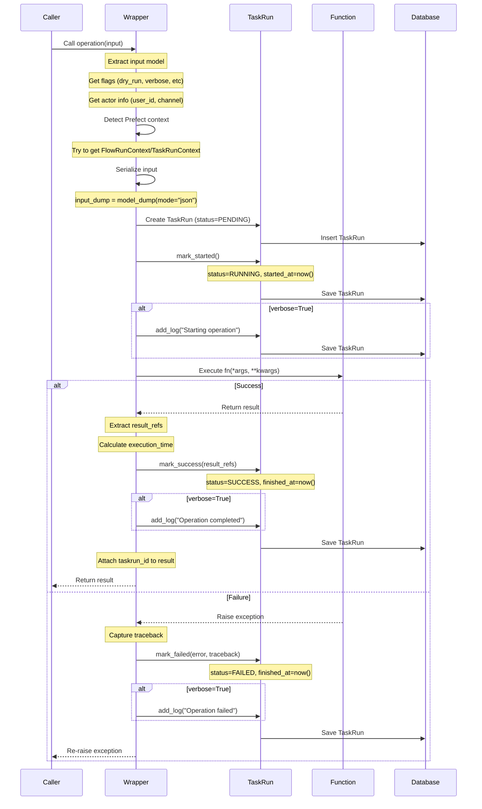

# @operation Decorator

**Version:** 1.0.0
**Last Updated:** 2025-10-15

## Table of Contents

1. [Overview](#overview)
2. [Parameters Reference](#parameters-reference)
3. [OperationMetadata Structure](#operationmetadata-structure)
4. [Wrapper Mechanics](#wrapper-mechanics)
5. [Wrapper Execution Flow](#wrapper-execution-flow)
6. [TaskRun Creation](#taskrun-creation)
7. [Prefect Context Detection](#prefect-context-detection)
8. [Input/Output Serialization](#inputoutput-serialization)
9. [Complete Examples](#complete-examples)
10. [When to Use async_enabled](#when-to-use-async_enabled)

---

## Overview

The `@operation` decorator is the **core mechanism** for registering operations in the Jobhunter system. It provides:

1. **Registry integration** - Automatically registers operation metadata in `OperationRegistry`
2. **Automatic observability** - Creates `TaskRun` records for every execution
3. **Type safety** - Enforces Pydantic input/output schemas
4. **Orchestration awareness** - Detects Prefect context for workflow integration
5. **Audit trail** - Captures inputs, outputs, errors, and execution metadata

### Purpose

The decorator transforms a simple async function into a fully observable, traceable operation with:
- Automatic TaskRun creation and lifecycle management
- Input/output serialization
- Error handling and traceback capture
- Performance metrics (execution time)
- Actor tracking (who, when, how)
- Prefect integration detection

### Role in Architecture

```
Operation Function (decorated)
         ↓
  @operation decorator
         ↓
  ┌──────────────────────┐
  │ Wrapper Function     │
  │ - Creates TaskRun    │
  │ - Executes function  │
  │ - Updates TaskRun    │
  └──────────────────────┘
         ↓
  OperationRegistry (metadata)
  TaskRun Collection (audit log)
```

---

## Parameters Reference

### Decorator Signature

```python
def operation(
    *,
    name: str,
    description: str,
    category: str,
    inputs: type[BaseModel],
    outputs: type[BaseModel],
    tags: list[str] | None = None,
    permissions: list[str] | None = None,
    async_enabled: bool = False,
    models_in: list[str] | None = None,
    models_out: list[str] | None = None,
    stage: str | None = None,
    create_taskrun: bool = True,
)
```

### Parameter Details

#### Required Parameters

| Parameter | Type | Description |
|-----------|------|-------------|
| `name` | `str` | **Unique operation identifier**. Used for registry lookup and TaskRun tracking. Should be snake_case (e.g., `"update_job"`, `"bulk_delete_jobs"`). |
| `description` | `str` | **Human-readable description** of what the operation does. Shown in UI and API docs. |
| `category` | `str` | **Operation category** for grouping (e.g., `"database"`, `"scraping"`, `"processing"`). |
| `inputs` | `type[BaseModel]` | **Pydantic model class** defining input schema. Must inherit from `BaseModel`. |
| `outputs` | `type[BaseModel]` | **Pydantic model class** defining output schema. Must inherit from `BaseModel`. |

#### Optional Parameters

| Parameter | Type | Default | Description |
|-----------|------|---------|-------------|
| `tags` | `list[str] \| None` | `None` | **Tags for filtering** operations (e.g., `["jobs", "update", "database"]`). Used in UI and API to filter/search operations. |
| `permissions` | `list[str] \| None` | `None` | **Required permissions** to execute operation (e.g., `["jobs:write"]`). Future use for authorization. |
| `async_enabled` | `bool` | `False` | **Enable async wrapper** with TaskRun creation. Set to `True` to activate observability. |
| `models_in` | `list[str] \| None` | `None` | **Input model names** (e.g., `["Job"]`). Documents which models are read by this operation. |
| `models_out` | `list[str] \| None` | `None` | **Output model names** (e.g., `["Job"]`). Documents which models are created/modified. |
| `stage` | `str \| None` | `None` | **Pipeline stage** for operations that are part of a data pipeline (e.g., `"extract"`, `"transform"`, `"load"`). |
| `create_taskrun` | `bool` | `True` | **Enable TaskRun creation**. Set to `False` to disable observability (useful for testing). |

---

## OperationMetadata Structure

When an operation is decorated, metadata is created and stored in the `OperationRegistry`:

```python
from dataclasses import dataclass, field
from collections.abc import Callable
from typing import Any
from pydantic import BaseModel

@dataclass
class OperationMetadata:
    """Metadata describing a registered operation."""

    name: str                           # Operation name
    description: str                    # Human-readable description
    category: str                       # Category for grouping
    input_schema: type[BaseModel]       # Pydantic input model
    output_schema: type[BaseModel]      # Pydantic output model
    function: Callable[..., Any] | Any  # The actual function/method
    tags: list[str] = field(default_factory=list)
    permissions: list[str] = field(default_factory=list)
    async_enabled: bool = False
    models_in: list[str] = field(default_factory=list)
    models_out: list[str] = field(default_factory=list)
    stage: str | None = None
```

### Registry Storage

```python
# Registration happens automatically when decorator is applied
OperationRegistry.register(meta)

# Later retrieval
meta = OperationRegistry.get("update_job")
all_ops = OperationRegistry.list_all()
db_ops = OperationRegistry.by_category("database")
```

---

## Wrapper Mechanics

The decorator wraps the original function with observability logic **only if** both conditions are met:
1. `create_taskrun=True` (default)
2. `async_enabled=True`

### Wrapper Implementation

```python
# From core/decorators.py (lines 102-238)

if create_taskrun and async_enabled:

    @functools.wraps(fn)
    async def _wrapped_async(*args, **kwargs):
        """Async wrapper that creates TaskRun for observability."""

        # Import here to avoid circular imports
        from core.examples.models.taskrun import Actor, TaskRun

        # Extract input from first arg (should be Pydantic model)
        input_model = args[0] if args else None

        # Get flags from input model
        dry_run = getattr(input_model, "dry_run", False) if input_model else False
        test_mode = getattr(input_model, "test_mode", False) if input_model else False
        verbose = getattr(input_model, "verbose", False) if input_model else False

        # Get actor info from input model (if available)
        user_id = getattr(input_model, "user_id", None) if input_model else None
        channel = getattr(input_model, "channel", "api") if input_model else "api"

        # Create actor
        actor = Actor(
            user_id=user_id,
            channel=channel,
        )

        # Detect Prefect orchestration context
        orchestrated = False
        prefect_flow_run_id = None
        prefect_task_run_id = None

        try:
            from prefect.context import FlowRunContext, TaskRunContext

            flow_ctx = FlowRunContext.get()
            task_ctx = TaskRunContext.get()

            if flow_ctx or task_ctx:
                orchestrated = True
                if flow_ctx and flow_ctx.flow_run:
                    prefect_flow_run_id = str(flow_ctx.flow_run.id)
                if task_ctx and task_ctx.task_run:
                    prefect_task_run_id = str(task_ctx.task_run.id)
        except (ImportError, Exception):
            # Prefect not available or no context - run directly
            pass

        # Serialize input
        input_dump = {}
        if input_model:
            try:
                input_dump = input_model.model_dump(mode="json")
            except Exception:
                input_dump = {"error": "Failed to serialize input"}

        # Create TaskRun
        taskrun = TaskRun(
            operation_name=name,
            actor=actor,
            input_dump=input_dump,
            orchestrated=orchestrated,
            prefect_flow_run_id=prefect_flow_run_id,
            prefect_task_run_id=prefect_task_run_id,
            metadata={
                "dry_run": dry_run,
                "test_mode": test_mode,
                "verbose": verbose,
            },
        )
        await taskrun.insert()

        # Mark as started
        taskrun.mark_started()
        await taskrun.save()

        # Log if verbose
        if verbose:
            taskrun.add_log("INFO", f"Starting operation: {name}", {"input": input_dump})
            await taskrun.save()

        try:
            # Execute operation
            start_time = datetime.utcnow()
            result = await fn(*args, **kwargs)
            execution_time = (datetime.utcnow() - start_time).total_seconds()

            # Extract result_refs from output (if available)
            result_refs = []
            if hasattr(result, "job_ids"):
                result_refs.extend(
                    [{"collection": "jobs", "document_id": id} for id in result.job_ids]
                )
            if hasattr(result, "query_index_id"):
                result_refs.append(
                    {"collection": "queryindexes", "document_id": result.query_index_id}
                )

            # Mark as success
            taskrun.mark_success(
                result_refs=result_refs,
                metadata={"execution_time": execution_time},
            )

            if verbose:
                taskrun.add_log(
                    "INFO",
                    f"Operation completed: {name}",
                    {"execution_time": execution_time},
                )

            await taskrun.save()

            # Add taskrun_id to result if possible
            if hasattr(result, "task_run_id"):
                result.task_run_id = str(taskrun.id)

            return result

        except Exception as e:
            # Mark as failed
            error_tb = traceback.format_exc()
            taskrun.mark_failed(
                error_message=str(e),
                error_traceback=error_tb,
            )

            if verbose:
                taskrun.add_log("ERROR", f"Operation failed: {name}", {"error": str(e)})

            await taskrun.save()
            raise

    return _wrapped_async
```

### Key Points

1. **Lazy import** - `TaskRun` is imported inside wrapper to avoid circular imports
2. **Input extraction** - First argument is assumed to be Pydantic input model
3. **Flag extraction** - Looks for `dry_run`, `test_mode`, `verbose` attributes
4. **Actor creation** - Captures `user_id` and `channel` from input
5. **Prefect detection** - Attempts to get Prefect context (graceful failure)
6. **Input serialization** - Uses `model_dump(mode="json")` for JSON-safe serialization
7. **Result refs** - Automatically extracts `job_ids` and `query_index_id` from output
8. **Error handling** - Catches all exceptions, logs, and re-raises

---

## Wrapper Execution Flow



---

## TaskRun Creation

Every time an operation with `async_enabled=True` and `create_taskrun=True` is called, a TaskRun record is created:

### TaskRun Model

```python
class TaskRun(Document):
    """Audit log for every operation execution."""

    # Operation identification
    operation_name: Indexed(str)  # Name of the operation
    idempotency_key: Indexed(str) | None  # Optional idempotency key

    # Actor information
    actor: Actor  # Who/what triggered this run

    # Execution lifecycle
    status: Indexed(str)  # PENDING → RUNNING → SUCCESS/FAILED
    started_at: Indexed(datetime)
    finished_at: datetime | None
    duration_ms: int | None

    # Orchestration metadata
    orchestrated: bool  # True if running under Prefect
    prefect_flow_run_id: str | None
    prefect_task_run_id: str | None

    # Input/Output
    input_dump: dict[str, Any]  # Serialized input
    result_refs: list[dict[str, str]]  # References to created records
    # Example: [{"collection": "jobs", "document_id": "..."}]

    # Error handling
    error_list: list[dict[str, Any]]  # Errors for bulk operations
    error_message: str | None
    error_traceback: str | None

    # Logging
    logs_ref: str | None  # External log reference
    log_entries: list[dict[str, Any]]  # Inline logs

    # Metadata
    tags: list[str]
    metadata: dict[str, Any]

    # Timestamps
    created_at: datetime
    updated_at: datetime
```

### TaskRun Lifecycle

1. **Creation** - `TaskRun(...)` with `status=PENDING`
2. **Insert** - `await taskrun.insert()` - Save to database
3. **Start** - `taskrun.mark_started()` - Set `status=RUNNING`, `started_at=now()`
4. **Success** - `taskrun.mark_success(...)` - Set `status=SUCCESS`, `finished_at=now()`, calculate `duration_ms`
5. **Failure** - `taskrun.mark_failed(...)` - Set `status=FAILED`, capture error details

### What Gets Stored

| Field | Source | Example |
|-------|--------|---------|
| `operation_name` | Decorator `name` parameter | `"update_job"` |
| `actor.user_id` | Input model `user_id` attribute | `"user_123"` or `None` |
| `actor.channel` | Input model `channel` attribute | `"api"`, `"cli"`, `"ui"` |
| `input_dump` | `input_model.model_dump(mode="json")` | `{"job_id": "123", "updates": {...}}` |
| `orchestrated` | Prefect context detection | `True` if running in Prefect flow |
| `prefect_flow_run_id` | `FlowRunContext.get().flow_run.id` | `"abc-123-xyz"` or `None` |
| `result_refs` | Extracted from output model | `[{"collection": "jobs", "document_id": "123"}]` |
| `duration_ms` | `(finished_at - started_at).total_seconds() * 1000` | `1250` |
| `error_message` | Exception `str(e)` | `"Job with ID 123 not found"` |
| `error_traceback` | `traceback.format_exc()` | Full Python traceback |

---

## Prefect Context Detection

The wrapper attempts to detect if it's running under Prefect orchestration:

```python
# Detect Prefect orchestration context
orchestrated = False
prefect_flow_run_id = None
prefect_task_run_id = None

try:
    # Try to import Prefect and get context
    from prefect.context import FlowRunContext, TaskRunContext

    flow_ctx = FlowRunContext.get()
    task_ctx = TaskRunContext.get()

    if flow_ctx or task_ctx:
        orchestrated = True
        if flow_ctx and flow_ctx.flow_run:
            prefect_flow_run_id = str(flow_ctx.flow_run.id)
        if task_ctx and task_ctx.task_run:
            prefect_task_run_id = str(task_ctx.task_run.id)
except (ImportError, Exception):
    # Prefect not available or no context - run directly
    pass
```

### When orchestrated=True

- Operation is running inside a Prefect `@flow` or `@task`
- `prefect_flow_run_id` and/or `prefect_task_run_id` are captured
- TaskRun can be linked back to Prefect UI for correlation

### When orchestrated=False

- Operation is called directly (CLI, API, script)
- No Prefect context available
- Still creates TaskRun for observability

### Why This Matters

1. **Dual execution mode** - Same operation works standalone or orchestrated
2. **Traceability** - Link TaskRun to Prefect run for end-to-end visibility
3. **Debugging** - Know if operation was part of orchestrated workflow
4. **Analytics** - Separate metrics for direct vs. orchestrated executions

---

## Input/Output Serialization

### Input Serialization

The wrapper serializes the input model to JSON-safe format:

```python
# Serialize input
input_dump = {}
if input_model:
    try:
        input_dump = input_model.model_dump(mode="json")
    except Exception:
        input_dump = {"error": "Failed to serialize input"}
```

**Key Points:**
- Uses Pydantic's `model_dump(mode="json")` for JSON-safe serialization
- Handles datetime, enums, nested models automatically
- Gracefully handles serialization failures
- Stored in `TaskRun.input_dump` for replay/debugging

### Output Serialization (Result Refs)

The wrapper extracts references to created/modified records:

```python
# Extract result_refs from output (if available)
result_refs = []
if hasattr(result, "job_ids"):
    result_refs.extend(
        [{"collection": "jobs", "document_id": id} for id in result.job_ids]
    )
if hasattr(result, "query_index_id"):
    result_refs.append(
        {"collection": "queryindexes", "document_id": result.query_index_id}
    )
```

**Convention:**
- Output models can include `job_ids: list[str]` for bulk operations
- Output models can include `query_index_id: str` for single record operations
- Wrapper automatically extracts these and converts to `result_refs` format
- Format: `{"collection": "collection_name", "document_id": "id"}`

**Why Result Refs?**
- Links TaskRun to actual database records
- Enables "show me what this operation created"
- Supports undo/rollback operations
- Powers data lineage tracking

---

## Complete Examples

### Example 1: Simple Database Operation

```python
from core import operation
from pydantic import BaseModel, Field
from models.job import Job  # Your model

class UpdateJobInput(BaseModel):
    """Input schema for updating a job."""
    job_id: str = Field(..., description="Job ID to update")
    updates: dict = Field(..., description="Fields to update")
    user_id: str | None = Field(None, description="User ID for scoping")

class UpdateJobOutput(BaseModel):
    """Output schema for update job operation."""
    success: bool
    job_id: str
    updated_fields: list[str]
    message: str

@operation(
    name="update_job",
    description="Update specific fields of a job",
    category="database",
    inputs=UpdateJobInput,
    outputs=UpdateJobOutput,
    tags=["jobs", "update", "database"],
)
async def update_job(input: UpdateJobInput) -> UpdateJobOutput:
    """Update specific fields of a job."""
    try:
        # Find job
        query = {"_id": input.job_id}
        if input.user_id:
            query["user_id"] = input.user_id

        job = await Job.find_one(query)
        if not job:
            return UpdateJobOutput(
                success=False,
                job_id=input.job_id,
                updated_fields=[],
                message=f"Job with ID {input.job_id} not found",
            )

        # Apply updates
        updated_fields = []
        for field, value in input.updates.items():
            if hasattr(job, field):
                setattr(job, field, value)
                updated_fields.append(field)

        # Save
        await job.save()

        return UpdateJobOutput(
            success=True,
            job_id=input.job_id,
            updated_fields=updated_fields,
            message=f"Successfully updated {len(updated_fields)} field(s)",
        )

    except Exception as e:
        return UpdateJobOutput(
            success=False,
            job_id=input.job_id,
            updated_fields=[],
            message=f"Error updating job: {str(e)}",
        )
```

**Usage:**
```python
# Direct call (no TaskRun created - async_enabled=False by default)
input = UpdateJobInput(job_id="123", updates={"notes": "Interesting"})
result = await update_job(input)
print(result.message)
```

---

### Example 2: Bulk Operation with TaskRun

```python
from core import operation
from pydantic import BaseModel, Field

class BulkDeleteJobsInput(BaseModel):
    """Input schema for bulk delete."""
    job_ids: list[str] | None = Field(None, description="Job IDs to delete")
    filters: dict | None = Field(None, description="Filters for jobs to delete")
    user_id: str | None = Field(None, description="User ID for scoping")
    dry_run: bool = Field(False, description="Preview without deleting")
    verbose: bool = Field(False, description="Enable verbose logging")

class BulkDeleteJobsOutput(BaseModel):
    """Output schema for bulk delete."""
    success: bool
    deleted_count: int
    job_ids: list[str]
    message: str
    task_run_id: str | None = Field(None, description="TaskRun ID for tracking")

@operation(
    name="bulk_delete_jobs",
    description="Delete multiple jobs by IDs or filters",
    category="database",
    inputs=BulkDeleteJobsInput,
    outputs=BulkDeleteJobsOutput,
    tags=["jobs", "bulk", "delete"],
    async_enabled=True,  # Enable TaskRun creation
)
async def bulk_delete_jobs(input: BulkDeleteJobsInput) -> BulkDeleteJobsOutput:
    """Delete multiple jobs at once."""
    try:
        deleted_ids = []

        if input.job_ids:
            # Delete by IDs
            for job_id in input.job_ids:
                query = {"_id": job_id}
                if input.user_id:
                    query["user_id"] = input.user_id

                job = await Job.find_one(query)
                if job:
                    if not input.dry_run:
                        await job.delete()
                    deleted_ids.append(job_id)

        elif input.filters:
            # Delete by filters
            query = input.filters.copy()
            if input.user_id:
                query["user_id"] = input.user_id

            jobs = await Job.find(query).limit(10000).to_list()

            for job in jobs:
                if not input.dry_run:
                    await job.delete()
                deleted_ids.append(str(job.id))

        else:
            return BulkDeleteJobsOutput(
                success=False,
                deleted_count=0,
                job_ids=[],
                message="Must provide either job_ids or filters",
            )

        return BulkDeleteJobsOutput(
            success=True,
            deleted_count=len(deleted_ids),
            job_ids=deleted_ids,
            message=f"Successfully deleted {len(deleted_ids)} job(s)",
        )

    except Exception as e:
        return BulkDeleteJobsOutput(
            success=False,
            deleted_count=0,
            job_ids=[],
            message=f"Error during bulk delete: {str(e)}",
        )
```

**Usage:**
```python
# Call with TaskRun creation
input = BulkDeleteJobsInput(
    job_ids=["123", "456", "789"],
    user_id="user_123",
    verbose=True
)
result = await bulk_delete_jobs(input)

# TaskRun is automatically created:
# - operation_name="bulk_delete_jobs"
# - actor.user_id="user_123"
# - input_dump={"job_ids": [...], "user_id": "...", "verbose": true}
# - status: PENDING → RUNNING → SUCCESS
# - result_refs: [{"collection": "jobs", "document_id": "123"}, ...]
# - Log entries: "Starting operation...", "Operation completed..."

print(f"Deleted: {result.deleted_count}")
print(f"TaskRun ID: {result.task_run_id}")
```

---

### Example 3: Operation with Result Refs

```python
from core import operation
from pydantic import BaseModel, Field

class CreateJobsInput(BaseModel):
    """Input schema for creating jobs."""
    jobs_data: list[dict] = Field(..., description="List of job data dicts")
    user_id: str | None = Field(None, description="User ID for ownership")

class CreateJobsOutput(BaseModel):
    """Output schema for create jobs."""
    success: bool
    created_count: int
    job_ids: list[str]  # This will be extracted as result_refs!
    message: str

@operation(
    name="create_jobs_batch",
    description="Create multiple jobs in batch",
    category="database",
    inputs=CreateJobsInput,
    outputs=CreateJobsOutput,
    tags=["jobs", "create", "bulk"],
    async_enabled=True,
    models_out=["Job"],  # Documents that Job model is modified
)
async def create_jobs_batch(input: CreateJobsInput) -> CreateJobsOutput:
    """Create multiple jobs in batch."""
    job_ids = []

    for job_data in input.jobs_data:
        job = Job(**job_data)
        if input.user_id:
            job.user_id = input.user_id
        await job.insert()
        job_ids.append(str(job.id))

    return CreateJobsOutput(
        success=True,
        created_count=len(job_ids),
        job_ids=job_ids,  # Wrapper extracts this!
        message=f"Created {len(job_ids)} jobs",
    )
```

**What Happens:**
```python
result = await create_jobs_batch(input)

# TaskRun.result_refs is automatically populated:
# [
#   {"collection": "jobs", "document_id": "job_1_id"},
#   {"collection": "jobs", "document_id": "job_2_id"},
#   {"collection": "jobs", "document_id": "job_3_id"}
# ]

# Query TaskRun later to see what was created:
taskrun = await TaskRun.find_one({"operation_name": "create_jobs_batch"})
for ref in taskrun.result_refs:
    job = await Job.get(ref["document_id"])
    print(f"Created: {job.title}")
```

---

### Example 4: Operation in Prefect Flow

```python
from prefect import flow, task
from core import operation

@operation(
    name="process_jobs",
    description="Process jobs with enrichment",
    category="processing",
    inputs=ProcessJobsInput,
    outputs=ProcessJobsOutput,
    async_enabled=True,
)
async def process_jobs(input: ProcessJobsInput) -> ProcessJobsOutput:
    """Process and enrich jobs."""
    # Business logic here
    pass

@task
async def process_jobs_task(input: ProcessJobsInput):
    """Prefect task wrapper."""
    return await process_jobs(input)

@flow
async def daily_job_processing():
    """Daily job processing flow."""
    input = ProcessJobsInput(batch_size=100)
    result = await process_jobs_task(input)
    return result

# When flow runs:
# - TaskRun.orchestrated = True
# - TaskRun.prefect_flow_run_id = "flow-run-123"
# - TaskRun.prefect_task_run_id = "task-run-456"
# - Can link back to Prefect UI for full context
```

---

## When to Use async_enabled

### Set async_enabled=True When:

1. **Operation modifies database** - Need audit trail of all changes
2. **Long-running operation** - Want to track duration and status
3. **Bulk operations** - Need observability for batch processing
4. **User-facing operations** - Need to show operation history to users
5. **Orchestrated operations** - Part of Prefect flows/workflows
6. **Operations that can fail** - Want detailed error tracking

### Set async_enabled=False When:

1. **Read-only operations** - Simple queries that don't change state
2. **High-frequency calls** - Performance-critical, called thousands of times
3. **Testing/development** - Don't want TaskRun overhead during tests
4. **Internal utilities** - Helper functions not exposed to users

### Performance Considerations

**With async_enabled=True:**
- **Overhead:** ~50-150ms per operation (TaskRun creation + 2-3 DB writes)
- **Storage:** Each TaskRun is ~1-5 KB depending on input/output size
- **Benefits:** Complete observability, replay capability, audit trail

**With async_enabled=False:**
- **Overhead:** None (direct function call)
- **Storage:** None
- **Benefits:** Maximum performance

**Recommendation:** Start with `async_enabled=False` for new operations. Enable it when:
- Moving to production
- Adding to user-facing API
- Including in orchestrated workflows
- Debugging complex issues

---

## Summary

The `@operation` decorator is the cornerstone of operation management in Jobhunter:

1. **Metadata Registration** - Automatic registry of all operations
2. **Type Safety** - Enforced input/output schemas via Pydantic
3. **Observability** - Automatic TaskRun creation for audit trails
4. **Orchestration Integration** - Seamless Prefect detection and linking
5. **Error Tracking** - Comprehensive error capture with tracebacks
6. **Performance Metrics** - Execution time tracking
7. **Actor Tracking** - Know who called what, when, and how

**Best Practices:**
- Always define clear input/output schemas
- Use descriptive names and descriptions
- Enable `async_enabled=True` for important operations
- Include `user_id` in input schemas for multi-user systems
- Use `verbose=True` flag for debugging
- Document operations with examples
- Test both success and failure paths

**Related Documentation:**
- [HOW_CORE_WORKS.md](./HOW_CORE_WORKS.md) - Overall core architecture
- [DATAMODEL_DECORATOR.md](./DATAMODEL_DECORATOR.md) - Model registration
- [ORCHESTRATION.md](./ORCHESTRATION.md) - Prefect orchestration guide
- [TaskRun Model](../examples/models/taskrun.py) - Audit log implementation
- [Operation Registry](../registries.py) - Registry implementation
