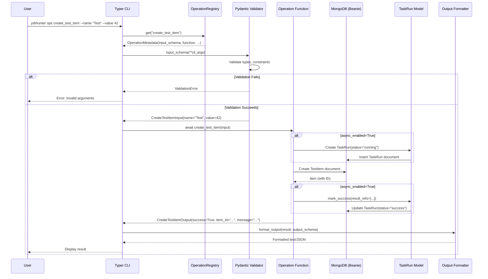

# CLI Integration

**How the Core System Auto-Generates Typer CLI Commands from Operations**

## Overview

The CLI integration leverages the `OperationRegistry` to automatically generate Typer commands from operations decorated with `@operation`. This creates a zero-boilerplate CLI where commands emerge directly from your operation definitions.

**Core Principle:** Define operations once with `@operation` → CLI commands auto-generate from metadata

```
┌─────────────────────┐
│  @operation         │  Decorator captures metadata
│  decorated function │  (name, inputs, outputs, description)
└──────────┬──────────┘
           │
           ▼
┌─────────────────────┐
│  OperationRegistry  │  Stores OperationMetadata
│  .register(meta)    │  (input_schema, output_schema, function)
└──────────┬──────────┘
           │
           ▼
┌─────────────────────┐
│  CLIRenderer        │  Reads registry at startup
│  .mount_operations  │  Generates Typer commands dynamically
└──────────┬──────────┘
           │
           ▼
┌─────────────────────┐
│  jobhunter CLI      │  Auto-generated commands
│  ops <operation>    │  with type-safe arguments
└─────────────────────┘
```

**Key Components:**
- **`@operation` decorator** (`core/decorators.py`) - Registers operation metadata
- **`OperationRegistry`** (`core/registries.py`) - Stores all registered operations
- **`CLIRenderer`** (`core/renderers/cli_renderer.py`) - Contract for CLI generation
- **CLI Implementation** (`cli/main.py`) - Concrete Typer app that reads registry

## Command Generation

### How Operations Become CLI Commands

**Step 1: Define Operation**

```python
# core/examples/operations/test_ops.py
from pydantic import BaseModel, Field
from core.decorators import operation

class CreateTestItemInput(BaseModel):
    """Input for creating a test item."""
    name: str = Field(..., description="Item name")
    description: str | None = Field(None, description="Item description")
    value: int = Field(default=0, description="Numeric value")

class CreateTestItemOutput(BaseModel):
    """Output from creating a test item."""
    success: bool = Field(..., description="Whether operation succeeded")
    item_id: str | None = Field(None, description="Created item ID")
    message: str = Field(..., description="Result message")

@operation(
    name="create_test_item",
    description="Create a new test item",
    category="testing",
    inputs=CreateTestItemInput,
    outputs=CreateTestItemOutput,
    tags=["test", "crud"],
    models_out=["TestItem"],
)
async def create_test_item(input: CreateTestItemInput) -> CreateTestItemOutput:
    """Create a new test item in the database."""
    from core.examples.models.models.test_model import TestItem

    try:
        item = TestItem(
            name=input.name,
            description=input.description,
            value=input.value,
        )
        await item.insert()

        return CreateTestItemOutput(
            success=True,
            item_id=str(item.id),
            message=f"Successfully created test item: {input.name}",
        )
    except Exception as e:
        return CreateTestItemOutput(
            success=False,
            item_id=None,
            message=f"Error creating test item: {str(e)}",
        )
```

**Step 2: Registry Captures Metadata**

When the module is imported, the `@operation` decorator automatically registers:

```python
# Automatically happens on import
OperationMetadata(
    name="create_test_item",
    description="Create a new test item",
    category="testing",
    input_schema=CreateTestItemInput,   # Pydantic schema
    output_schema=CreateTestItemOutput, # Pydantic schema
    function=create_test_item,          # Actual async function
    tags=["test", "crud"],
    models_out=["TestItem"],
)
```

**Step 3: CLI Reads Registry**

```python
# cli/main.py (implementation would look like this)
import typer
from core.registries import OperationRegistry

app = typer.Typer()
ops_app = typer.Typer()
app.add_typer(ops_app, name="ops")

# At startup: Generate commands from registry
def generate_cli_commands():
    """Auto-generate Typer commands from OperationRegistry."""

    for op_meta in OperationRegistry.list_all():
        # Create command dynamically
        create_operation_command(ops_app, op_meta)

def create_operation_command(app: typer.Typer, op_meta: OperationMetadata):
    """Create a Typer command for an operation.

    Converts Pydantic input schema to CLI arguments/options.
    """

    # Build command function signature from input schema
    def command_wrapper(**kwargs):
        """Generated command wrapper."""
        # 1. Validate input using Pydantic schema
        input_model = op_meta.input_schema(**kwargs)

        # 2. Execute operation
        result = asyncio.run(op_meta.function(input_model))

        # 3. Format and display output
        display_result(result, op_meta.output_schema)

    # Dynamically add to Typer app
    app.command(name=op_meta.name, help=op_meta.description)(command_wrapper)

# Initialize commands on startup
generate_cli_commands()
```

**Step 4: Use Generated Command**

```bash
# Command is now available!
jobhunter ops create_test_item --name "My Item" --description "Test description" --value 42
```

## Argument Mapping

### Pydantic Schemas → CLI Arguments

The CLI renderer automatically maps Pydantic field types to appropriate Typer argument types:

**Field Type Mapping:**

| Pydantic Type | Typer Type | Example |
|---------------|------------|---------|
| `str` | `str` | `--name "value"` |
| `int` | `int` | `--value 42` |
| `float` | `float` | `--score 0.85` |
| `bool` | `bool` (flag) | `--enabled` / `--no-enabled` |
| `str \| None` | `Optional[str]` | `--description "text"` (optional) |
| `list[str]` | `List[str]` | `--keywords python --keywords django` |
| `dict` | `str` (JSON) | `--metadata '{"key": "value"}'` |

**Example Mapping:**

```python
# Input Schema
class SearchJobsInput(BaseModel):
    keywords: list[str] = Field(..., description="Search keywords")
    location: str | None = Field(None, description="Location filter")
    limit: int = Field(default=10, description="Max results")
    remote_only: bool = Field(default=False, description="Remote jobs only")

# Generated CLI Arguments
"""
jobhunter ops search_jobs \
  --keywords python \           # list[str]: multiple values
  --keywords django \           #
  --location "Berlin" \         # Optional[str]
  --limit 20 \                  # int with default
  --remote-only                 # bool flag
"""
```

**Field Attributes to CLI Options:**

```python
class MyInput(BaseModel):
    # Required field → required argument
    name: str = Field(..., description="Item name")
    # CLI: --name VALUE (required)

    # Optional field → optional argument
    description: str | None = Field(None, description="Item description")
    # CLI: --description VALUE (optional)

    # Field with default → optional with default
    value: int = Field(default=0, description="Numeric value")
    # CLI: --value VALUE (default: 0)

    # Boolean field → flag
    verbose: bool = Field(default=False, description="Verbose output")
    # CLI: --verbose / --no-verbose
```

**Help Text Generation:**

The CLI automatically uses Pydantic field descriptions for help text:

```bash
$ jobhunter ops create_test_item --help

Usage: jobhunter ops create_test_item [OPTIONS]

Create a new test item

Options:
  --name TEXT              Item name [required]
  --description TEXT       Item description
  --value INTEGER         Numeric value [default: 0]
  --help                  Show this message and exit
```

## Command Execution Flow



**Execution Steps:**

1. **User invokes command** - Typer parses CLI arguments
2. **Registry lookup** - Find operation metadata by name
3. **Input validation** - Construct Pydantic input model from CLI args
4. **Async execution** - Run operation function with validated input
5. **Observability** - If `async_enabled=True`, create TaskRun for audit
6. **Database operation** - Operation performs business logic
7. **Result formatting** - Convert output model to user-friendly display
8. **Display** - Show result in terminal with colors/formatting

## Complete Example

### From @operation to CLI Command

**Step 1: Define Input/Output Schemas**

```python
# core/examples/operations/job_ops.py
from pydantic import BaseModel, Field

class SearchJobsInput(BaseModel):
    """Input for searching jobs."""

    keywords: list[str] = Field(
        ...,
        description="Search keywords (e.g., 'python', 'django')"
    )
    location: str | None = Field(
        None,
        description="Filter by location"
    )
    limit: int = Field(
        default=10,
        ge=1,
        le=100,
        description="Maximum number of results"
    )
    min_score: float = Field(
        default=0.0,
        ge=0.0,
        le=100.0,
        description="Minimum match score"
    )
    remote_only: bool = Field(
        default=False,
        description="Only show remote jobs"
    )

class SearchJobsOutput(BaseModel):
    """Output from searching jobs."""

    success: bool = Field(..., description="Whether search succeeded")
    jobs: list[dict] = Field(default_factory=list, description="Found jobs")
    count: int = Field(default=0, description="Number of results")
    message: str = Field(..., description="Status message")
```

**Step 2: Register Operation**

```python
from core.decorators import operation
from core.examples.models.models.job import Job

@operation(
    name="search_jobs",
    description="Search for jobs by keywords and filters",
    category="jobs",
    inputs=SearchJobsInput,
    outputs=SearchJobsOutput,
    tags=["search", "jobs"],
    models_in=["Job"],
    async_enabled=True,
)
async def search_jobs(input: SearchJobsInput) -> SearchJobsOutput:
    """Search for jobs matching criteria.

    Args:
        input: SearchJobsInput with search criteria

    Returns:
        SearchJobsOutput with matching jobs
    """
    try:
        # Build query
        query = {}

        if input.location:
            query["location"] = {"$regex": input.location, "$options": "i"}

        if input.remote_only:
            query["remote"] = True

        if input.min_score > 0:
            query["match_score"] = {"$gte": input.min_score}

        # Search jobs
        jobs = await Job.find(query).limit(input.limit).to_list()

        # Filter by keywords (simple implementation)
        if input.keywords:
            filtered_jobs = []
            for job in jobs:
                title_lower = job.title.lower()
                if any(kw.lower() in title_lower for kw in input.keywords):
                    filtered_jobs.append(job)
            jobs = filtered_jobs

        # Convert to dict
        jobs_data = [
            {
                "id": str(job.id),
                "title": job.title,
                "company": job.company,
                "location": job.location,
                "match_score": job.match_score,
            }
            for job in jobs
        ]

        return SearchJobsOutput(
            success=True,
            jobs=jobs_data,
            count=len(jobs_data),
            message=f"Found {len(jobs_data)} matching jobs",
        )

    except Exception as e:
        return SearchJobsOutput(
            success=False,
            jobs=[],
            count=0,
            message=f"Search failed: {str(e)}",
        )
```

**Step 3: CLI Command Auto-Generated**

The operation is now available as a CLI command:

```bash
# Basic usage
jobhunter ops search_jobs --keywords python

# With location filter
jobhunter ops search_jobs --keywords python --location Berlin

# Multiple keywords
jobhunter ops search_jobs --keywords python --keywords django --keywords fastapi

# All filters
jobhunter ops search_jobs \
  --keywords python \
  --location "Berlin" \
  --limit 20 \
  --min-score 70.0 \
  --remote-only

# View help
jobhunter ops search_jobs --help
```

**Step 4: Output Display**

```bash
$ jobhunter ops search_jobs --keywords python --location Berlin --limit 5

✓ Found 3 matching jobs

┌─────────────────────────────────────────────────────────────────┐
│ Job 1: Senior Python Developer                                  │
├─────────────────────────────────────────────────────────────────┤
│ Company:      TechCorp GmbH                                     │
│ Location:     Berlin, Germany                                   │
│ Match Score:  85.0                                              │
│ ID:           507f1f77bcf86cd799439011                          │
└─────────────────────────────────────────────────────────────────┘

┌─────────────────────────────────────────────────────────────────┐
│ Job 2: Python Backend Engineer                                  │
├─────────────────────────────────────────────────────────────────┤
│ Company:      StartupCo                                         │
│ Location:     Berlin, Germany (Remote)                          │
│ Match Score:  78.5                                              │
│ ID:           507f1f77bcf86cd799439012                          │
└─────────────────────────────────────────────────────────────────┘

┌─────────────────────────────────────────────────────────────────┐
│ Job 3: Full-Stack Python Developer                              │
├─────────────────────────────────────────────────────────────────┤
│ Company:      InnovateLabs                                      │
│ Location:     Berlin, Germany                                   │
│ Match Score:  72.0                                              │
│ ID:           507f1f77bcf86cd799439013                          │
└─────────────────────────────────────────────────────────────────┘
```

## Output Formatting

### How Operation Outputs Display in Terminal

The CLI renderer formats operation outputs based on the output schema and result data:

**Format 1: Simple Success/Failure**

```python
# Output Schema
class SimpleOutput(BaseModel):
    success: bool
    message: str

# CLI Display
"""
✓ Operation completed successfully
Message: Item created with ID 507f1f77bcf86cd799439011
"""
```

**Format 2: Structured Data (JSON)**

```python
# With --json flag
jobhunter ops search_jobs --keywords python --json

{
  "success": true,
  "jobs": [
    {
      "id": "507f1f77bcf86cd799439011",
      "title": "Senior Python Developer",
      "company": "TechCorp GmbH",
      "location": "Berlin, Germany",
      "match_score": 85.0
    }
  ],
  "count": 1,
  "message": "Found 1 matching jobs"
}
```

**Format 3: Table View**

```python
# For list-based outputs
jobhunter ops list_test_items --status active

╭─────────────┬──────────────────┬──────────┬───────╮
│ ID          │ Name             │ Status   │ Value │
├─────────────┼──────────────────┼──────────┼───────┤
│ 507f1f77... │ Test Item 1      │ active   │ 42    │
│ 507f1f78... │ Test Item 2      │ active   │ 100   │
│ 507f1f79... │ Test Item 3      │ active   │ 15    │
╰─────────────┴──────────────────┴──────────┴───────╯

Total: 3 items
```

**Format 4: Progress/Verbose Mode**

```python
# With verbose flag (from input schema)
jobhunter ops create_test_item --name "Test" --value 42 --verbose

⏳ Creating TaskRun...
✓ TaskRun created: 507f1f77bcf86cd799439011

⏳ Validating input...
✓ Input validated

⏳ Creating TestItem...
✓ TestItem created: 507f1f77bcf86cd799439012

⏳ Updating TaskRun...
✓ TaskRun marked as success

✓ Operation completed successfully
Item ID: 507f1f77bcf86cd799439012
Message: Successfully created test item: Test
```

**Color Coding:**

- **Green (✓)** - Success messages
- **Red (✗)** - Error messages
- **Yellow (⚠)** - Warnings
- **Blue (ℹ)** - Info messages
- **Cyan** - IDs and technical details

## Error Handling

### CLI Error Display

The CLI provides user-friendly error messages for common failure scenarios:

**1. Validation Errors (Pydantic)**

```bash
$ jobhunter ops create_test_item --value "not-a-number"

✗ Validation Error

Field: value
Error: Input should be a valid integer

Usage: jobhunter ops create_test_item [OPTIONS]

Try: jobhunter ops create_test_item --help
```

**2. Operation Failures**

```bash
$ jobhunter ops search_jobs --keywords python --min-score 150

✗ Operation Failed

Error: Search failed: min_score must be between 0 and 100
Status: success=False
Message: Search failed: min_score must be between 0 and 100

View detailed logs:
  jobhunter logs show --operation search_jobs --status failed
```

**3. Database Connection Errors**

```bash
$ jobhunter ops create_test_item --name "Test"

✗ Database Error

Error: Connection refused (localhost:27017)
Suggestion: Ensure MongoDB is running

Start MongoDB:
  systemctl start mongod
  # or
  docker run -d -p 27017:27017 mongo:latest
```

**4. Missing Required Arguments**

```bash
$ jobhunter ops create_test_item

✗ Missing required option: --name

Usage: jobhunter ops create_test_item [OPTIONS]

Options:
  --name TEXT       Item name [required]
  --description TEXT   Item description
  --value INTEGER   Numeric value [default: 0]

Try: jobhunter ops create_test_item --help
```

**5. Operation Not Found**

```bash
$ jobhunter ops nonexistent_operation

✗ Operation not found: nonexistent_operation

Available operations:
  - create_test_item       Create a new test item
  - list_test_items        List test items with optional filtering
  - search_jobs            Search for jobs by keywords and filters

List all operations:
  jobhunter ops list
```

**6. Async Execution Errors (with TaskRun)**

```bash
$ jobhunter ops process_job --job-id "invalid-id"

✗ Operation failed during execution

TaskRun ID: 507f1f77bcf86cd799439011
Error: Document not found: invalid-id
Traceback available in TaskRun

View full error:
  jobhunter taskrun show 507f1f77bcf86cd799439011

Retry with same input:
  jobhunter taskrun retry 507f1f77bcf86cd799439011
```

## How to Add New Commands

Adding a new CLI command is automatic - just decorate an operation:

**Step 1: Create Operation**

```python
# core/examples/operations/new_feature.py
from pydantic import BaseModel, Field
from core.decorators import operation

class MyNewInput(BaseModel):
    param1: str = Field(..., description="First parameter")
    param2: int = Field(default=10, description="Second parameter")

class MyNewOutput(BaseModel):
    success: bool
    result: str

@operation(
    name="my_new_feature",
    description="Does something amazing",
    category="features",
    inputs=MyNewInput,
    outputs=MyNewOutput,
)
async def my_new_feature(input: MyNewInput) -> MyNewOutput:
    # Implementation
    return MyNewOutput(
        success=True,
        result=f"Processed {input.param1} with {input.param2}"
    )
```

**Step 2: Import Module (ensure it's loaded)**

```python
# core/examples/operations/__init__.py
from .new_feature import my_new_feature  # Auto-registers on import
```

**Step 3: Use Immediately**

```bash
# Command is now available!
jobhunter ops my_new_feature --param1 "test" --param2 20

# Help is auto-generated
jobhunter ops my_new_feature --help
```

**That's it!** No manual CLI code needed. The command is generated from:
- Operation name → command name
- Input schema → CLI arguments
- Field descriptions → help text
- Field types → argument types
- Defaults → optional arguments

## Summary

The CLI integration provides:

1. **Zero-boilerplate commands** - Just decorate operations, commands auto-generate
2. **Type-safe arguments** - Pydantic schemas ensure correct types at CLI level
3. **Automatic help text** - Field descriptions become CLI documentation
4. **Consistent UX** - All operations have same command structure
5. **Error handling** - Validation and execution errors display clearly
6. **Output formatting** - Results render appropriately (tables, JSON, success messages)
7. **Observability** - TaskRun integration for audit trail
8. **Extensibility** - Add new commands by adding operations

**Development Workflow:**

```
1. Define Pydantic input/output schemas
   ↓
2. Implement operation function
   ↓
3. Add @operation decorator
   ↓
4. Command automatically available in CLI!
```

**No manual CLI code required** - the registry-driven architecture handles everything.
