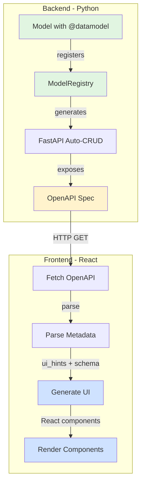
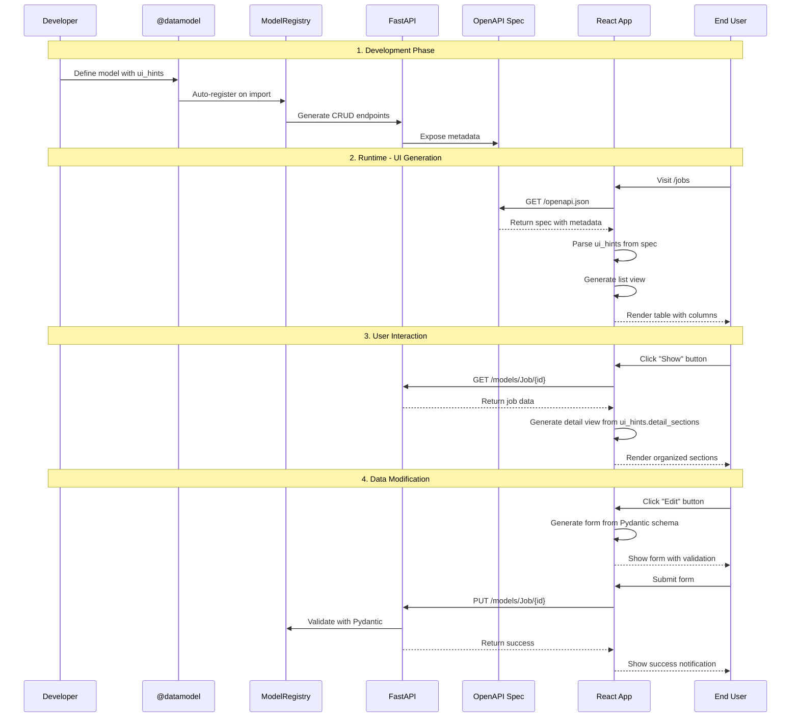

# Frontend Integration Guide

**Version:** 1.0.0
**Last Updated:** 2025-10-15

## Overview

This document explains how the JobHunter core system integrates with the React/Refine.dev frontend to auto-generate UI components from backend metadata. The integration is **metadata-driven**, meaning the frontend automatically adapts to backend model and operation changes without manual UI coding.

### Key Concept: Define Once, Generate Everywhere

```
Python @datamodel decorator → Registry → FastAPI endpoints → OpenAPI spec → React UI
```

1. **Backend**: Define model once with `@datamodel` decorator
2. **Registry**: Metadata captured in `ModelRegistry`
3. **API**: FastAPI auto-generates CRUD endpoints
4. **Discovery**: OpenAPI spec exposes metadata
5. **Frontend**: React components auto-generate from spec

**Benefits:**
- No manual React component creation for CRUD operations
- UI stays in sync with backend changes
- Reduced boilerplate and maintenance
- Type-safe by default (Pydantic → OpenAPI → TypeScript)

---

## Architecture Overview



---

## 1. Model Metadata Flow

### 1.1 Backend: Model Definition

Models are defined using the `@datamodel` decorator with UI hints:

```python
# core/examples/models/models/test_model.py
from core.decorators import datamodel
from beanie import Document
from pydantic import Field

@datamodel(
    name="TestItem",
    description="Simple test model for validating core architecture",
    tags=["test", "core"],
    ui={
        "icon": "🧪",
        "primary_field": "name",
        "secondary_field": "status",
        "list_fields": ["name", "status", "value", "created_at"],
        "detail_sections": [
            {
                "name": "Basic Info",
                "fields": ["name", "description", "status"],
            },
            {
                "name": "Data",
                "fields": ["value", "metadata"],
            },
            {
                "name": "Timestamps",
                "fields": ["created_at", "updated_at"],
            },
        ],
    },
)
class TestItem(Document):
    """Test model for core architecture validation."""

    name: str = Field(..., description="Item name")
    description: str | None = Field(None, description="Item description")
    status: str = Field(default="active", description="Status")
    value: int = Field(default=0, description="Numeric value")
    metadata: dict = Field(default_factory=dict, description="Additional metadata")
    created_at: datetime = Field(default_factory=datetime.utcnow)
    updated_at: datetime = Field(default_factory=datetime.utcnow)

    class Settings:
        name = "test_items"
```

### 1.2 UI Hints Structure

The `ui` parameter in `@datamodel` defines how the frontend should render this model:

```python
ui = {
    # Display
    "icon": "🧪",                          # Icon for navigation/headers
    "primary_field": "name",               # Main field for titles
    "secondary_field": "status",           # Subtitle/secondary info

    # List View (table columns)
    "list_fields": [
        "name",
        "status",
        "value",
        "created_at"
    ],

    # Detail View (organized sections)
    "detail_sections": [
        {
            "name": "Basic Info",
            "fields": ["name", "description", "status"],
            "collapsible": False,         # Optional: can collapse section
            "collapsed": False,           # Optional: initially collapsed
        },
        {
            "name": "Data",
            "fields": ["value", "metadata"],
        },
    ],

    # Optional: Custom field widgets
    "field_widgets": {
        "status": "select",               # dropdown for status
        "description": "textarea",        # multi-line input
        "metadata": "json_editor",        # JSON editor widget
    },

    # Optional: List view customization
    "list_settings": {
        "default_sort": "created_at",
        "default_sort_order": "desc",
        "page_size": 50,
        "searchable": True,
    }
}
```

### 1.3 Registration in ModelRegistry

When the model is imported, the decorator automatically registers it:

```python
# core/registries.py
@dataclass
class ModelInfo:
    """Registered model information."""

    name: str                               # "TestItem"
    document_cls: type[Any]                 # TestItem class
    ui_hints: dict[str, Any]               # UI configuration
    tags: list[str]                        # ["test", "core"]
    relations: list[dict[str, Any]]        # Relationships
    searchable_fields: list[str]           # Fields for search
    sortable_fields: list[str]             # Fields for sorting

class ModelRegistry:
    """Global registry for models."""

    _models: dict[str, ModelInfo] = {}

    @classmethod
    def register(cls, info: ModelInfo) -> None:
        """Register a model."""
        cls._models[info.name] = info
```

---

## 2. API Endpoints for Metadata

### 2.1 Discovery Endpoint: GET /models

Frontend fetches all available models:

```bash
curl http://localhost:8000/models
```

**Response:**
```json
[
  {
    "name": "TestItem",
    "tags": ["test", "core"],
    "ui_hints": {
      "icon": "🧪",
      "primary_field": "name",
      "secondary_field": "status",
      "list_fields": ["name", "status", "value", "created_at"],
      "detail_sections": [
        {
          "name": "Basic Info",
          "fields": ["name", "description", "status"]
        }
      ]
    },
    "relations": [],
    "searchable_fields": ["name", "description"],
    "sortable_fields": ["name", "created_at", "value"]
  }
]
```

### 2.2 Schema Endpoint: GET /models/{model_name}/schema

Frontend fetches detailed Pydantic schema:

```bash
curl http://localhost:8000/models/TestItem/schema
```

**Response:**
```json
{
  "name": "TestItem",
  "schema": {
    "type": "object",
    "properties": {
      "name": {
        "type": "string",
        "description": "Item name",
        "title": "Name"
      },
      "status": {
        "type": "string",
        "default": "active",
        "description": "Status",
        "title": "Status"
      },
      "value": {
        "type": "integer",
        "default": 0,
        "description": "Numeric value",
        "title": "Value"
      }
    },
    "required": ["name"]
  },
  "searchable_fields": ["name", "description"],
  "sortable_fields": ["name", "created_at", "value"],
  "relations": []
}
```

### 2.3 Auto-Generated CRUD Endpoints

These are automatically created for each model:

| Endpoint | Method | Purpose |
|----------|--------|---------|
| `/models/TestItem/` | GET | List items with pagination |
| `/models/TestItem/` | POST | Create new item |
| `/models/TestItem/{id}` | GET | Get single item |
| `/models/TestItem/{id}` | PUT | Update item |
| `/models/TestItem/{id}` | DELETE | Delete item |

---

## 3. Frontend: Fetching Metadata

### 3.1 OpenAPI Spec Parsing

Frontend fetches and parses the OpenAPI specification:

```typescript
// frontend/data-explorer/src/utils/openapi.ts

export interface ModelMetadata {
  name: string;
  displayName: string;
  description?: string;
  tags?: string[];
  fields: Record<string, FieldMetadata>;
  endpoints: {
    list?: string;
    getOne?: string;
    create?: string;
    update?: string;
    deleteOne?: string;
  };
}

export interface FieldMetadata {
  type: string;              // "string" | "number" | "boolean" | "array" | "object"
  description?: string;
  required?: boolean;
  format?: string;           // "date-time" | "email" | "uri" | etc.
  enum?: string[];
  isRelationship?: boolean;
  relatedModel?: string;
}

/**
 * Fetch OpenAPI spec and extract model metadata
 */
export async function getModelMetadata(): Promise<Map<string, ModelMetadata>> {
  const spec = await fetchOpenAPISpec("http://localhost:8000/openapi.json");
  return extractModelsFromPaths(spec);
}
```

### 3.2 React Hook: useModelMetadata

Convenient hook for components:

```typescript
// frontend/data-explorer/src/hooks/useModelMetadata.ts

import { useState, useEffect } from 'react';
import { getModelMetadata } from '../utils/openapi';

export function useModelMetadata(modelName: string) {
  const [metadata, setMetadata] = useState<ModelMetadata | null>(null);
  const [loading, setLoading] = useState(true);
  const [error, setError] = useState<Error | null>(null);

  useEffect(() => {
    const fetchMetadata = async () => {
      try {
        const models = await getModelMetadata();
        const model = models.get(modelName.toLowerCase());

        if (model) {
          setMetadata(model);
        } else {
          setError(new Error(`Model "${modelName}" not found`));
        }
      } catch (err) {
        setError(err as Error);
      } finally {
        setLoading(false);
      }
    };

    fetchMetadata();
  }, [modelName]);

  return { metadata, loading, error };
}
```

---

## 4. UI Generation from Metadata

### 4.1 List View Generation

Automatically generate table views:

```typescript
// frontend/data-explorer/src/generators/listView.tsx

import { List, useTable, EditButton, ShowButton } from '@refinedev/antd';
import { Table } from 'antd';

export function generateListView(resource: string, metadata: ModelMetadata) {
  return function GeneratedListView() {
    const { tableProps } = useTable({
      resource,
      syncWithLocation: true,
    });

    // Use ui_hints.list_fields if available, otherwise infer from schema
    const tableFields = metadata.ui_hints?.list_fields ||
                        getDefaultTableFields(metadata);

    return (
      <List>
        <Table {...tableProps} rowKey="id">
          {tableFields.map((fieldName) => {
            const field = metadata.fields[fieldName];

            return (
              <Table.Column
                key={fieldName}
                dataIndex={fieldName}
                title={formatFieldName(fieldName)}
                render={(value) => getFieldComponent(field, value)}
                sorter={field.type === 'string' || field.type === 'number'}
              />
            );
          })}

          <Table.Column
            title="Actions"
            render={(_, record) => (
              <Space>
                <ShowButton size="small" recordItemId={record.id} />
                <EditButton size="small" recordItemId={record.id} />
              </Space>
            )}
          />
        </Table>
      </List>
    );
  };
}
```

**What users see:**

```
┌─────────────────────────────────────────────────────────┐
│ 🧪 Test Items                             [+ Create New] │
├─────────────────────────────────────────────────────────┤
│ Name ▼    │ Status    │ Value  │ Created At    │ Actions│
├───────────┼───────────┼────────┼───────────────┼────────┤
│ Test 1    │ active    │ 100    │ 2025-10-15   │ 👁 ✏️   │
│ Test 2    │ inactive  │ 200    │ 2025-10-14   │ 👁 ✏️   │
│ Test 3    │ active    │ 150    │ 2025-10-13   │ 👁 ✏️   │
└─────────────────────────────────────────────────────────┘
```

### 4.2 Detail View Generation

Automatically generate detail pages with sections:

```typescript
// frontend/data-explorer/src/generators/showView.tsx

import { Show, EditButton } from '@refinedev/antd';
import { Card, Descriptions } from 'antd';
import { useShow } from '@refinedev/core';

export function generateShowView(resource: string, metadata: ModelMetadata) {
  return function GeneratedShowView() {
    const { queryResult } = useShow({ resource });
    const { data, isLoading } = queryResult;
    const record = data?.data;

    const sections = metadata.ui_hints?.detail_sections ||
                     getDefaultDetailSections(metadata);

    return (
      <Show isLoading={isLoading}>
        {sections.map((section) => (
          <Card key={section.name} title={section.name} style={{ marginBottom: 16 }}>
            <Descriptions bordered column={1}>
              {section.fields.map((fieldName) => {
                const field = metadata.fields[fieldName];
                const value = record?.[fieldName];

                return (
                  <Descriptions.Item
                    key={fieldName}
                    label={formatFieldName(fieldName)}
                  >
                    {getFieldComponent(field, value)}
                  </Descriptions.Item>
                );
              })}
            </Descriptions>
          </Card>
        ))}
      </Show>
    );
  };
}
```

**What users see:**

```
┌─────────────────────────────────────────┐
│ 🧪 Test Item #123             [✏️ Edit] │
├─────────────────────────────────────────┤
│ ┌─ Basic Info ────────────────────────┐ │
│ │ Name:        Test 1                 │ │
│ │ Description: A test item            │ │
│ │ Status:      active                 │ │
│ └─────────────────────────────────────┘ │
│                                         │
│ ┌─ Data ──────────────────────────────┐ │
│ │ Value:       100                    │ │
│ │ Metadata:    { "key": "value" }     │ │
│ └─────────────────────────────────────┘ │
│                                         │
│ ┌─ Timestamps ────────────────────────┐ │
│ │ Created At:  2025-10-15 14:30:00   │ │
│ │ Updated At:  2025-10-15 15:45:00   │ │
│ └─────────────────────────────────────┘ │
└─────────────────────────────────────────┘
```

### 4.3 Field Component Selection

Automatic field rendering based on type:

```typescript
// frontend/data-explorer/src/generators/utils.tsx

import {
  TextField, NumberField, DateField, BooleanField,
  EmailField, UrlField, TagField
} from '@refinedev/antd';

export function getFieldComponent(field: FieldMetadata, value: any) {
  // Handle null/undefined
  if (value === null || value === undefined) {
    return <TextField value="-" />;
  }

  // Handle by type and format
  switch (field.type) {
    case 'boolean':
      return <BooleanField value={value} />;

    case 'number':
    case 'integer':
      return <NumberField value={value} />;

    case 'string':
      if (field.format === 'date-time' || field.format === 'date') {
        return <DateField value={value} />;
      }
      if (field.format === 'email') {
        return <EmailField value={value} />;
      }
      if (field.format === 'uri' || field.format === 'url') {
        return <UrlField value={value} />;
      }
      if (field.enum) {
        return <TagField value={value} />;  // Colored badge
      }
      return <TextField value={value} />;

    case 'array':
      return <TagField value={value} />;    // Multiple badges

    case 'object':
      return <TextField value={JSON.stringify(value, null, 2)} />;

    default:
      return <TextField value={String(value)} />;
  }
}
```

---

## 5. Form Generation

### 5.1 Create/Edit Forms

Forms are auto-generated from Pydantic schemas:

```typescript
// frontend/data-explorer/src/generators/createView.tsx

import { Create, useForm } from '@refinedev/antd';
import { Form, Input, InputNumber, Select, DatePicker } from 'antd';

export function generateCreateView(resource: string, metadata: ModelMetadata) {
  return function GeneratedCreateView() {
    const { formProps, saveButtonProps } = useForm({ resource });

    const formFields = getFormFields(metadata);

    return (
      <Create saveButtonProps={saveButtonProps}>
        <Form {...formProps} layout="vertical">
          {formFields.map((fieldName) => {
            const field = metadata.fields[fieldName];
            const inputConfig = getInputComponent(fieldName, field);

            return (
              <Form.Item
                key={fieldName}
                label={formatFieldName(fieldName)}
                name={fieldName}
                rules={getValidationRules(field)}
                required={field.required}
              >
                {renderInput(inputConfig)}
              </Form.Item>
            );
          })}
        </Form>
      </Create>
    );
  };
}

function renderInput(config: any) {
  switch (config.type) {
    case 'number':
      return <InputNumber style={{ width: '100%' }} />;
    case 'select':
      return <Select options={config.options} />;
    case 'textarea':
      return <Input.TextArea rows={config.rows || 4} />;
    case 'date':
      return <DatePicker style={{ width: '100%' }} />;
    case 'datetime':
      return <DatePicker showTime style={{ width: '100%' }} />;
    default:
      return <Input />;
  }
}
```

**What users see:**

```
┌──────────────────────────────────────┐
│ Create Test Item           [💾 Save] │
├──────────────────────────────────────┤
│                                      │
│ Name *                               │
│ ┌──────────────────────────────────┐ │
│ │                                  │ │
│ └──────────────────────────────────┘ │
│                                      │
│ Description                          │
│ ┌──────────────────────────────────┐ │
│ │                                  │ │
│ │                                  │ │
│ └──────────────────────────────────┘ │
│                                      │
│ Status *                             │
│ ┌──────────────────────────────────┐ │
│ │ active              ▼            │ │
│ └──────────────────────────────────┘ │
│   • active                           │
│   • inactive                         │
│   • archived                         │
│                                      │
│ Value                                │
│ ┌──────────────────────────────────┐ │
│ │ 0                  [↑] [↓]       │ │
│ └──────────────────────────────────┘ │
│                                      │
└──────────────────────────────────────┘
```

### 5.2 Validation Rules

Pydantic constraints automatically become form validation:

```python
# Backend
class TestItem(Document):
    name: str = Field(..., min_length=3, max_length=100)
    email: str = Field(..., regex=r"^[\w\.-]+@[\w\.-]+\.\w+$")
    age: int = Field(..., ge=0, le=150)
```

```typescript
// Frontend - Auto-generated
const validationRules = {
  name: [
    { required: true, message: 'Name is required' },
    { min: 3, message: 'Name must be at least 3 characters' },
    { max: 100, message: 'Name must not exceed 100 characters' },
  ],
  email: [
    { required: true, message: 'Email is required' },
    { type: 'email', message: 'Please enter a valid email' },
  ],
  age: [
    { required: true, message: 'Age is required' },
    { type: 'number', min: 0, max: 150, message: 'Age must be between 0 and 150' },
  ],
};
```

---

## 6. Operation Actions Integration

Operations registered with `@operation` also auto-generate UI actions.

### 6.1 Backend: Operation Definition

```python
# core/examples/operations/test_operations.py
from core.decorators import operation

@operation(
    name="generate_report",
    description="Generate a report for test items",
    category="reports",
    tags=["test"],
    models_in=["TestItem"],
    models_out=["Report"],
)
async def generate_report(item_id: str) -> dict:
    """Generate report for a test item."""
    # ... implementation
    return {"status": "success", "report_id": "..."}
```

### 6.2 Frontend: Action Buttons

Operations become action buttons in the UI:

```typescript
// frontend/data-explorer/src/components/ActionButtons.tsx

import { Button } from 'antd';
import { useCustomMutation } from '@refinedev/core';

export function OperationActionButtons({ resource, recordId, operations }) {
  return (
    <Space>
      {operations.map((op) => (
        <OperationButton
          key={op.name}
          operation={op}
          recordId={recordId}
        />
      ))}
    </Space>
  );
}

function OperationButton({ operation, recordId }) {
  const { mutate, isLoading } = useCustomMutation();

  const handleClick = () => {
    mutate({
      url: `/operations/${operation.name}`,
      method: 'post',
      values: { item_id: recordId },
    });
  };

  return (
    <Button
      onClick={handleClick}
      loading={isLoading}
      icon={operation.icon}
    >
      {operation.description}
    </Button>
  );
}
```

**What users see:**

```
┌─────────────────────────────────────────┐
│ 🧪 Test Item #123                       │
├─────────────────────────────────────────┤
│ [Basic Info]                            │
│                                         │
│ Actions:                                │
│ ┌─────────────┐ ┌──────────────┐       │
│ │ 📊 Generate │ │ 📤 Export    │       │
│ │    Report   │ │    Data      │       │
│ └─────────────┘ └──────────────┘       │
└─────────────────────────────────────────┘
```

### 6.3 Operations Graph Endpoint

Frontend discovers available operations:

```bash
curl http://localhost:8000/operations
```

**Response:**
```json
[
  {
    "name": "generate_report",
    "description": "Generate a report for test items",
    "category": "reports",
    "tags": ["test"],
    "models_in": ["TestItem"],
    "models_out": ["Report"],
    "input_schema": {
      "type": "object",
      "properties": {
        "item_id": { "type": "string" }
      },
      "required": ["item_id"]
    }
  }
]
```

---

## 7. Complete Data Flow

### 7.1 End-to-End Mermaid Diagram



### 7.2 Step-by-Step Flow

**1. Developer adds a new model:**
```python
@datamodel(
    name="Job",
    ui={"icon": "💼", "list_fields": ["title", "company", "status"]}
)
class Job(Document):
    title: str
    company: str
    status: str
```

**2. On application startup:**
- Model automatically registers in `ModelRegistry`
- FastAPI generates endpoints: `/models/Job/`, `/models/Job/{id}`
- OpenAPI spec includes Job model with ui_hints

**3. User opens frontend:**
- Frontend fetches `/openapi.json`
- Parses Job model metadata
- Discovers `ui_hints.list_fields = ["title", "company", "status"]`
- Generates table with these columns

**4. User clicks "Create Job":**
- Frontend reads Pydantic schema from OpenAPI
- Generates form fields: title (text), company (text), status (select)
- Adds validation based on Field constraints

**5. User submits form:**
- Frontend POSTs to `/models/Job/`
- Backend validates with Pydantic
- Returns created job with ID
- Frontend redirects to detail view

**6. Frontend generates detail view:**
- Reads `ui_hints.detail_sections`
- Creates cards for each section
- Renders fields with appropriate components

---

## 8. Complete Example: From Model to UI

### 8.1 Backend Model

```python
# core/examples/models/models/job.py
from core.decorators import datamodel
from beanie import Document, Indexed
from pydantic import Field
from datetime import datetime

@datamodel(
    name="Job",
    description="Job posting with enrichment and matching",
    tags=["jobs", "scraping"],
    ui={
        "icon": "💼",
        "primary_field": "title",
        "secondary_field": "company_name",
        "list_fields": [
            "title",
            "company_name",
            "location_city",
            "status",
            "match_score"
        ],
        "detail_sections": [
            {
                "name": "Basic Info",
                "fields": ["title", "company_name", "location_raw", "url"],
            },
            {
                "name": "Details",
                "fields": ["description", "employment_type", "remote_type"],
            },
            {
                "name": "Matching",
                "fields": ["match_score", "ai_summary"],
            },
        ],
        "list_settings": {
            "default_sort": "match_score",
            "default_sort_order": "desc",
        }
    },
)
class Job(Document):
    # Core fields
    title: str = Field(..., description="Job title")
    company_name: str = Field(..., description="Company name")
    location_city: str | None = Field(None, description="City")
    location_raw: str = Field(..., description="Raw location")
    url: str = Field(..., description="Job URL")
    description: str = Field(..., description="Job description")

    # Optional fields
    employment_type: str | None = Field(None, description="Full-time, part-time, etc")
    remote_type: str | None = Field(None, description="Remote, hybrid, onsite")

    # AI enrichment
    match_score: float | None = Field(None, ge=0, le=100, description="Match score")
    ai_summary: str | None = Field(None, description="AI summary")

    # Status
    status: str = Field(default="new", description="Status")

    # Timestamps
    created_at: Indexed(datetime) = Field(default_factory=datetime.utcnow)

    class Settings:
        name = "jobs"
```

### 8.2 Generated API Endpoints

```
GET    /models/Job/          - List jobs
POST   /models/Job/          - Create job
GET    /models/Job/{id}      - Get job
PUT    /models/Job/{id}      - Update job
DELETE /models/Job/{id}      - Delete job

GET    /models                - List all models (includes Job)
GET    /models/Job/schema    - Get Job schema
```

### 8.3 Frontend Usage

```typescript
// frontend/data-explorer/src/pages/jobs/list.tsx
import { generateListView } from '../../generators/listView';
import { useModelMetadata } from '../../hooks/useModelMetadata';

export default function JobList() {
  const { metadata, loading } = useModelMetadata('Job');

  if (loading) return <Spin />;

  // Auto-generate list view from metadata
  const ListView = generateListView('jobs', metadata);

  return <ListView />;
}
```

### 8.4 What Users See

**List View:**
```
┌──────────────────────────────────────────────────────────────────┐
│ 💼 Jobs                                        [🔍 Search] [+ New] │
├──────────────────────────────────────────────────────────────────┤
│ Title ▼     │ Company    │ City      │ Status │ Match % │ Actions │
├─────────────┼────────────┼───────────┼────────┼─────────┼─────────┤
│ Senior Dev  │ Google     │ Berlin    │ new    │ 95%     │ 👁 ✏️    │
│ Backend Eng │ Microsoft  │ Munich    │ new    │ 89%     │ 👁 ✏️    │
│ Full Stack  │ Amazon     │ Hamburg   │ applied│ 82%     │ 👁 ✏️    │
└──────────────────────────────────────────────────────────────────┘
  Showing 1-3 of 150 • Page 1 of 50           < 1 2 3 ... 50 >
```

**Detail View:**
```
┌─────────────────────────────────────────────────────┐
│ 💼 Senior Developer                      [✏️ Edit]  │
├─────────────────────────────────────────────────────┤
│ ┌─ Basic Info ────────────────────────────────────┐ │
│ │ Title:        Senior Developer                  │ │
│ │ Company:      Google                           │ │
│ │ Location:     Berlin, Germany                  │ │
│ │ URL:          https://careers.google.com/...   │ │
│ └─────────────────────────────────────────────────┘ │
│                                                     │
│ ┌─ Details ───────────────────────────────────────┐ │
│ │ Description:  We are looking for...            │ │
│ │               [long text]                      │ │
│ │ Type:         Full-time                        │ │
│ │ Remote:       Hybrid                           │ │
│ └─────────────────────────────────────────────────┘ │
│                                                     │
│ ┌─ Matching ──────────────────────────────────────┐ │
│ │ Match Score:  95%  ████████████████░░░░         │ │
│ │ AI Summary:   Great match for your Python      │ │
│ │               and cloud skills. Strong culture  │ │
│ │               fit based on your preferences.    │ │
│ └─────────────────────────────────────────────────┘ │
└─────────────────────────────────────────────────────┘
```

---

## 9. Customization and Overrides

### 9.1 When to Override Auto-Generated UI

Auto-generation works for 80% of cases. Override when you need:

1. **Complex interactions**: Multi-step wizards, drag-and-drop
2. **Custom visualizations**: Charts, graphs, timelines
3. **Special layouts**: Dashboard widgets, kanban boards
4. **Advanced forms**: Conditional fields, dynamic sections

### 9.2 Hybrid Approach: Partial Overrides

Use auto-generation as a base, override specific parts:

```typescript
// Use generated list view
import { generateListView } from '../../generators/listView';

// Custom detail view
export function JobShow() {
  const { queryResult } = useShow();
  const { data } = queryResult;

  return (
    <Show>
      {/* Auto-generated sections from ui_hints */}
      <AutoGeneratedSections data={data} />

      {/* Custom section */}
      <Card title="Application Timeline">
        <CustomTimelineComponent job={data} />
      </Card>

      {/* Custom actions */}
      <Space>
        <Button onClick={() => applyToJob(data.id)}>
          Quick Apply
        </Button>
        <Button onClick={() => generateCV(data.id)}>
          Generate CV
        </Button>
      </Space>
    </Show>
  );
}
```

### 9.3 Extending UI Hints

Add custom hints for specific use cases:

```python
@datamodel(
    name="Job",
    ui={
        # ... standard hints ...

        # Custom visualizations
        "custom_views": {
            "kanban": {
                "grouping_field": "status",
                "card_title": "title",
                "card_subtitle": "company_name",
            },
            "timeline": {
                "date_field": "created_at",
                "title_field": "title",
            },
        },

        # Field-specific rendering
        "field_renderers": {
            "description": {
                "type": "markdown",
                "preview_length": 200,
            },
            "match_score": {
                "type": "progress_bar",
                "color_thresholds": {
                    80: "green",
                    60: "yellow",
                    0: "red",
                },
            },
        },
    },
)
class Job(Document):
    # ...
```

### 9.4 Custom Components Registry

Register custom field renderers:

```typescript
// frontend/data-explorer/src/components/customFields.tsx

const customFieldRenderers = {
  markdown: (value: string) => <MarkdownPreview content={value} />,
  progress_bar: (value: number, config: any) => (
    <Progress
      percent={value}
      strokeColor={getColorForValue(value, config.color_thresholds)}
    />
  ),
  json_editor: (value: any) => <JsonEditor value={value} />,
};

// Use in field rendering
export function getFieldComponent(field: FieldMetadata, value: any) {
  // Check for custom renderer
  if (field.custom_renderer) {
    const renderer = customFieldRenderers[field.custom_renderer];
    if (renderer) {
      return renderer(value, field.renderer_config);
    }
  }

  // Fall back to default rendering
  return getDefaultFieldComponent(field, value);
}
```

---

## 10. Best Practices

### 10.1 Model Design

**DO:**
- Provide meaningful descriptions for all fields
- Use appropriate Pydantic types and constraints
- Define `ui_hints.list_fields` for important columns
- Group related fields in `detail_sections`
- Use enums for status/category fields

**DON'T:**
- Expose sensitive fields without filtering
- Create deeply nested objects (flatten for UI)
- Use vague field names (e.g., "data", "info")
- Skip validation constraints

### 10.2 UI Hints Design

```python
# GOOD: Clear, organized UI hints
ui={
    "icon": "💼",
    "primary_field": "title",              # Clear main identifier
    "list_fields": [                       # Most important fields
        "title", "company_name",
        "status", "match_score"
    ],
    "detail_sections": [                   # Logical grouping
        {
            "name": "Basic Info",
            "fields": ["title", "company_name", "url"]
        },
        {
            "name": "Application Details",
            "fields": ["status", "applied_date"],
            "collapsible": True,
        }
    ]
}

# BAD: Unclear, unorganized
ui={
    "icon": "X",                           # No icon
    "list_fields": [                       # Too many fields
        "id", "title", "company_name", "description",
        "status", "url", "created_at", "updated_at",
        "match_score", "ai_summary"
    ],
    "detail_sections": [                   # No logical grouping
        {
            "name": "All Fields",
            "fields": [...all fields...]
        }
    ]
}
```

### 10.3 Performance Considerations

**Frontend Caching:**
```typescript
// Cache OpenAPI spec to avoid repeated fetches
const CACHE_TTL = 60000; // 1 minute

export async function getCachedOpenAPISpec(): Promise<OpenAPISchema> {
  const now = Date.now();

  if (cachedSpec && (now - cacheTimestamp) < CACHE_TTL) {
    return cachedSpec;
  }

  cachedSpec = await fetchOpenAPISpec();
  cacheTimestamp = now;
  return cachedSpec;
}
```

**Backend Optimization:**
- Use indexes on sortable/searchable fields
- Implement pagination for large datasets
- Cache expensive computations (match_score, ai_summary)

### 10.4 Error Handling

**Frontend:**
```typescript
export function useModelMetadata(modelName: string) {
  const [error, setError] = useState<Error | null>(null);

  try {
    const metadata = await getModelMetadata();
    // ...
  } catch (err) {
    setError(err as Error);

    // Fallback to basic view
    return {
      metadata: getDefaultMetadata(modelName),
      loading: false,
      error,
    };
  }
}
```

**Backend:**
```python
@router.get("/models/{model_name}/schema")
async def get_model_schema(model_name: str):
    model_info = ModelRegistry.get(model_name)

    if not model_info:
        raise HTTPException(
            status_code=404,
            detail=f"Model '{model_name}' not found. Available models: {list(ModelRegistry._models.keys())}"
        )

    return {
        "name": model_info.name,
        "schema": model_info.document_cls.model_json_schema(),
        # ...
    }
```

---

## 11. Troubleshooting

### 11.1 UI Not Updating After Model Changes

**Problem:** Made changes to model but UI still shows old fields.

**Solution:**
1. Clear OpenAPI cache: `clearOpenAPICache()` in browser console
2. Restart FastAPI server
3. Hard refresh browser: `Ctrl+Shift+R`
4. Check model is registered: `GET /models` should include your model

### 11.2 Fields Not Rendering Correctly

**Problem:** Field shows as text when it should be a date/email/etc.

**Solution:**
- Check Pydantic field has correct type annotation
- Verify Field format parameter: `Field(..., format="date-time")`
- Check OpenAPI spec: `/models/{name}/schema` should show correct format

```python
# WRONG
created_at: str = Field(...)  # Will render as text

# RIGHT
created_at: datetime = Field(...)  # Will render as date
```

### 11.3 Validation Errors on Form Submit

**Problem:** Frontend validation passes but backend rejects.

**Solution:**
- Ensure frontend parsing matches Pydantic types
- Check required fields are marked in Pydantic: `Field(...)`
- Verify constraints (min_length, ge, le) match on both ends

### 11.4 Model Not Appearing in Frontend

**Problem:** Added new model but it doesn't show in navigation.

**Checklist:**
1. Model decorated with `@datamodel`?
2. Model imported in `core/examples/models/models/__init__.py`?
3. Beanie initialized with model: `init_beanie(..., document_models=[Job])`
4. FastAPI server restarted?
5. Check `/models` endpoint includes your model

---

## 12. Summary

### Key Takeaways

1. **Define Once**: Use `@datamodel` with `ui_hints` on backend
2. **Auto-Generate**: Frontend reads metadata and generates UI
3. **No Manual CRUD**: Both API and UI are automatically created
4. **Type-Safe**: Pydantic → OpenAPI → TypeScript ensures consistency
5. **Customizable**: Override auto-generation for complex cases

### The Power of Metadata-Driven UI

```
Traditional Approach:
1. Define backend model          ✏️  (manual)
2. Create API endpoints          ✏️  (manual)
3. Write OpenAPI docs            ✏️  (manual)
4. Create React components       ✏️  (manual)
5. Define forms and validation   ✏️  (manual)
─────────────────────────────────────────────
Result: 5 places to update when changing a field

JobHunter Approach:
1. Define model with @datamodel  ✏️  (manual)
2. Everything else               ✅  (automatic)
─────────────────────────────────────────────
Result: 1 place to update, everything syncs
```

### Development Workflow

```bash
# 1. Define model with ui_hints
vim src/database/models/my_model.py

# 2. Restart API (auto-registers model)
make api

# 3. Frontend auto-discovers model
# No frontend code needed!

# 4. Visit http://localhost:3000/my-models
# See auto-generated list view

# 5. Click "Create" or "Edit"
# See auto-generated forms

# 6. Customize only if needed
vim frontend/src/pages/my-models/custom.tsx
```

---

## Appendix: Reference

### A. Full ui_hints Schema

```typescript
interface UIHints {
  // Display
  icon?: string;                    // Emoji or icon name
  primary_field?: string;           // Field for titles/headers
  secondary_field?: string;         // Field for subtitles

  // List View
  list_fields?: string[];           // Columns to show in table
  list_settings?: {
    default_sort?: string;          // Field to sort by
    default_sort_order?: 'asc' | 'desc';
    page_size?: number;             // Items per page
    searchable?: boolean;           // Enable search
  };

  // Detail View
  detail_sections?: Array<{
    name: string;                   // Section title
    fields: string[];               // Fields in section
    collapsible?: boolean;          // Can collapse section
    collapsed?: boolean;            // Initially collapsed
  }>;

  // Forms
  field_widgets?: Record<string, string>;  // Custom input types

  // Custom Views
  custom_views?: Record<string, any>;      // Custom view configs
  field_renderers?: Record<string, any>;   // Custom field rendering
}
```

### B. Refine.dev Integration

JobHunter uses [Refine.dev](https://refine.dev) - a React framework for building data-intensive applications:

**Key Concepts:**
- **Resources**: Models exposed to frontend (auto-generated from `/models`)
- **Data Providers**: REST/GraphQL adapters (custom provider for JobHunter API)
- **Components**: Pre-built CRUD components (List, Show, Edit, Create)
- **Hooks**: React hooks for data fetching (useTable, useShow, useForm)

**Benefits:**
- Automatic routing
- Built-in pagination, sorting, filtering
- Form management with validation
- Undo/redo support
- Optimistic updates

### C. Related Documentation

- **[HOW_CORE_WORKS.md](../HOW_CORE_WORKS.md)** - Core system architecture
- **[API Documentation](http://localhost:8000/docs)** - FastAPI Swagger UI
- **[Refine.dev Docs](https://refine.dev/docs)** - Frontend framework
- **[Pydantic Docs](https://docs.pydantic.dev)** - Schema validation

---

**Document End**
