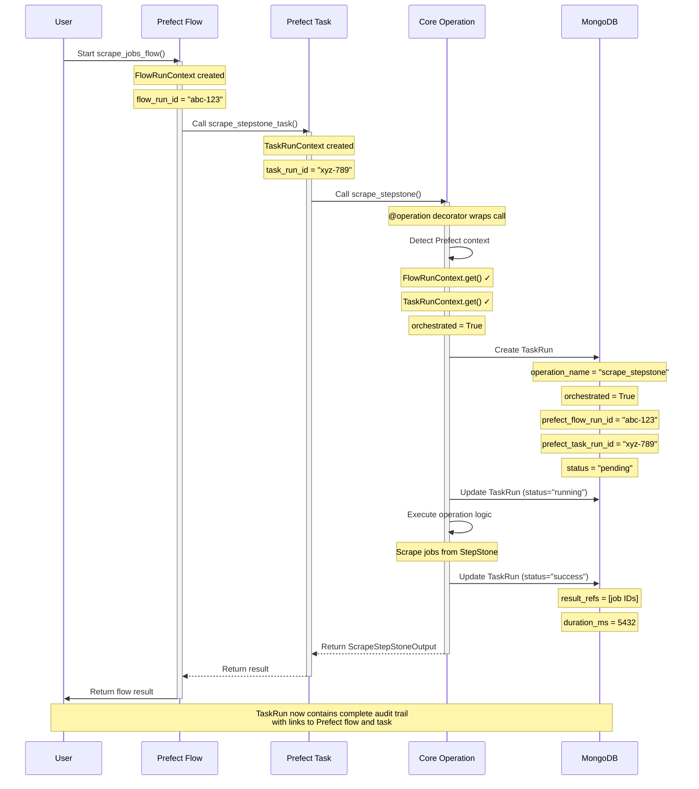

# Prefect Integration

**Version:** 1.0.0
**Last Updated:** 2025-10-15

## Overview

JobHunter AI integrates with [Prefect](https://www.prefect.io/) for workflow orchestration, providing a powerful three-layer architecture:

```
┌──────────────────────────────────────────────────────────────┐
│ Layer 1: Prefect Flows                                       │
│ - High-level workflows composing multiple tasks              │
│ - Flow-level retries, scheduling, parameters                 │
│ - Example: scrape_jobs_flow, apply_to_job_flow               │
└──────────────────────────────────────────────────────────────┘
                            │
                            ▼
┌──────────────────────────────────────────────────────────────┐
│ Layer 2: Prefect Tasks                                       │
│ - Task-level retries, caching, dependencies                  │
│ - Wraps domain operations with Prefect decorators            │
│ - Example: scrape_stepstone_task, generate_cv_task           │
└──────────────────────────────────────────────────────────────┘
                            │
                            ▼
┌──────────────────────────────────────────────────────────────┐
│ Layer 3: Core Operations                                     │
│ - Domain logic with @operation decorator                     │
│ - Auto-detects Prefect context                               │
│ - Creates TaskRun records with Prefect IDs                   │
│ - Example: scrape_stepstone, generate_cv, apply_job          │
└──────────────────────────────────────────────────────────────┘
```

**Key Benefits:**

1. **Observability**: Every operation execution creates a TaskRun record
2. **Orchestration**: Flows compose tasks into complex workflows
3. **Resilience**: Automatic retries at both flow and task level
4. **Scheduling**: Schedule flows via Prefect deployments
5. **Context Linking**: TaskRuns automatically link to Prefect flow/task IDs
6. **Flexibility**: Operations can run standalone OR within Prefect

---

## Architecture Components

### 1. Core Operations (`core/examples/operations/`)

Domain operations decorated with `@operation`:

```python
from core.decorators import operation
from pydantic import BaseModel

class MyOperationInput(BaseModel):
    param1: str
    user_id: str | None = None
    dry_run: bool = False
    test_mode: bool = False
    verbose: bool = False

class MyOperationOutput(BaseModel):
    success: bool
    result_id: str | None = None

@operation(
    name="my_operation",
    description="Example operation",
    category="processing",
    inputs=MyOperationInput,
    outputs=MyOperationOutput,
    async_enabled=True,
    create_taskrun=True,  # Enable TaskRun creation
)
async def my_operation(input: MyOperationInput) -> MyOperationOutput:
    # Your domain logic here
    return MyOperationOutput(success=True, result_id="123")
```

### 2. Prefect Tasks (`core/examples/workflows/tasks.py`)

Thin wrappers around operations with Prefect task decorators:

```python
from prefect import task

@task(
    name="my_operation_task",
    description="Prefect task wrapper for my_operation",
    retries=3,
    retry_delay_seconds=60,
    tags=["processing"],
)
async def my_operation_task(
    param1: str,
    user_id: str | None = None,
    dry_run: bool = False,
) -> MyOperationOutput:
    """Prefect task wrapper for my_operation."""
    input_data = MyOperationInput(
        param1=param1,
        user_id=user_id,
        dry_run=dry_run,
    )
    return await my_operation(input_data)
```

### 3. Prefect Flows (`core/examples/workflows/flows.py`)

High-level workflows composing multiple tasks:

```python
from prefect import flow

@flow(
    name="my_workflow_flow",
    description="Complete workflow with multiple steps",
    retries=1,
    retry_delay_seconds=300,
)
async def my_workflow_flow(
    param1: str,
    user_id: str | None = None,
    notify: bool = True,
    dry_run: bool = False,
) -> dict[str, Any]:
    """Complete workflow."""
    # Step 1: Run first operation
    result1 = await my_operation_task(
        param1=param1,
        user_id=user_id,
        dry_run=dry_run,
    )

    # Step 2: Run second operation (depends on result1)
    result2 = await another_operation_task(
        result_id=result1.result_id,
        user_id=user_id,
        dry_run=dry_run,
    )

    # Step 3: Send notification
    if notify:
        await notify_task(
            message=f"Workflow complete: {result2.status}",
            user_id=user_id,
        )

    return {
        "success": True,
        "result1": result1,
        "result2": result2,
    }
```

---

## Context Detection

The `@operation` decorator automatically detects when it's running within a Prefect context and captures orchestration metadata.

### How Context Detection Works

From `core/decorators.py` (lines 128-148):

```python
# Detect Prefect orchestration context
orchestrated = False
prefect_flow_run_id = None
prefect_task_run_id = None

try:
    # Try to import Prefect and get context
    from prefect.context import FlowRunContext, TaskRunContext

    flow_ctx = FlowRunContext.get()
    task_ctx = TaskRunContext.get()

    if flow_ctx or task_ctx:
        orchestrated = True
        if flow_ctx and flow_ctx.flow_run:
            prefect_flow_run_id = str(flow_ctx.flow_run.id)
        if task_ctx and task_ctx.task_run:
            prefect_task_run_id = str(task_ctx.task_run.id)
except (ImportError, Exception):
    # Prefect not available or no context - run directly
    pass
```

**Behavior:**

1. **Within Prefect**: Sets `orchestrated=True` and captures flow/task run IDs
2. **Standalone**: Sets `orchestrated=False`, IDs remain `None`
3. **Prefect Not Installed**: Gracefully degrades, runs as standalone

This allows operations to run **anywhere** while still providing orchestration metadata when available.

---

## TaskRun Linking

Every operation execution creates a `TaskRun` document for observability. When running within Prefect, TaskRuns automatically link to the orchestration context.

### TaskRun Model Fields

From `core/examples/models/models/taskrun.py`:

```python
class TaskRun(Document):
    """Audit log for every operation execution."""

    # Operation identification
    operation_name: Indexed(str)  # Which operation ran

    # Actor information
    actor: Actor  # Who triggered it

    # Execution lifecycle
    status: str  # pending, running, success, failed
    started_at: datetime
    finished_at: datetime | None
    duration_ms: int | None

    # Orchestration metadata
    orchestrated: bool = False  # Was this orchestrated via Prefect?
    prefect_flow_run_id: str | None  # Link to Prefect flow run
    prefect_task_run_id: str | None  # Link to Prefect task run

    # Input/Output
    input_dump: dict[str, Any]  # Serialized input parameters
    result_refs: list[dict[str, str]]  # References to created documents

    # Error handling
    error_message: str | None
    error_traceback: str | None
    error_list: list[dict[str, Any]]

    # Logging
    log_entries: list[dict[str, Any]]

    # Metadata
    metadata: dict[str, Any]
```

### TaskRun Creation Flow

From `core/decorators.py` (lines 159-172):

```python
# Create TaskRun
taskrun = TaskRun(
    operation_name=name,
    actor=actor,
    input_dump=input_dump,
    orchestrated=orchestrated,  # True if Prefect context detected
    prefect_flow_run_id=prefect_flow_run_id,  # Captured from context
    prefect_task_run_id=prefect_task_run_id,  # Captured from context
    metadata={
        "dry_run": dry_run,
        "test_mode": test_mode,
        "verbose": verbose,
    },
)
await taskrun.insert()
```

### Querying by Orchestration

```python
# Find all orchestrated operations
orchestrated_runs = await TaskRun.find(
    TaskRun.orchestrated == True
).to_list()

# Find operations from a specific Prefect flow
flow_runs = await TaskRun.find(
    TaskRun.prefect_flow_run_id == "abc-123-def-456"
).to_list()

# Find operations from a specific Prefect task
task_runs = await TaskRun.find(
    TaskRun.prefect_task_run_id == "xyz-789-uvw-012"
).to_list()

# Find standalone (non-orchestrated) operations
standalone_runs = await TaskRun.find(
    TaskRun.orchestrated == False
).to_list()
```

---

## Integration Flow

### Sequence Diagram



---

## Complete Example

### Example 1: Scraping Workflow

**Flow Definition** (`core/examples/workflows/flows.py`):

```python
@flow(
    name="scrape_jobs_flow",
    description="Scrape jobs from multiple sources",
    retries=1,
    retry_delay_seconds=300,
)
async def scrape_jobs_flow(
    sources: list[str] | None = None,
    keywords: str | None = None,
    location: str | None = None,
    limit: int = 10,
    fetch_details: bool = True,
    user_id: str | None = None,
    notify: bool = True,
    dry_run: bool = False,
) -> dict[str, Any]:
    """Scrape jobs from multiple sources."""
    sources = sources or ["stepstone"]
    results = {}

    # Scrape from each source
    for source in sources:
        if source == "stepstone":
            result = await scrape_stepstone_task(
                keywords=keywords,
                location=location,
                limit=limit,
                fetch_details=fetch_details,
                user_id=user_id,
                dry_run=dry_run,
            )
            results[source] = {
                "success": result.success,
                "jobs_created": result.jobs_created,
                "job_ids": result.job_ids,
            }

    # Send notification
    if notify:
        total_jobs = sum(r.get("jobs_created", 0) for r in results.values())
        await notify_task(
            message=f"Scraped {total_jobs} jobs from {len(sources)} sources",
            notification_type="success",
            user_id=user_id,
            metadata={"results": results},
        )

    return results
```

**Task Wrapper** (`core/examples/workflows/tasks.py`):

```python
@task(
    name="scrape_stepstone_task",
    description="Scrape jobs from StepStone.de",
    retries=3,
    retry_delay_seconds=60,
    tags=["scraping", "stepstone"],
)
async def scrape_stepstone_task(
    keywords: str | None = None,
    location: str | None = None,
    limit: int = 10,
    fetch_details: bool = True,
    user_id: str | None = None,
    dry_run: bool = False,
) -> ScrapeStepStoneOutput:
    """Prefect task wrapper for scrape_stepstone operation."""
    # Convert keywords to list
    keywords_list = [kw.strip() for kw in keywords.split(",")] if keywords else []

    query = QueryObject(
        keywords=keywords_list,
        location=location or ""
    ) if keywords_list or location else None

    input_data = ScrapeStepStoneInput(
        query=query,
        limit=limit,
        fetch_details=fetch_details,
        user_id=user_id,
        dry_run=dry_run,
    )

    return await scrape_stepstone(input_data)
```

**Core Operation** (simplified from `core/examples/operations/scraping_ops_v2.py`):

```python
@operation(
    name="scrape_stepstone",
    description="Scrape jobs from StepStone.de",
    category="scraping",
    inputs=ScrapeStepStoneInput,
    outputs=ScrapeStepStoneOutput,
    async_enabled=True,
    create_taskrun=True,
    models_out=["Job", "Page", "QueryIndex"],
)
async def scrape_stepstone(input: ScrapeStepStoneInput) -> ScrapeStepStoneOutput:
    """Scrape jobs from StepStone.de."""
    # Operation logic here
    # When this runs within Prefect, TaskRun is automatically created
    # with prefect_flow_run_id and prefect_task_run_id

    return ScrapeStepStoneOutput(
        success=True,
        jobs_created=10,
        job_ids=["id1", "id2", ...],
    )
```

**Running the Flow:**

```python
import asyncio
from core.examples.workflows.flows import scrape_jobs_flow

# Run directly (creates Prefect flow run + task runs + TaskRuns)
result = asyncio.run(
    scrape_jobs_flow(
        sources=["stepstone"],
        keywords="python,developer",
        location="Berlin",
        limit=20,
        user_id="user_123",
    )
)
```

**What Gets Created:**

1. **Prefect Flow Run**: `flow_run_id = "abc-123-def-456"`
2. **Prefect Task Run**: `task_run_id = "xyz-789-uvw-012"`
3. **TaskRun Document** in MongoDB:
   ```python
   {
       "_id": ObjectId("..."),
       "operation_name": "scrape_stepstone",
       "actor": {"user_id": "user_123", "channel": "api"},
       "status": "success",
       "started_at": "2025-10-15T10:00:00",
       "finished_at": "2025-10-15T10:00:05",
       "duration_ms": 5432,
       "orchestrated": True,  # ← Detected Prefect context
       "prefect_flow_run_id": "abc-123-def-456",  # ← From FlowRunContext
       "prefect_task_run_id": "xyz-789-uvw-012",  # ← From TaskRunContext
       "input_dump": {
           "query": {"keywords": ["python", "developer"], "location": "Berlin"},
           "limit": 20,
           "fetch_details": True,
           "dry_run": False,
       },
       "result_refs": [
           {"collection": "jobs", "document_id": "id1"},
           {"collection": "jobs", "document_id": "id2"},
           # ...
       ],
       "metadata": {"dry_run": False, "test_mode": False, "verbose": False},
   }
   ```

---

## Example 2: Application Workflow

This example shows a multi-step workflow with dependencies:

**Flow** (`core/examples/workflows/flows.py`):

```python
@flow(
    name="apply_to_job_flow",
    description="Complete job application workflow",
    retries=1,
    retry_delay_seconds=120,
)
async def apply_to_job_flow(
    job_id: str,
    user_id: str | None = None,
    cv_template: str = "default",
    letter_template: str = "default",
    dry_run: bool = False,
) -> dict[str, Any]:
    """Apply to a job: generate CV → generate letter → submit application."""

    # Step 1: Generate CV
    cv_result = await generate_cv_task(
        job_id=job_id,
        user_id=user_id,
        template_name=cv_template,
        dry_run=dry_run,
    )

    if not cv_result.success:
        return {
            "success": False,
            "error": cv_result.error_message,
        }

    # Step 2: Generate cover letter
    letter_result = await generate_letter_task(
        job_id=job_id,
        user_id=user_id,
        template_name=letter_template,
        dry_run=dry_run,
    )

    if not letter_result.success:
        return {
            "success": False,
            "cv_id": cv_result.cv_id,
            "error": letter_result.error_message,
        }

    # Step 3: Submit application
    apply_result = await apply_job_task(
        job_id=job_id,
        user_id=user_id,
        cv_id=cv_result.cv_id,
        letter_id=letter_result.letter_id,
        dry_run=dry_run,
    )

    return {
        "success": apply_result.success,
        "cv_id": cv_result.cv_id,
        "letter_id": letter_result.letter_id,
        "application_id": apply_result.application_id,
    }
```

**What Gets Created:**

For a single flow run, you get **one Prefect flow run** and **three TaskRuns**:

```python
# TaskRun 1: generate_cv operation
{
    "operation_name": "generate_cv",
    "orchestrated": True,
    "prefect_flow_run_id": "abc-123",  # Same flow ID
    "prefect_task_run_id": "task-001",  # Unique task ID
    "result_refs": [{"collection": "cvs", "document_id": "cv_123"}],
}

# TaskRun 2: generate_letter operation
{
    "operation_name": "generate_letter",
    "orchestrated": True,
    "prefect_flow_run_id": "abc-123",  # Same flow ID
    "prefect_task_run_id": "task-002",  # Different task ID
    "result_refs": [{"collection": "letters", "document_id": "letter_456"}],
}

# TaskRun 3: apply_job operation
{
    "operation_name": "apply_job",
    "orchestrated": True,
    "prefect_flow_run_id": "abc-123",  # Same flow ID
    "prefect_task_run_id": "task-003",  # Different task ID
    "result_refs": [{"collection": "applications", "document_id": "app_789"}],
}
```

All three TaskRuns share the same `prefect_flow_run_id`, allowing you to query all operations from a single workflow run.

---

## Benefits

### 1. Observability

**Complete Audit Trail:**

```python
# Find all operations from a specific workflow run
flow_operations = await TaskRun.find(
    TaskRun.prefect_flow_run_id == "abc-123-def-456"
).sort(-TaskRun.started_at).to_list()

for tr in flow_operations:
    print(f"{tr.operation_name}: {tr.status} ({tr.duration_ms}ms)")
    print(f"  Input: {tr.input_dump}")
    print(f"  Output: {tr.result_refs}")
```

**Performance Analytics:**

```python
# Average duration by operation
pipeline = [
    {"$match": {"orchestrated": True, "status": "success"}},
    {"$group": {
        "_id": "$operation_name",
        "avg_duration": {"$avg": "$duration_ms"},
        "count": {"$sum": 1},
    }},
    {"$sort": {"avg_duration": -1}},
]

stats = await TaskRun.get_motor_collection().aggregate(pipeline).to_list(None)
```

### 2. Retry and Error Handling

**Task-Level Retries:**

```python
@task(
    retries=3,  # Retry failed tasks 3 times
    retry_delay_seconds=60,  # Wait 60s between retries
)
async def scrape_stepstone_task(...):
    # If this fails, Prefect automatically retries
    return await scrape_stepstone(input_data)
```

**Flow-Level Retries:**

```python
@flow(
    retries=1,  # Retry entire flow once if it fails
    retry_delay_seconds=300,  # Wait 5 minutes before retry
)
async def scrape_jobs_flow(...):
    # If any task fails and exhausts its retries,
    # the entire flow can be retried
    ...
```

### 3. Scheduling

**Deploy Flows for Scheduled Execution:**

```python
from prefect.deployments import Deployment
from prefect.server.schemas.schedules import CronSchedule

deployment = Deployment.build_from_flow(
    flow=scrape_jobs_flow,
    name="daily-job-scrape",
    schedule=CronSchedule(cron="0 9 * * *"),  # Run daily at 9 AM
    parameters={
        "sources": ["stepstone"],
        "keywords": "python,developer",
        "location": "Berlin",
        "limit": 50,
    },
)

deployment.apply()
```

### 4. Dependency Management

**Sequential Dependencies:**

```python
# Step 2 depends on Step 1's output
cv_result = await generate_cv_task(...)
letter_result = await generate_letter_task(...)
apply_result = await apply_job_task(
    cv_id=cv_result.cv_id,  # Uses output from Step 1
    letter_id=letter_result.letter_id,  # Uses output from Step 2
)
```

**Parallel Execution:**

```python
from prefect import flow
from prefect.tasks import task_runner

@flow(task_runner=DaskTaskRunner())  # Enable parallel execution
async def parallel_scrape_flow(...):
    # These tasks run in parallel
    results = await asyncio.gather(
        scrape_stepstone_task(keywords="python"),
        scrape_stepstone_task(keywords="golang"),
        scrape_stepstone_task(keywords="rust"),
    )
    return results
```

### 5. Flexibility

**Standalone Execution:**

```python
# Operations can run WITHOUT Prefect
from core.examples.operations.scraping_ops_v2 import scrape_stepstone, ScrapeStepStoneInput

result = await scrape_stepstone(ScrapeStepStoneInput(
    query=QueryObject(keywords=["python"], location="Berlin"),
    limit=10,
))
# TaskRun created with orchestrated=False
```

**CLI Execution:**

```bash
# CLI can trigger Prefect flows
jobhunter flow run scrape_jobs_flow \
    --keywords "python,developer" \
    --location "Berlin" \
    --limit 20
```

**API Execution:**

```python
# FastAPI endpoint can trigger Prefect flows
@router.post("/workflows/scrape")
async def trigger_scrape_workflow(request: ScrapeRequest):
    result = await scrape_jobs_flow(
        sources=request.sources,
        keywords=request.keywords,
        location=request.location,
    )
    return result
```

---

## Querying TaskRuns

### By Orchestration Status

```python
# All orchestrated operations
orchestrated = await TaskRun.find(
    TaskRun.orchestrated == True
).to_list()

# All standalone operations
standalone = await TaskRun.find(
    TaskRun.orchestrated == False
).to_list()
```

### By Prefect Flow

```python
# All operations from a specific flow run
flow_ops = await TaskRun.find(
    TaskRun.prefect_flow_run_id == "abc-123-def-456"
).sort(-TaskRun.started_at).to_list()

# Count operations per flow
pipeline = [
    {"$match": {"orchestrated": True}},
    {"$group": {
        "_id": "$prefect_flow_run_id",
        "count": {"$sum": 1},
        "operations": {"$push": "$operation_name"},
    }},
]
results = await TaskRun.get_motor_collection().aggregate(pipeline).to_list(None)
```

### By Operation Name

```python
# All scraping operations orchestrated via Prefect
scrape_ops = await TaskRun.find(
    TaskRun.operation_name == "scrape_stepstone",
    TaskRun.orchestrated == True,
).to_list()
```

### Success Rate by Flow

```python
# Calculate success rate per flow
pipeline = [
    {"$match": {"orchestrated": True}},
    {"$group": {
        "_id": "$prefect_flow_run_id",
        "total": {"$sum": 1},
        "successes": {
            "$sum": {"$cond": [{"$eq": ["$status", "success"]}, 1, 0]}
        },
    }},
    {"$project": {
        "flow_run_id": "$_id",
        "total": 1,
        "successes": 1,
        "success_rate": {
            "$multiply": [{"$divide": ["$successes", "$total"]}, 100]
        },
    }},
]
results = await TaskRun.get_motor_collection().aggregate(pipeline).to_list(None)
```

---

## Best Practices

### 1. Use Tasks for Retryable Units

Wrap each operation in a Prefect task with appropriate retry settings:

```python
@task(
    retries=3,  # Retry network operations
    retry_delay_seconds=60,
)
async def scrape_stepstone_task(...):
    return await scrape_stepstone(input_data)
```

### 2. Use Flows for Business Workflows

Compose tasks into flows that represent business processes:

```python
@flow(name="daily_job_hunt")
async def daily_job_hunt_flow():
    # 1. Scrape new jobs
    jobs = await scrape_jobs_flow(...)

    # 2. Score jobs against profile
    scored = await score_jobs_task(jobs)

    # 3. Apply to top matches
    await apply_to_jobs_task(scored[:5])
```

### 3. Always Pass Typed Inputs

Always use Pydantic models for inputs/outputs:

```python
# Good
input_data = ScrapeStepStoneInput(query=query, limit=10)
result = await scrape_stepstone(input_data)

# Bad
result = await scrape_stepstone(query, 10)  # No type safety
```

### 4. Use Dry Run for Testing

Test workflows without side effects:

```python
result = await scrape_jobs_flow(
    keywords="python",
    dry_run=True,  # No database writes, no external API calls
)
```

### 5. Monitor TaskRuns

Regularly query TaskRuns for insights:

```python
# Failed operations in last 24 hours
from datetime import datetime, timedelta

yesterday = datetime.utcnow() - timedelta(days=1)
failed = await TaskRun.find(
    TaskRun.status == "failed",
    TaskRun.started_at >= yesterday,
).to_list()

for tr in failed:
    print(f"{tr.operation_name}: {tr.error_message}")
```

---

## Deployment

### Register Flows

```python
# register_flows.py
import asyncio
from core.examples.workflows.flows import scrape_jobs_flow, apply_to_job_flow
from prefect.deployments import Deployment
from prefect.server.schemas.schedules import CronSchedule

async def register():
    # Daily scraping
    scrape_deployment = Deployment.build_from_flow(
        flow=scrape_jobs_flow,
        name="daily-job-scrape",
        schedule=CronSchedule(cron="0 9 * * *"),
        parameters={
            "sources": ["stepstone"],
            "keywords": "python,golang,rust",
            "location": "Berlin",
            "limit": 100,
        },
    )
    await scrape_deployment.apply()

    print("Flows registered successfully")

if __name__ == "__main__":
    asyncio.run(register())
```

### Start Prefect Server

```bash
# Start Prefect server
prefect server start

# In another terminal, start agent
prefect agent start --pool default
```

### Trigger Flows

```bash
# Via CLI
prefect deployment run scrape_jobs_flow/daily-job-scrape

# Via Python
from prefect.deployments import run_deployment
run_deployment(name="scrape_jobs_flow/daily-job-scrape")
```

---

## Troubleshooting

### TaskRuns Not Linking to Prefect

**Problem:** TaskRuns have `orchestrated=False` even when running in Prefect.

**Solution:** Ensure Prefect context is available:

```python
from prefect.context import FlowRunContext, TaskRunContext

# Check if context exists
flow_ctx = FlowRunContext.get()
task_ctx = TaskRunContext.get()
print(f"Flow context: {flow_ctx}")
print(f"Task context: {task_ctx}")
```

### Import Errors

**Problem:** `ImportError: cannot import name 'FlowRunContext'`

**Solution:** Install Prefect:

```bash
poetry add prefect
# or
pip install prefect
```

### Operations Not Creating TaskRuns

**Problem:** No TaskRun documents in database.

**Solution:** Check decorator settings:

```python
@operation(
    # ...
    async_enabled=True,  # Must be True
    create_taskrun=True,  # Must be True
)
```

---

## Summary

The Prefect integration provides:

1. **Three-layer architecture**: Flows → Tasks → Operations
2. **Automatic context detection**: Operations detect Prefect context
3. **Complete observability**: Every operation creates a TaskRun
4. **Orchestration metadata**: TaskRuns link to Prefect flow/task IDs
5. **Flexibility**: Operations run standalone OR orchestrated
6. **Resilience**: Automatic retries at flow and task level
7. **Scheduling**: Deploy flows for scheduled execution

**Key files:**

- `/home/jp/jobhunter-core-minimal/core/core/decorators.py` - `@operation` decorator with Prefect detection
- `/home/jp/jobhunter-core-minimal/core/database/models/taskrun.py` - TaskRun model with orchestration fields
- `/home/jp/jobhunter-core-minimal/core/workflows/flows.py` - Prefect flows
- `/home/jp/jobhunter-core-minimal/core/workflows/tasks.py` - Prefect task wrappers

**Next Steps:**

1. Implement more flows for your workflows
2. Deploy flows to Prefect for scheduling
3. Monitor TaskRuns for insights
4. Optimize retry strategies based on failure patterns

