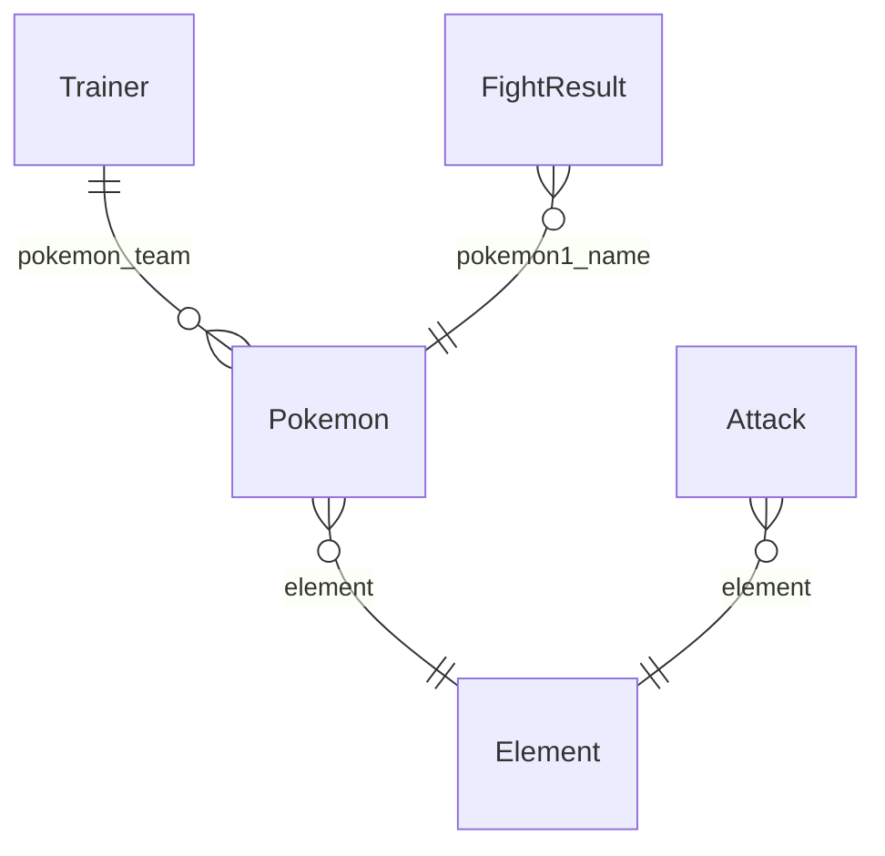

# Model Relationships



## Legend

- **Entities**: Data models (@datamodel decorated classes)
- **Relationships**: How models connect
  - `||--o{` = One-to-many (parent has many children)
  - `}o--||` = Many-to-one (child belongs to parent)
- **Labels**: Field names that create the relationships

## Model Composition

### Pokemon

- **belongs to** `Element` via field `element`

### Trainer

- **has many** `Pokemon` via field `pokemon_team`

### Attack

- **belongs to** `Element` via field `element`

### FightResult

- **belongs to** `Pokemon` via field `pokemon1_name`
- **belongs to** `Pokemon` via field `pokemon2_name`

```

## Model Details

### Pokemon

A Pokemon with stats, type, and attacks. Can evolve into other Pokemon and participate in battles.

**Fields**:

- `id`: typing.Optional[beanie.odm.fields.PydanticObjectId] - MongoDB document ObjectID
- `revision_id`: typing.Optional[uuid.UUID] - None
- `name`: <class 'str'> - Pokemon name
- `element`: <class 'str'> - Primary element type
- `level`: <class 'int'> - Current level (1-100)
- `experience`: <class 'int'> - Total experience points
- `health`: <class 'int'> - Hit Points (HP)
- `attack`: <class 'int'> - Attack stat
- `defense`: <class 'int'> - Defense stat
- `sp_attack`: <class 'int'> - Special Attack stat
- `sp_defense`: <class 'int'> - Special Defense stat
- `speed`: <class 'int'> - Speed stat
- `attacks`: list[str] - List of attack/move names this Pokemon knows
- `evolves_into`: str | None - Name of Pokemon this evolves into (if any)
- `evolution_level`: int | None - Level required to evolve

**Relationships**:
- belongs to `Element` via `element`

### Trainer

A Pokemon Trainer with a team of Pokemons.

**Fields**:

- `id`: typing.Optional[beanie.odm.fields.PydanticObjectId] - MongoDB document ObjectID
- `revision_id`: typing.Optional[uuid.UUID] - None
- `name`: <class 'str'> - Trainer name
- `region`: <class 'str'> - Home region
- `badge_count`: <class 'int'> - Number of badges earned (0-8)
- `level`: <class 'int'> - Trainer level
- `pokemon_team`: list[models.pokemon.Pokemon] - List of Pokemon in this trainer's team (max 6)
- `pokemon_count`: <class 'int'> - Total Pokemon caught
- `wins`: <class 'int'> - Battle wins
- `losses`: <class 'int'> - Battle losses

**Relationships**:
- has many `Pokemon` via `pokemon_team`

### Attack

Attack/Move that a Pokemon can learn. Examples: Tackle, Thunderbolt, Water Gun, etc.

**Fields**:

- `id`: typing.Optional[beanie.odm.fields.PydanticObjectId] - MongoDB document ObjectID
- `revision_id`: typing.Optional[uuid.UUID] - None
- `name`: <class 'str'> - Attack name
- `description`: <class 'str'> - Attack description
- `power`: <class 'int'> - Attack power (0-150)
- `accuracy`: <class 'float'> - Attack accuracy (0-1)
- `element`: <class 'str'> - Element type of this attack
- `pp`: <class 'int'> - Power Points (uses per battle)

**Relationships**:
- belongs to `Element` via `element`

### Element

Element/Type for Pokemon attacks and resistances. Examples: Fire, Water, Grass, Electric, etc.

**Fields**:

- `id`: typing.Optional[beanie.odm.fields.PydanticObjectId] - MongoDB document ObjectID
- `revision_id`: typing.Optional[uuid.UUID] - None
- `name`: <class 'str'> - Element name (Fire, Water, Grass, etc.)
- `description`: <class 'str'> - Element description
- `strong_against`: list[str] - List of element names this is strong against
- `weak_against`: list[str] - List of element names this is weak against

### FightResult

Result of a battle between two Pokemon.

**Fields**:

- `id`: typing.Optional[beanie.odm.fields.PydanticObjectId] - MongoDB document ObjectID
- `revision_id`: typing.Optional[uuid.UUID] - None
- `pokemon1_name`: <class 'str'> - First Pokemon name
- `pokemon2_name`: <class 'str'> - Second Pokemon name
- `winner`: <class 'str'> - Name of winning Pokemon
- `loser`: <class 'str'> - Name of losing Pokemon
- `pokemon1_hp_left`: <class 'int'> - HP remaining for Pokemon 1
- `pokemon2_hp_left`: <class 'int'> - HP remaining for Pokemon 2
- `winning_move`: str | None - Attack that caused victory
- `turns`: <class 'int'> - Number of turns the battle lasted
- `experience_gained`: <class 'int'> - Experience gained by winner

**Relationships**:
- belongs to `Pokemon` via `pokemon1_name`
- belongs to `Pokemon` via `pokemon2_name`
