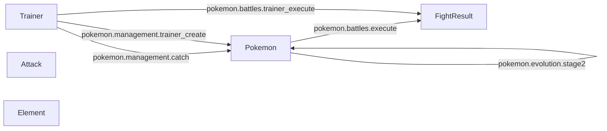

# Operation Flow Graph

## Legend

- **Nodes**: Data models (@datamodel decorated classes)
- **Edges**: Operations (@operation decorated functions)
- **Labels**: Operation names

## Operations Detail

### pokemon.management.catch

**Description**: Trainer catches a new Pokemon
**Category**: management
**Input Models**: Trainer
**Output Models**: Pokemon

### pokemon.management.train

**Description**: Train a Pokemon to increase stats and level
**Category**: management
**Input Models**: Pokemon
**Output Models**: Pokemon

### pokemon.management.trainer_create

**Description**: Create a new Pokemon trainer
**Category**: management
**Input Models**: Trainer
**Output Models**: Pokemon

### pokemon.battles.execute

**Description**: Simulate a battle between two Pokemon
**Category**: battles
**Input Models**: Pokemon
**Output Models**: FightResult

### pokemon.battles.trainer_execute

**Description**: Simulate a full battle between two Pokemon trainers
**Category**: battles
**Input Models**: Trainer
**Output Models**: FightResult

### pokemon.evolution.stage1

**Description**: Evolve a Pokemon to its first evolution form
**Category**: evolution
**Input Models**: Pokemon
**Output Models**: Pokemon

### pokemon.evolution.stage2

**Description**: Evolve a Pokemon to its second evolution form
**Category**: evolution
**Input Models**: Pokemon
**Output Models**: Pokemon
